<div align="center">

# UE5-3DGS

### Unreal Engine 5 → 3D Gaussian Splatting Export Pipeline

[](https://www.unrealengine.com/)
[](LICENSE)
[](https://isocpp.org/)
[](https://colmap.github.io/)

**Production-ready plugin for exporting Unreal Engine 5 scenes to 3D Gaussian Splatting training datasets**

[Quick Start](#-quick-start) · [Architecture](#-architecture) · [API Reference](docs/api/README.md) · [Guides](docs/guides/README.md)

</div>

---

## 📋 Table of Contents

- [Overview](#-overview)
- [Features](#-features)
- [Quick Start](#-quick-start)
- [Architecture](#-architecture)
- [Core Systems](#-core-systems)
- [Export Formats](#-export-formats)
- [Usage Examples](#-usage-examples)
- [API Reference](#-api-reference)
- [Configuration](#-configuration)
- [Testing](#-testing)
- [Contributing](#-contributing)

---

## 🎯 Overview

UE5-3DGS bridges Unreal Engine 5's powerful rendering capabilities with 3D Gaussian Splatting (3DGS) neural rendering. This plugin automates the complex process of generating training-ready datasets from UE5 scenes, handling coordinate system transformations, camera intrinsics extraction, and multi-format export.


### Why UE5-3DGS?

| Challenge | Solution |
|-----------|----------|
| Complex coordinate transformations | Automated UE5↔COLMAP conversion with mathematical precision |
| Camera intrinsics extraction | Direct integration with UE5's camera component system |
| Optimal view sampling | 5 trajectory algorithms optimized for 3DGS training |
| Format compliance | Byte-perfect COLMAP and PLY output |
| Production workflow | Editor mode with real-time preview and validation |

---

## ✨ Features

<details>
<summary><b>🔄 Coordinate System Conversion</b></summary>

Handles the complex transformation between UE5 and COLMAP coordinate systems:

```mermaid
graph TB
    subgraph UE5["UE5 Coordinate System"]
        direction TB
        UE5_X["X → Forward"]
        UE5_Y["Y → Right"]
        UE5_Z["Z → Up"]
        UE5_H["Left-handed"]
        UE5_U["Centimeters"]
    end

    subgraph COLMAP["COLMAP Coordinate System"]
        direction TB
        COL_X["X → Right"]
        COL_Y["Y → Down"]
        COL_Z["Z → Forward"]
        COL_H["Right-handed"]
        COL_U["Meters"]
    end

    UE5 -->|"Transform Matrix"| COLMAP

    style UE5 fill:#ff6b6b,color:#fff
    style COLMAP fill:#4ecdc4,color:#fff
```



**Transformation Matrix:**
```
COLMAP.X =  UE5.Y / 100
COLMAP.Y = -UE5.Z / 100
COLMAP.Z =  UE5.X / 100
```

</details>

<details>
<summary><b>📸 Camera Intrinsics Extraction</b></summary>

Supports all standard camera models:

| Model | Parameters | Use Case |
|-------|------------|----------|
| `PINHOLE` | fx, fy, cx, cy | Standard perspective |
| `SIMPLE_PINHOLE` | f, cx, cy | Equal focal lengths |
| `RADIAL` | f, cx, cy, k1, k2 | Barrel/pincushion distortion |
| `OPENCV` | fx, fy, cx, cy, k1, k2, p1, p2 | Full OpenCV model |

```cpp
FCameraIntrinsics Intrinsics;
Intrinsics.Width = 1920;
Intrinsics.Height = 1080;
Intrinsics.FocalLengthX = 1000.0f;
Intrinsics.FocalLengthY = 1000.0f;
Intrinsics.PrincipalPointX = 960.0f;
Intrinsics.PrincipalPointY = 540.0f;
Intrinsics.Model = ECameraModel::PINHOLE;
```

</details>

<details>
<summary><b>🎬 Trajectory Generation</b></summary>

Five optimized camera trajectory algorithms:

```mermaid
graph TD
    subgraph Trajectories["Camera Trajectory Types"]
        Orbital["🔄 Orbital Rings<br/>3-5 elevation levels"]
        Spiral["🌀 Spiral<br/>Continuous coverage"]
        Hemisphere["🌐 Hemisphere<br/>Fibonacci distribution"]
        Full360["⭕ Full 360°<br/>Single elevation"]
        Custom["⚙️ Custom<br/>User-defined paths"]
    end

    Orbital --> |"Best for"| Objects["Object Scanning"]
    Spiral --> |"Best for"| Interiors["Interior Scenes"]
    Hemisphere --> |"Best for"| Outdoor["Outdoor Environments"]
    Full360 --> |"Best for"| Turntable["Product Shots"]
    Custom --> |"Best for"| Special["Special Requirements"]
```



**Optimal Training Parameters:**
- **View Count:** 100-180 images
- **Overlap:** 60-80% between adjacent views
- **Elevation Angles:** -30° to +60° for full coverage

</details>

<details>
<summary><b>📦 Export Format Support</b></summary>

#### COLMAP Dataset Structure
```
output/
├── cameras.txt          # Camera intrinsics
├── images.txt           # Image poses (quaternion + translation)
├── points3D.txt         # Sparse point cloud (optional)
└── images/
    ├── frame_0000.png
    ├── frame_0001.png
    └── ...
```

#### 3DGS PLY Format (236 bytes/point)

```mermaid
graph LR
    subgraph PLY["PLY Point Structure (236 bytes)"]
        Pos["Position<br/>12 bytes<br/>float x,y,z"]
        Norm["Normal<br/>12 bytes<br/>float nx,ny,nz"]
        DC["DC SH<br/>12 bytes<br/>float r,g,b"]
        Rest["Rest SH<br/>180 bytes<br/>45 × float"]
        Op["Opacity<br/>4 bytes<br/>float"]
        Scale["Scale<br/>12 bytes<br/>float sx,sy,sz"]
        Rot["Rotation<br/>16 bytes<br/>float qw,qx,qy,qz"]
    end

    Pos --> Norm --> DC --> Rest --> Op --> Scale --> Rot
```


</details>

---

## 🚀 Quick Start

### Prerequisites

- Unreal Engine 5.3 or later
- Visual Studio 2022 (Windows) or Xcode 14+ (macOS)
- C++17 compatible compiler

### Installation

<details>
<summary><b>Option 1: Clone into Plugins folder</b></summary>

```bash
cd YourProject/Plugins
git clone https://github.com/yourusername/UE5-3DGS.git
```

</details>

<details>
<summary><b>Option 2: Add as Git submodule</b></summary>

```bash
git submodule add https://github.com/yourusername/UE5-3DGS.git Plugins/UE5_3DGS
git submodule update --init --recursive
```

</details>

### Basic Usage

```cpp
#include "UE5_3DGS.h"

// 1. Configure capture settings
FCaptureSettings Settings;
Settings.OutputDirectory = TEXT("/Game/Exports/Scene01");
Settings.ImageWidth = 1920;
Settings.ImageHeight = 1080;
Settings.TrajectoryType = ETrajectoryType::Orbital;
Settings.ViewCount = 150;

// 2. Create and run orchestrator
UCaptureOrchestrator* Orchestrator = NewObject<UCaptureOrchestrator>();
Orchestrator->Initialize(Settings);
Orchestrator->StartCapture();
```

### Editor Mode

1. Enable the plugin in Edit → Plugins
2. Open Window → UE5-3DGS Capture Panel
3. Configure settings in the property panel
4. Click "Generate Preview" to visualize camera positions
5. Click "Start Capture" to begin export

---

## 🏗 Architecture


### Module Structure


---

## 🔧 Core Systems

### Coordinate Converter

The coordinate converter handles all transformations between UE5 and COLMAP coordinate systems.

```mermaid
sequenceDiagram
    participant UE5 as UE5 Scene
    participant Conv as CoordinateConverter
    participant COLMAP as COLMAP Dataset

    UE5->>Conv: FVector Position (cm, LH, Z-up)
    Conv->>Conv: Apply axis remapping
    Conv->>Conv: Convert units (cm → m)
    Conv->>Conv: Adjust handedness
    Conv->>COLMAP: FVector Position (m, RH, Y-down)

    UE5->>Conv: FQuat Rotation
    Conv->>Conv: Conjugate for handedness
    Conv->>Conv: Remap quaternion axes
    Conv->>COLMAP: FQuat Rotation (COLMAP convention)
```



<details>
<summary><b>Implementation Details</b></summary>

```cpp
FVector FCoordinateConverter::UE5ToColmap(const FVector& UE5Position)
{
    // UE5: X-forward, Y-right, Z-up (left-handed, centimeters)
    // COLMAP: X-right, Y-down, Z-forward (right-handed, meters)
    return FVector(
        UE5Position.Y * 0.01f,   // UE5.Y → COLMAP.X (right)
        -UE5Position.Z * 0.01f,  // -UE5.Z → COLMAP.Y (down)
        UE5Position.X * 0.01f    // UE5.X → COLMAP.Z (forward)
    );
}

FQuat FCoordinateConverter::UE5ToColmapRotation(const FQuat& UE5Rotation)
{
    // Conjugate for handedness change, then remap axes
    FQuat Conjugate = UE5Rotation.IsNormalized() ?
        FQuat(-UE5Rotation.X, -UE5Rotation.Y, -UE5Rotation.Z, UE5Rotation.W) :
        UE5Rotation.GetNormalized().IsNormalized();

    return FQuat(
        Conjugate.Y,   // X component
        -Conjugate.Z,  // Y component
        Conjugate.X,   // Z component
        Conjugate.W    // W component
    );
}
```

</details>

### Trajectory Generator

Generates optimal camera paths for 3DGS training coverage.


<details>
<summary><b>Orbital Ring Algorithm</b></summary>

```cpp
TArray<FTransform> FTrajectoryGenerator::GenerateOrbital(
    const FVector& TargetCenter,
    float Radius,
    int32 ViewCount,
    const TArray<float>& ElevationAngles)
{
    TArray<FTransform> Trajectory;

    int32 RingCount = ElevationAngles.Num();
    int32 ViewsPerRing = ViewCount / RingCount;

    for (int32 Ring = 0; Ring < RingCount; ++Ring)
    {
        float Elevation = FMath::DegreesToRadians(ElevationAngles[Ring]);
        float RingRadius = Radius * FMath::Cos(Elevation);
        float Height = Radius * FMath::Sin(Elevation);

        for (int32 i = 0; i < ViewsPerRing; ++i)
        {
            float Azimuth = (2.0f * PI * i) / ViewsPerRing;

            FVector Position(
                TargetCenter.X + RingRadius * FMath::Cos(Azimuth),
                TargetCenter.Y + RingRadius * FMath::Sin(Azimuth),
                TargetCenter.Z + Height
            );

            FRotator LookAt = (TargetCenter - Position).Rotation();
            Trajectory.Add(FTransform(LookAt, Position));
        }
    }

    return Trajectory;
}
```

</details>

### Depth Extractor

Extracts depth information from UE5's scene capture system.


---

## 📤 Export Formats

### COLMAP Text Format

<details>
<summary><b>cameras.txt Specification</b></summary>

```
# Camera list with one line of data per camera:
#   CAMERA_ID, MODEL, WIDTH, HEIGHT, PARAMS[]
# Number of cameras: N

1 PINHOLE 1920 1080 1000.0 1000.0 960.0 540.0
```

**Supported Models:**
| Model | Parameter Count | Format |
|-------|-----------------|--------|
| SIMPLE_PINHOLE | 3 | f, cx, cy |
| PINHOLE | 4 | fx, fy, cx, cy |
| SIMPLE_RADIAL | 4 | f, cx, cy, k |
| RADIAL | 5 | f, cx, cy, k1, k2 |
| OPENCV | 8 | fx, fy, cx, cy, k1, k2, p1, p2 |

</details>

<details>
<summary><b>images.txt Specification</b></summary>

```
# Image list with two lines of data per image:
#   IMAGE_ID, QW, QX, QY, QZ, TX, TY, TZ, CAMERA_ID, NAME
#   POINTS2D[] as (X, Y, POINT3D_ID)
# Number of images: N

1 0.851 0.325 -0.125 0.394 1.234 -0.567 2.891 1 frame_0000.png

2 0.923 0.284 -0.198 0.156 1.456 -0.234 3.012 1 frame_0001.png

```

**Quaternion Convention:** COLMAP uses `(QW, QX, QY, QZ)` order (scalar-first).

</details>

<details>
<summary><b>points3D.txt Specification</b></summary>

```
# 3D point list with one line of data per point:
#   POINT3D_ID, X, Y, Z, R, G, B, ERROR, TRACK[] as (IMAGE_ID, POINT2D_IDX)

1 1.234 -0.567 2.891 128 64 32 0.5 1 0 2 1
```

</details>

### 3DGS PLY Format

<details>
<summary><b>PLY Header Structure</b></summary>

```
ply
format binary_little_endian 1.0
element vertex N
property float x
property float y
property float z
property float nx
property float ny
property float nz
property float f_dc_0
property float f_dc_1
property float f_dc_2
property float f_rest_0
...
property float f_rest_44
property float opacity
property float scale_0
property float scale_1
property float scale_2
property float rot_0
property float rot_1
property float rot_2
property float rot_3
end_header
```

</details>

<details>
<summary><b>Spherical Harmonics Encoding</b></summary>


**Conversion Formula:**
```cpp
// RGB to SH DC coefficient
const float C0 = 0.28209479177387814f;
float sh_dc = (color - 0.5f) / C0;

// SH DC to RGB
float rgb = sh_dc * C0 + 0.5f;
```

</details>

---

## 💡 Usage Examples

### Basic Scene Export

```cpp
void ExportSceneToColmap()
{
    // Configure settings
    FCaptureSettings Settings;
    Settings.OutputDirectory = FPaths::ProjectSavedDir() / TEXT("Exports/MyScene");
    Settings.ImageWidth = 1920;
    Settings.ImageHeight = 1080;
    Settings.TrajectoryType = ETrajectoryType::Orbital;
    Settings.ViewCount = 150;
    Settings.TargetActor = GetWorld()->GetFirstPlayerController()->GetPawn();
    Settings.OrbitRadius = 500.0f; // 5 meters

    // Create orchestrator
    UCaptureOrchestrator* Orchestrator = NewObject<UCaptureOrchestrator>(this);
    Orchestrator->Initialize(Settings);

    // Bind completion delegate
    Orchestrator->OnCaptureComplete.AddDynamic(this, &AMyActor::OnExportComplete);

    // Start async capture
    Orchestrator->StartCapture();
}

void OnExportComplete(bool bSuccess, const FString& OutputPath)
{
    if (bSuccess)
    {
        UE_LOG(LogTemp, Log, TEXT("Export complete: %s"), *OutputPath);
    }
}
```

### Custom Trajectory

```cpp
void ExportWithCustomTrajectory()
{
    // Generate custom keyframe trajectory
    TArray<FTransform> CustomPath;

    // Add keyframes manually
    CustomPath.Add(FTransform(FRotator(0, 0, 0), FVector(0, 0, 200)));
    CustomPath.Add(FTransform(FRotator(0, 90, 0), FVector(200, 0, 200)));
    CustomPath.Add(FTransform(FRotator(0, 180, 0), FVector(0, 0, 200)));
    CustomPath.Add(FTransform(FRotator(0, 270, 0), FVector(-200, 0, 200)));

    // Interpolate between keyframes
    TArray<FTransform> InterpolatedPath =
        FTrajectoryGenerator::InterpolateKeyframes(CustomPath, 150);

    // Configure with custom trajectory
    FCaptureSettings Settings;
    Settings.TrajectoryType = ETrajectoryType::Custom;
    Settings.CustomTrajectory = InterpolatedPath;

    // ... rest of export code
}
```

### Blueprint Integration


---

## 📚 API Reference

Full API documentation available in [docs/api/README.md](docs/api/README.md).

### Quick Reference

| Class | Purpose | Key Methods |
|-------|---------|-------------|
| `UCaptureOrchestrator` | Main capture controller | `Initialize()`, `StartCapture()`, `StopCapture()` |
| `FCoordinateConverter` | Coordinate transformation | `UE5ToColmap()`, `ColmapToUE5()` |
| `FCameraIntrinsics` | Camera parameters | `ExtractFromComponent()`, `GetColmapModelName()` |
| `FTrajectoryGenerator` | Path generation | `GenerateOrbital()`, `GenerateSpiral()` |
| `FColmapWriter` | COLMAP export | `WriteCamerasTxt()`, `WriteImagesTxt()` |
| `FPlyExporter` | PLY export | `ExportGaussians()` |
| `FDepthExtractor` | Depth capture | `ExtractDepth()`, `ConvertToPointCloud()` |

---

## ⚙️ Configuration

### FCaptureSettings

<details>
<summary><b>Complete Settings Reference</b></summary>

```cpp
USTRUCT(BlueprintType)
struct FCaptureSettings
{
    GENERATED_BODY()

    // Output Configuration
    UPROPERTY(EditAnywhere, Category = "Output")
    FString OutputDirectory;

    UPROPERTY(EditAnywhere, Category = "Output")
    EExportFormat ExportFormat = EExportFormat::COLMAP_Text;

    // Image Settings
    UPROPERTY(EditAnywhere, Category = "Image", meta = (ClampMin = "256", ClampMax = "8192"))
    int32 ImageWidth = 1920;

    UPROPERTY(EditAnywhere, Category = "Image", meta = (ClampMin = "256", ClampMax = "8192"))
    int32 ImageHeight = 1080;

    UPROPERTY(EditAnywhere, Category = "Image")
    EImageFormat ImageFormat = EImageFormat::PNG;

    // Trajectory Settings
    UPROPERTY(EditAnywhere, Category = "Trajectory")
    ETrajectoryType TrajectoryType = ETrajectoryType::Orbital;

    UPROPERTY(EditAnywhere, Category = "Trajectory", meta = (ClampMin = "10", ClampMax = "500"))
    int32 ViewCount = 150;

    UPROPERTY(EditAnywhere, Category = "Trajectory")
    float OrbitRadius = 500.0f;

    UPROPERTY(EditAnywhere, Category = "Trajectory")
    TArray<float> ElevationAngles = {-15.0f, 0.0f, 15.0f, 30.0f, 45.0f};

    // Target Settings
    UPROPERTY(EditAnywhere, Category = "Target")
    AActor* TargetActor = nullptr;

    UPROPERTY(EditAnywhere, Category = "Target")
    FVector TargetOffset = FVector::ZeroVector;

    // Advanced Settings
    UPROPERTY(EditAnywhere, Category = "Advanced")
    bool bCaptureDepth = true;

    UPROPERTY(EditAnywhere, Category = "Advanced")
    bool bGeneratePointCloud = false;

    UPROPERTY(EditAnywhere, Category = "Advanced")
    float MaxDepthDistance = 10000.0f;
};
```

</details>

### Editor Preferences

Access via Edit → Project Settings → Plugins → UE5-3DGS:

| Setting | Default | Description |
|---------|---------|-------------|
| Default Export Format | COLMAP_Text | Output format |
| Preview Visualization | Enabled | Show camera gizmos |
| Auto-validate Output | Enabled | Verify export integrity |
| Parallel Capture | Enabled | Multi-threaded rendering |

---

## 🧪 Testing

### Unit Tests

```bash
# Run all UE5-3DGS tests
UE5Editor.exe YourProject -ExecCmds="Automation RunTests UE5_3DGS" -unattended -nopause -nullrhi

# Run specific test category
UE5Editor.exe YourProject -ExecCmds="Automation RunTests UE5_3DGS.Unit.CoordinateConverter" -unattended
```

### Test Categories


<details>
<summary><b>Test Coverage</b></summary>

| Module | Lines | Coverage |
|--------|-------|----------|
| CoordinateConverter | 388 | 95% |
| CameraIntrinsics | 245 | 92% |
| TrajectoryGenerator | 312 | 88% |
| ColmapWriter | 456 | 90% |
| PlyExporter | 289 | 85% |
| CaptureOrchestrator | 534 | 82% |

**Total:** 977 lines of test code covering 5,831 lines of production code.

</details>

---

## 📖 Documentation

| Document | Description |
|----------|-------------|
| [Architecture Guide](docs/architecture/README.md) | System design and module interactions |
| [API Reference](docs/api/README.md) | Complete API documentation |
| [User Guide](docs/guides/user-guide.md) | Step-by-step usage instructions |
| [Format Specifications](docs/reference/formats.md) | COLMAP and PLY format details |
| [Coordinate Systems](docs/reference/coordinates.md) | Transformation mathematics |
| [Troubleshooting](docs/guides/troubleshooting.md) | Common issues and solutions |

---

## 🤝 Contributing

Contributions are welcome! Please read our [Contributing Guide](CONTRIBUTING.md) for details.

### Development Setup

```bash
# Clone repository
git clone https://github.com/yourusername/UE5-3DGS.git

# Generate project files (Windows)
GenerateProjectFiles.bat

# Build (Windows)
MSBuild.exe UE5_3DGS.sln /p:Configuration=Development

# Run tests
UE5Editor.exe YourProject -ExecCmds="Automation RunTests UE5_3DGS"
```

### Code Style

- Follow [UE5 Coding Standards](https://docs.unrealengine.com/5.0/en-US/epic-cplusplus-coding-standard-for-unreal-engine/)
- Prefix classes: `U` (UObject), `A` (Actor), `F` (struct/non-UObject)
- Use `UPROPERTY`/`UFUNCTION` macros for reflection
- Document public APIs with `/** */` comments

---

## 📄 License

This project is licensed under the MIT License - see the [LICENSE](LICENSE) file for details.

---

## 📚 References & Citations

### Academic Papers

<details>
<summary><b>3D Gaussian Splatting</b></summary>

```bibtex
@article{kerbl3Dgaussians,
    author    = {Kerbl, Bernhard and Kopanas, Georgios and Leimk{\"u}hler, Thomas and Drettakis, George},
    title     = {3D Gaussian Splatting for Real-Time Radiance Field Rendering},
    journal   = {ACM Transactions on Graphics},
    number    = {4},
    volume    = {42},
    month     = {July},
    year      = {2023},
    url       = {https://repo-sam.inria.fr/fungraph/3d-gaussian-splatting/}
}
```

**Repository:** [graphdeco-inria/gaussian-splatting](https://github.com/graphdeco-inria/gaussian-splatting)

</details>

<details>
<summary><b>COLMAP: Structure-from-Motion</b></summary>

```bibtex
@inproceedings{schoenberger2016sfm,
    author    = {Sch\"{o}nberger, Johannes Lutz and Frahm, Jan-Michael},
    title     = {Structure-from-Motion Revisited},
    booktitle = {Conference on Computer Vision and Pattern Recognition (CVPR)},
    year      = {2016}
}

@inproceedings{schoenberger2016mvs,
    author    = {Sch\"{o}nberger, Johannes Lutz and Zheng, Enliang and Pollefeys, Marc and Frahm, Jan-Michael},
    title     = {Pixelwise View Selection for Unstructured Multi-View Stereo},
    booktitle = {European Conference on Computer Vision (ECCV)},
    year      = {2016}
}
```

**Repository:** [colmap/colmap](https://github.com/colmap/colmap)
**Documentation:** [colmap.github.io](https://colmap.github.io/)

</details>

<details>
<summary><b>Related Research</b></summary>

**NeRF (Neural Radiance Fields):**
```bibtex
@inproceedings{mildenhall2020nerf,
    title     = {NeRF: Representing Scenes as Neural Radiance Fields for View Synthesis},
    author    = {Ben Mildenhall and Pratul P. Srinivasan and Matthew Tancik and Jonathan T. Barron and Ravi Ramamoorthi and Ren Ng},
    year      = {2020},
    booktitle = {ECCV}
}
```

**Instant-NGP:**
```bibtex
@article{mueller2022instant,
    author  = {M\"{u}ller, Thomas and Evans, Alex and Schied, Christoph and Keller, Alexander},
    title   = {Instant Neural Graphics Primitives with a Multiresolution Hash Encoding},
    journal = {ACM Trans. Graph.},
    year    = {2022},
    volume  = {41},
    number  = {4}
}
```

</details>

### GitHub Repositories

| Repository | Description | License |
|------------|-------------|---------|
| [graphdeco-inria/gaussian-splatting](https://github.com/graphdeco-inria/gaussian-splatting) | Original 3DGS implementation | Inria/Max-Planck |
| [colmap/colmap](https://github.com/colmap/colmap) | Structure-from-Motion pipeline | BSD-3-Clause |
| [nerfstudio-project/nerfstudio](https://github.com/nerfstudio-project/nerfstudio) | NeRF training framework | Apache-2.0 |
| [NVlabs/instant-ngp](https://github.com/NVlabs/instant-ngp) | NVIDIA Instant-NGP | NVIDIA License |
| [sxyu/svox2](https://github.com/sxyu/svox2) | Plenoxels implementation | BSD-2-Clause |
| [apchenstu/softras](https://github.com/apchenstu/softras) | Differentiable rendering | MIT |

### Format Specifications

| Format | Specification | Source |
|--------|---------------|--------|
| COLMAP cameras.txt | [cameras.txt format](https://colmap.github.io/format.html#cameras-txt) | COLMAP Documentation |
| COLMAP images.txt | [images.txt format](https://colmap.github.io/format.html#images-txt) | COLMAP Documentation |
| PLY Format | [PLY Polygon File Format](http://paulbourke.net/dataformats/ply/) | Paul Bourke |
| Spherical Harmonics | [SH Coefficients](https://github.com/graphdeco-inria/gaussian-splatting/blob/main/scene/gaussian_model.py) | 3DGS Repository |

---

## 🙏 Acknowledgments

- **[INRIA GraphDeco](https://team.inria.fr/graphdeco/)** - 3D Gaussian Splatting research team
- **[COLMAP Authors](https://colmap.github.io/)** - Johannes Schönberger et al.
- **[Epic Games](https://www.unrealengine.com/)** - Unreal Engine platform
- **[NVIDIA Research](https://www.nvidia.com/en-us/research/)** - Instant-NGP and related work

---

<div align="center">

**[⬆ Back to Top](#ue5-3dgs)**

Built with ❤️ for the 3D Gaussian Splatting community

</div>
