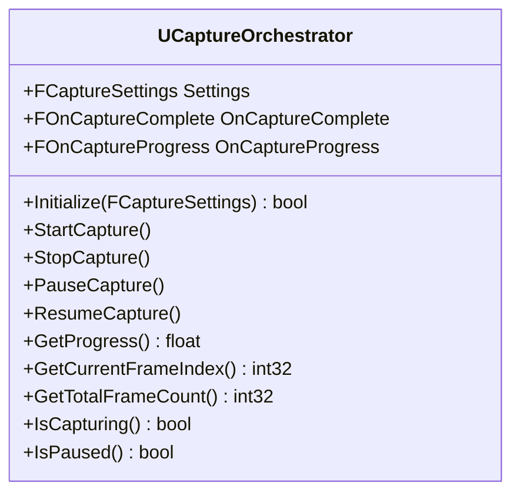
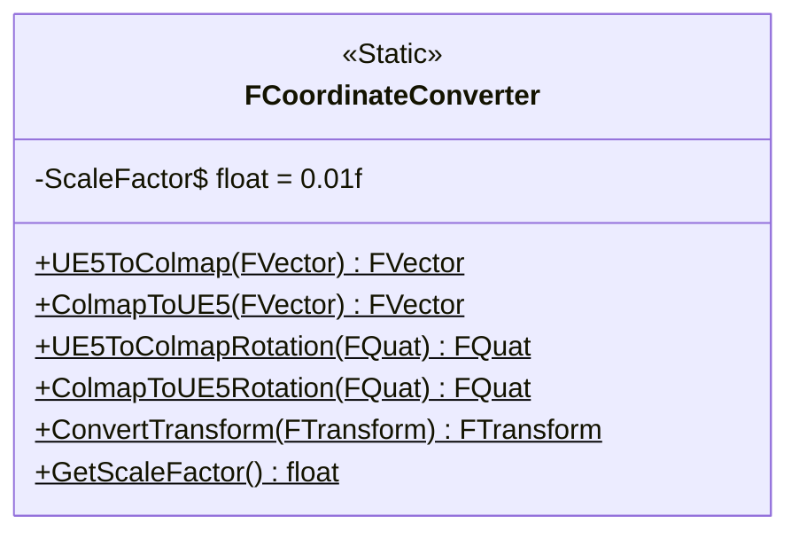
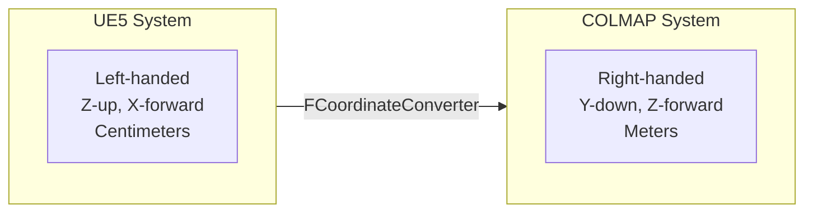
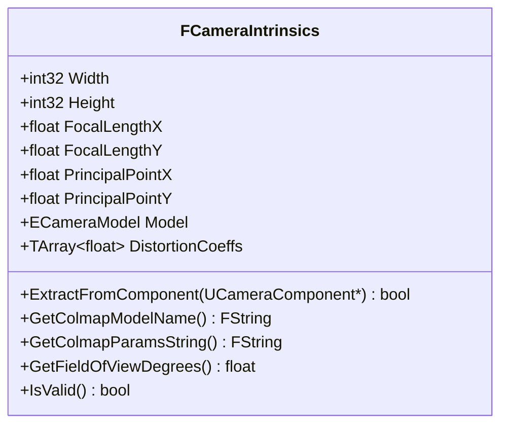
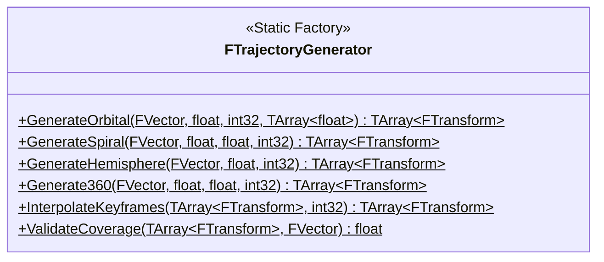
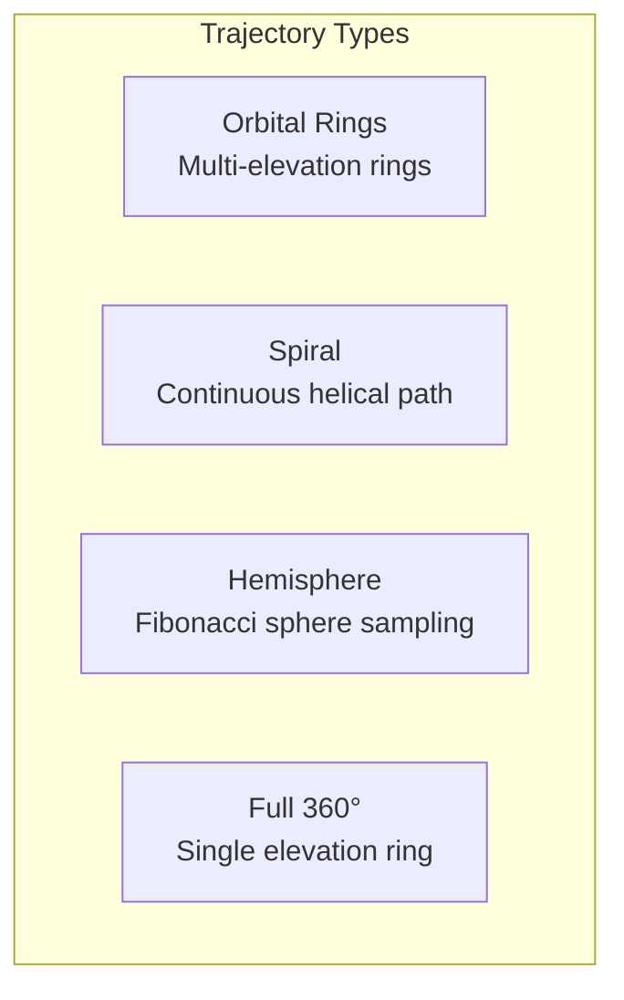
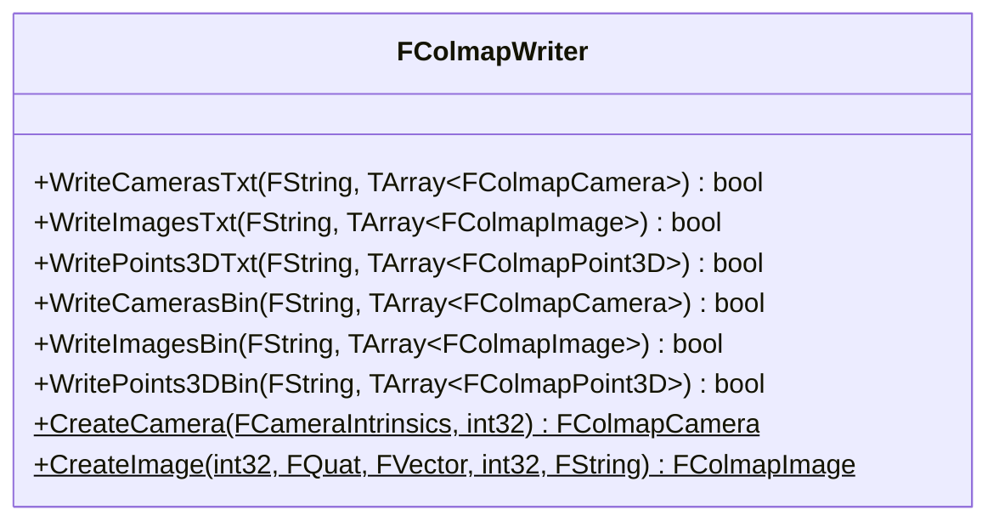
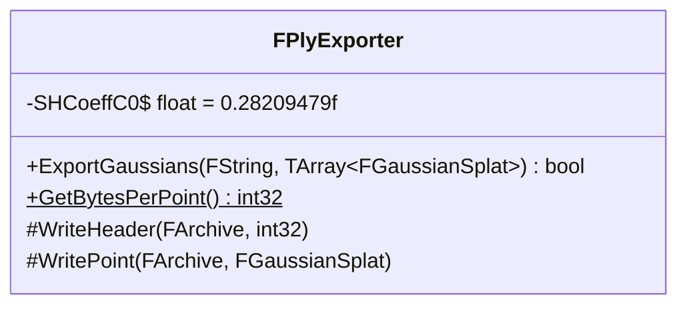

# API Reference

[← Back to Main README](../../README.md) | [← Architecture](../architecture/README.md) | [User Guide →](../guides/user-guide.md)

---

## Table of Contents

- [Core Classes](#core-classes)
- [Data Structures](#data-structures)
- [Enumerations](#enumerations)
- [Delegates](#delegates)
- [Module Functions](#module-functions)

---

## Core Classes

### UCaptureOrchestrator

Main capture controller that coordinates the entire export pipeline.



<details>
<summary><b>Public Methods</b></summary>

#### Initialize
```cpp
UFUNCTION(BlueprintCallable, Category = "UE5-3DGS")
bool Initialize(const FCaptureSettings& InSettings);
```
Initializes the orchestrator with capture settings. Must be called before `StartCapture()`.

**Parameters:**
| Name | Type | Description |
|------|------|-------------|
| `InSettings` | `const FCaptureSettings&` | Configuration for the capture session |

**Returns:** `true` if initialization successful, `false` otherwise.

---

#### StartCapture
```cpp
UFUNCTION(BlueprintCallable, Category = "UE5-3DGS")
void StartCapture();
```
Begins the asynchronous capture process. Broadcasts progress via `OnCaptureProgress` delegate.

---

#### StopCapture
```cpp
UFUNCTION(BlueprintCallable, Category = "UE5-3DGS")
void StopCapture();
```
Stops capture and discards incomplete data. For graceful stop with partial export, use `PauseCapture()` followed by manual flush.

---

#### GetProgress
```cpp
UFUNCTION(BlueprintCallable, Category = "UE5-3DGS")
float GetProgress() const;
```
**Returns:** Progress as float from 0.0 to 1.0.

</details>

<details>
<summary><b>Usage Example</b></summary>

```cpp
// Header
UPROPERTY()
UCaptureOrchestrator* Orchestrator;

// Implementation
void AMyActor::StartExport()
{
    FCaptureSettings Settings;
    Settings.OutputDirectory = TEXT("/Game/Exports/MyScene");
    Settings.ViewCount = 150;
    Settings.TrajectoryType = ETrajectoryType::Orbital;

    Orchestrator = NewObject<UCaptureOrchestrator>(this);

    if (Orchestrator->Initialize(Settings))
    {
        Orchestrator->OnCaptureComplete.AddDynamic(
            this, &AMyActor::OnExportComplete);
        Orchestrator->OnCaptureProgress.AddDynamic(
            this, &AMyActor::OnExportProgress);

        Orchestrator->StartCapture();
    }
}

void AMyActor::OnExportProgress(float Progress)
{
    UE_LOG(LogTemp, Log, TEXT("Export progress: %.1f%%"), Progress * 100.0f);
}

void AMyActor::OnExportComplete(bool bSuccess, const FString& OutputPath)
{
    if (bSuccess)
    {
        UE_LOG(LogTemp, Log, TEXT("Export complete: %s"), *OutputPath);
    }
}
```

</details>

---

### FCoordinateConverter

Static utility class for coordinate system transformations between UE5 and COLMAP conventions.



<details>
<summary><b>Static Methods</b></summary>

#### UE5ToColmap
```cpp
static FVector UE5ToColmap(const FVector& UE5Position);
```
Converts position from UE5 to COLMAP coordinate system.

**Transformation:**
```
COLMAP.X =  UE5.Y × 0.01  (right)
COLMAP.Y = -UE5.Z × 0.01  (down)
COLMAP.Z =  UE5.X × 0.01  (forward)
```

**Parameters:**
| Name | Type | Description |
|------|------|-------------|
| `UE5Position` | `const FVector&` | Position in UE5 coordinates (cm, LH, Z-up) |

**Returns:** Position in COLMAP coordinates (m, RH, Y-down)

---

#### UE5ToColmapRotation
```cpp
static FQuat UE5ToColmapRotation(const FQuat& UE5Rotation);
```
Converts rotation quaternion from UE5 to COLMAP convention.

**Parameters:**
| Name | Type | Description |
|------|------|-------------|
| `UE5Rotation` | `const FQuat&` | Rotation in UE5 left-handed system |

**Returns:** Rotation in COLMAP right-handed system

---

#### ConvertTransform
```cpp
static FTransform ConvertTransform(const FTransform& UE5Transform);
```
Converts complete transform (position + rotation + scale) to COLMAP coordinates.

</details>

<details>
<summary><b>Coordinate System Reference</b></summary>



| Axis | UE5 | COLMAP |
|------|-----|--------|
| Forward | +X | +Z |
| Right | +Y | +X |
| Up | +Z | -Y |
| Scale | cm | m |
| Handedness | Left | Right |

</details>

---

### FCameraIntrinsics

Represents camera intrinsic parameters compatible with COLMAP camera models.



<details>
<summary><b>Properties</b></summary>

| Property | Type | Description |
|----------|------|-------------|
| `Width` | `int32` | Image width in pixels |
| `Height` | `int32` | Image height in pixels |
| `FocalLengthX` | `float` | Horizontal focal length (fx) |
| `FocalLengthY` | `float` | Vertical focal length (fy) |
| `PrincipalPointX` | `float` | Principal point X (cx) |
| `PrincipalPointY` | `float` | Principal point Y (cy) |
| `Model` | `ECameraModel` | Camera model type |
| `DistortionCoeffs` | `TArray<float>` | Distortion coefficients |

</details>

<details>
<summary><b>Methods</b></summary>

#### ExtractFromComponent
```cpp
bool ExtractFromComponent(UCameraComponent* CameraComponent);
```
Extracts intrinsic parameters from a UE5 camera component.

**Parameters:**
| Name | Type | Description |
|------|------|-------------|
| `CameraComponent` | `UCameraComponent*` | Source camera component |

**Returns:** `true` if extraction successful

---

#### GetColmapModelName
```cpp
FString GetColmapModelName() const;
```
**Returns:** COLMAP model name string (`"PINHOLE"`, `"SIMPLE_RADIAL"`, etc.)

---

#### GetColmapParamsString
```cpp
FString GetColmapParamsString() const;
```
**Returns:** Space-separated parameter string for COLMAP `cameras.txt`

</details>

<details>
<summary><b>Camera Model Parameters</b></summary>

| Model | Parameters | COLMAP Format |
|-------|------------|---------------|
| `SIMPLE_PINHOLE` | f, cx, cy | `f cx cy` |
| `PINHOLE` | fx, fy, cx, cy | `fx fy cx cy` |
| `SIMPLE_RADIAL` | f, cx, cy, k | `f cx cy k` |
| `RADIAL` | f, cx, cy, k1, k2 | `f cx cy k1 k2` |
| `OPENCV` | fx, fy, cx, cy, k1, k2, p1, p2 | `fx fy cx cy k1 k2 p1 p2` |

</details>

---

### FTrajectoryGenerator

Static factory class for generating optimized camera trajectories.



<details>
<summary><b>Trajectory Types</b></summary>



#### GenerateOrbital
```cpp
static TArray<FTransform> GenerateOrbital(
    const FVector& TargetCenter,
    float Radius,
    int32 ViewCount,
    const TArray<float>& ElevationAngles = {-15.0f, 0.0f, 15.0f, 30.0f, 45.0f}
);
```
Generates camera positions on concentric orbital rings at different elevations.

**Parameters:**
| Name | Type | Description |
|------|------|-------------|
| `TargetCenter` | `const FVector&` | World position of target center |
| `Radius` | `float` | Orbit radius in centimeters |
| `ViewCount` | `int32` | Total number of views to generate |
| `ElevationAngles` | `const TArray<float>&` | Elevation angles in degrees |

**Returns:** Array of camera transforms looking at target

---

#### GenerateSpiral
```cpp
static TArray<FTransform> GenerateSpiral(
    const FVector& TargetCenter,
    float Radius,
    float HeightRange,
    int32 ViewCount
);
```
Generates a continuous spiral path around the target.

---

#### GenerateHemisphere
```cpp
static TArray<FTransform> GenerateHemisphere(
    const FVector& TargetCenter,
    float Radius,
    int32 ViewCount
);
```
Generates evenly distributed points on a hemisphere using Fibonacci sphere algorithm.

---

#### ValidateCoverage
```cpp
static float ValidateCoverage(
    const TArray<FTransform>& Trajectory,
    const FVector& TargetCenter
);
```
Estimates view coverage quality for 3DGS training.

**Returns:** Coverage score from 0.0 (poor) to 1.0 (optimal)

</details>

---

### FColmapWriter

Handles writing COLMAP-compatible output files.



<details>
<summary><b>Output Methods</b></summary>

#### WriteCamerasTxt
```cpp
bool WriteCamerasTxt(
    const FString& FilePath,
    const TArray<FColmapCamera>& Cameras
);
```
Writes cameras to COLMAP text format.

**Output Format:**
```
# Camera list with one line of data per camera:
#   CAMERA_ID, MODEL, WIDTH, HEIGHT, PARAMS[]
1 PINHOLE 1920 1080 1000.0 1000.0 960.0 540.0
```

---

#### WriteImagesTxt
```cpp
bool WriteImagesTxt(
    const FString& FilePath,
    const TArray<FColmapImage>& Images
);
```
Writes image poses to COLMAP text format.

**Output Format:**
```
# IMAGE_ID, QW, QX, QY, QZ, TX, TY, TZ, CAMERA_ID, NAME
# POINTS2D[] (empty for synthetic data)
1 0.851 0.325 -0.125 0.394 1.234 -0.567 2.891 1 frame_0000.png

```

</details>

---

### FPlyExporter

Exports 3D Gaussian Splatting PLY files.



<details>
<summary><b>PLY Export</b></summary>

#### ExportGaussians
```cpp
bool ExportGaussians(
    const FString& FilePath,
    const TArray<FGaussianSplat>& Gaussians
);
```
Exports array of Gaussian splats to binary PLY format.

**Parameters:**
| Name | Type | Description |
|------|------|-------------|
| `FilePath` | `const FString&` | Output file path |
| `Gaussians` | `const TArray<FGaussianSplat>&` | Array of Gaussian splat data |

**Returns:** `true` if export successful

**PLY Structure (236 bytes per point):**
| Field | Size | Type | Description |
|-------|------|------|-------------|
| Position | 12 | 3×float | x, y, z |
| Normal | 12 | 3×float | nx, ny, nz |
| DC SH | 12 | 3×float | f_dc_0, f_dc_1, f_dc_2 |
| Rest SH | 180 | 45×float | f_rest_0 ... f_rest_44 |
| Opacity | 4 | float | opacity |
| Scale | 12 | 3×float | scale_0, scale_1, scale_2 |
| Rotation | 16 | 4×float | rot_0, rot_1, rot_2, rot_3 |

</details>

---

## Data Structures

### FCaptureSettings

```cpp
USTRUCT(BlueprintType)
struct UNREALTOGAUSSIAN_API FCaptureSettings
{
    GENERATED_BODY()

    // Output
    UPROPERTY(EditAnywhere, Category = "Output")
    FString OutputDirectory;

    UPROPERTY(EditAnywhere, Category = "Output")
    EExportFormat ExportFormat = EExportFormat::COLMAP_Text;

    // Image
    UPROPERTY(EditAnywhere, Category = "Image")
    int32 ImageWidth = 1920;

    UPROPERTY(EditAnywhere, Category = "Image")
    int32 ImageHeight = 1080;

    // Trajectory
    UPROPERTY(EditAnywhere, Category = "Trajectory")
    ETrajectoryType TrajectoryType = ETrajectoryType::Orbital;

    UPROPERTY(EditAnywhere, Category = "Trajectory")
    int32 ViewCount = 150;

    UPROPERTY(EditAnywhere, Category = "Trajectory")
    float OrbitRadius = 500.0f;

    // Target
    UPROPERTY(EditAnywhere, Category = "Target")
    AActor* TargetActor = nullptr;
};
```

---

### FColmapCamera

```cpp
struct UNREALTOGAUSSIAN_API FColmapCamera
{
    int32 CameraId = 1;
    FCameraIntrinsics Intrinsics;
    bool bIsShared = true;
    FString Model;
    int32 Width = 0;
    int32 Height = 0;
    FString Params;
};
```

---

### FColmapImage

```cpp
struct UNREALTOGAUSSIAN_API FColmapImage
{
    int32 ImageId;
    FQuat Rotation;      // (qw, qx, qy, qz)
    FVector Translation;
    int32 CameraId;
    FString Name;
};
```

---

### FGaussianSplat

```cpp
struct UNREALTOGAUSSIAN_API FGaussianSplat
{
    FVector Position;
    FVector Normal;
    FVector ColorDC;           // DC spherical harmonics
    TArray<float> ColorRest;   // 45 higher-order SH coefficients
    float Opacity;
    FVector Scale;
    FQuat Rotation;
};
```

---

## Enumerations

### ECameraModel

```cpp
UENUM(BlueprintType)
enum class ECameraModel : uint8
{
    SIMPLE_PINHOLE,    // f, cx, cy
    PINHOLE,           // fx, fy, cx, cy
    SIMPLE_RADIAL,     // f, cx, cy, k
    RADIAL,            // f, cx, cy, k1, k2
    OPENCV,            // fx, fy, cx, cy, k1, k2, p1, p2
    OPENCV_FISHEYE     // fx, fy, cx, cy, k1, k2, k3, k4
};
```

### ETrajectoryType

```cpp
UENUM(BlueprintType)
enum class ETrajectoryType : uint8
{
    Orbital,      // Concentric rings at multiple elevations
    Spiral,       // Continuous helical path
    Hemisphere,   // Fibonacci sphere sampling
    Full360,      // Single elevation 360° ring
    Custom        // User-provided trajectory
};
```

### EExportFormat

```cpp
UENUM(BlueprintType)
enum class EExportFormat : uint8
{
    COLMAP_Text,    // cameras.txt, images.txt, points3D.txt
    COLMAP_Binary,  // cameras.bin, images.bin, points3D.bin
    PLY_3DGS,       // 3D Gaussian Splatting PLY
    All             // Export all formats
};
```

---

## Delegates

### FOnCaptureComplete

```cpp
DECLARE_DYNAMIC_MULTICAST_DELEGATE_TwoParams(
    FOnCaptureComplete,
    bool, bSuccess,
    const FString&, OutputPath
);
```

### FOnCaptureProgress

```cpp
DECLARE_DYNAMIC_MULTICAST_DELEGATE_OneParam(
    FOnCaptureProgress,
    float, Progress
);
```

### FOnFrameCaptured

```cpp
DECLARE_DYNAMIC_MULTICAST_DELEGATE_TwoParams(
    FOnFrameCaptured,
    int32, FrameIndex,
    const FString&, ImagePath
);
```

---

## Module Functions

### UE5_3DGS Module

```cpp
// Get module instance
IUE5_3DGSModule& Module = FModuleManager::GetModuleChecked<IUE5_3DGSModule>("UE5_3DGS");

// Check if module is loaded
bool bLoaded = FModuleManager::Get().IsModuleLoaded("UE5_3DGS");
```

---

## Related Documentation

| Document | Description |
|----------|-------------|
| [Architecture Guide](../architecture/README.md) | System design overview |
| [Format Specifications](../reference/formats.md) | COLMAP and PLY details |
| [Coordinate Systems](../reference/coordinates.md) | Math reference |
| [User Guide](../guides/user-guide.md) | Usage instructions |

---

[← Back to Main README](../../README.md) | [← Architecture](../architecture/README.md) | [User Guide →](../guides/user-guide.md)
