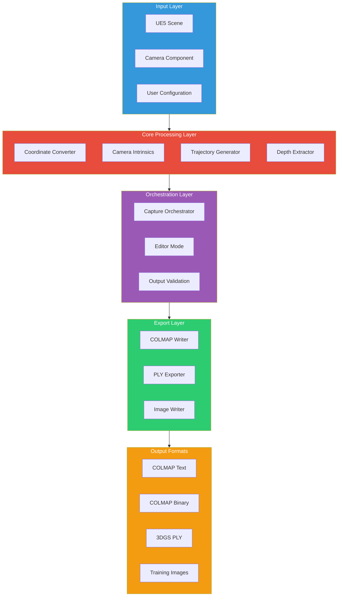
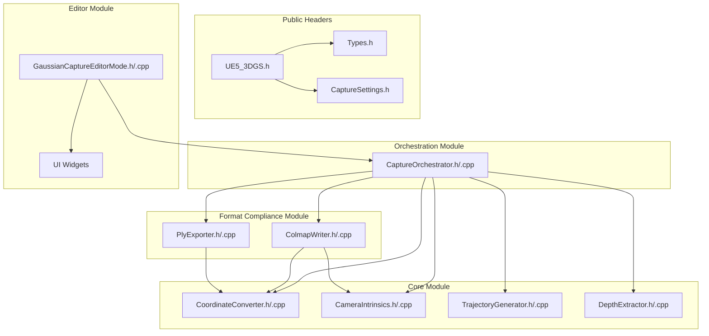
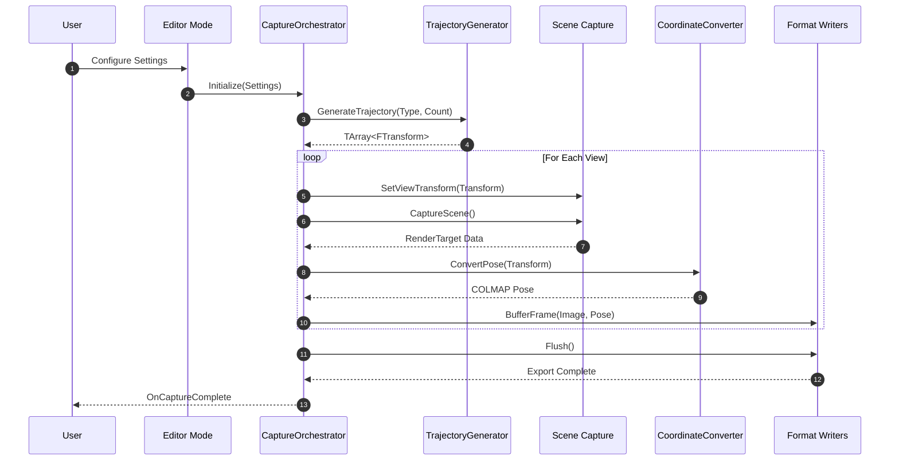
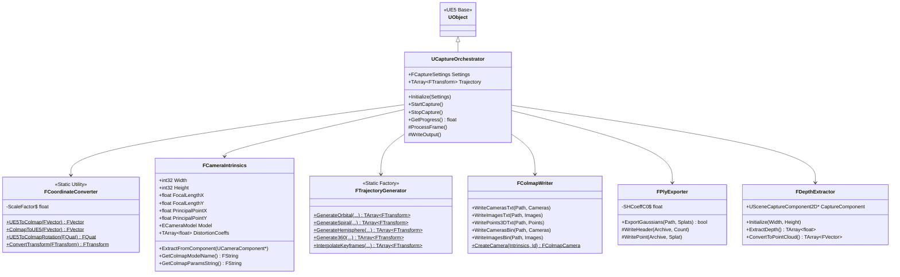
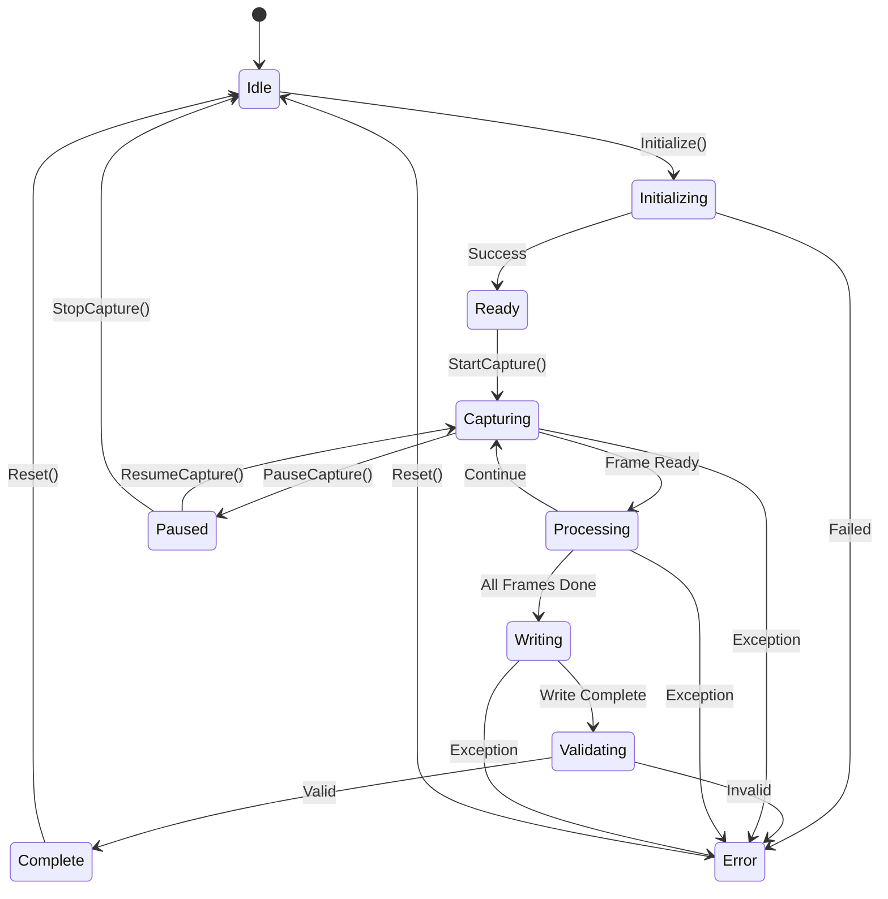
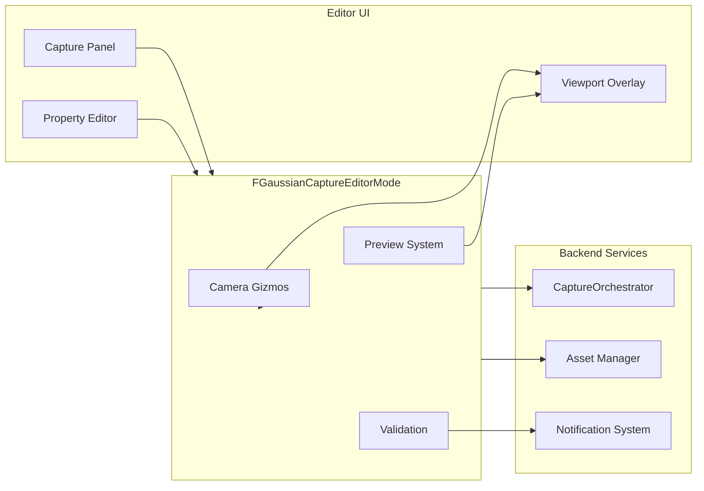
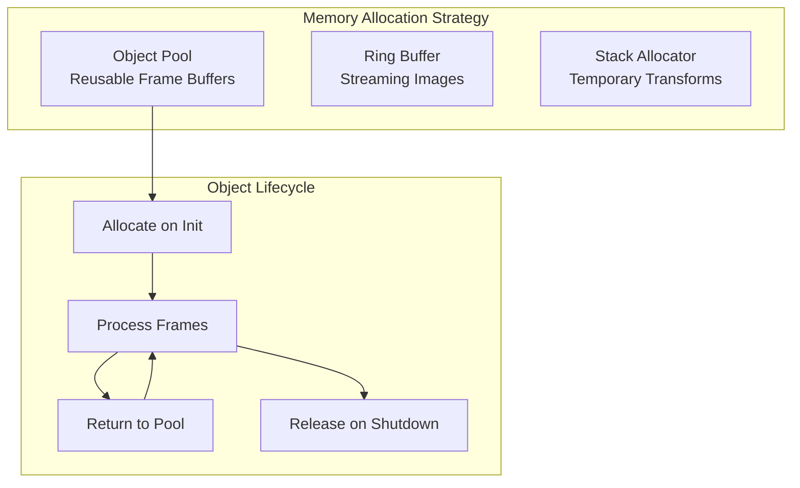
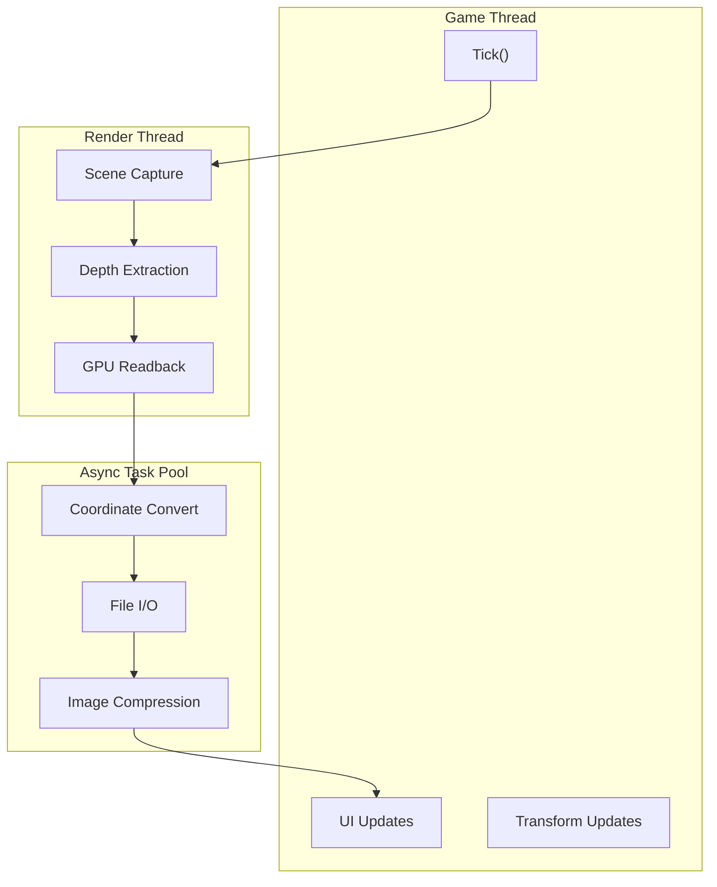
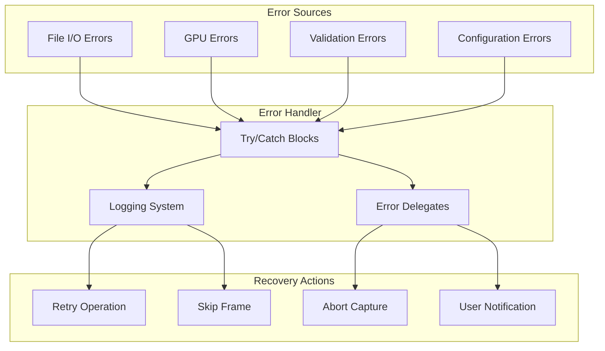

# Architecture Guide

[← Back to Main README](../../README.md) | [API Reference →](../api/README.md)

---

## System Architecture Overview

UE5-3DGS follows a modular pipeline architecture designed for extensibility, testability, and production reliability.

---

## Module Dependency Graph

---

## Data Flow Pipeline

---

## Class Hierarchy

---

## State Machine: Capture Process

---

## Component Interaction: Editor Mode

---

## Memory Management

**Key Considerations:**
- Frame buffers pooled to avoid allocation during capture
- Ring buffer for image streaming to disk
- RAII patterns for resource management
- Weak references for UObject interactions

---

## Threading Model

---

## Error Handling Architecture

---

## Extension Points

| Extension Point | Description | Implementation |
|-----------------|-------------|----------------|
| Custom Trajectory | User-defined camera paths | Implement `ITrajectoryProvider` |
| Export Format | New output formats | Extend `FExportWriter` |
| Validation Rules | Custom validation | Add to `FOutputValidator` |
| Post-Processing | Image filters | Register with `FCapturePostProcess` |

---

## Related Documentation

| Document | Description |
|----------|-------------|
| [API Reference](../api/README.md) | Complete API documentation |
| [Coordinate Systems](../reference/coordinates.md) | Transformation mathematics |
| [Format Specifications](../reference/formats.md) | COLMAP and PLY details |
| [User Guide](../guides/user-guide.md) | Step-by-step usage |

---

[← Back to Main README](../../README.md) | [API Reference →](../api/README.md)
