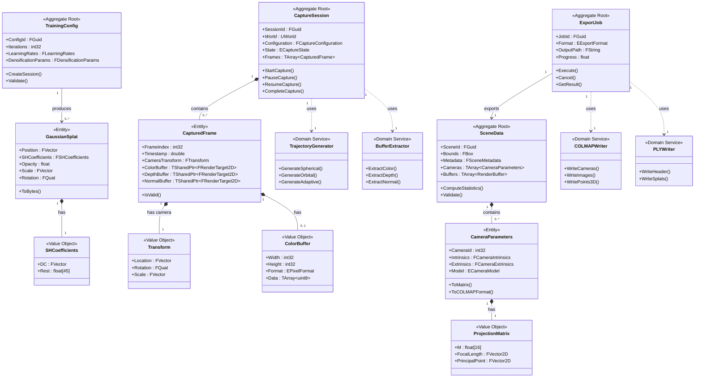

# Domain Model Overview

## UE5-3DGS Domain Model

This document describes the core domain model for the UE5-3DGS pipeline, which bridges Unreal Engine 5 rendering with 3D Gaussian Splatting representation generation.

## Domain Vision Statement

The UE5-3DGS domain enables the transformation of polygon-based UE5 scenes into neural radiance field representations through systematic camera capture, data extraction, and format conversion pipelines.

## Core Domain Concepts

### Primary Domains

1. **Scene Capture Domain** - Orchestrates camera trajectory generation and frame rendering
2. **Data Extraction Domain** - Handles buffer extraction and coordinate system conversion
3. **Format Conversion Domain** - Manages export to COLMAP, PLY, and training formats
4. **Training Domain** (Optional) - Provides in-engine 3DGS training capabilities

## Domain Model Diagram



## Ubiquitous Language

| Term | Definition |
|------|------------|
| **Capture Session** | A complete capture workflow from start to completion, containing all frames |
| **Captured Frame** | A single rendered image with associated camera parameters and metadata |
| **Camera Intrinsics** | Internal camera parameters (focal length, principal point, distortion) |
| **Camera Extrinsics** | External camera parameters (position, rotation in world space) |
| **Scene Data** | Aggregated extraction results from a capture session |
| **Export Job** | An asynchronous operation converting scene data to output format |
| **Gaussian Splat** | A single 3D gaussian primitive with position, colour, opacity, and shape |
| **Spherical Harmonics** | Basis functions encoding view-dependent colour in 3DGS |
| **Trajectory** | A planned sequence of camera poses for scene coverage |
| **Coverage** | Percentage of scene geometry visible in captured frames |
| **COLMAP Format** | Standard camera pose format used by 3DGS training pipelines |

## Domain Boundaries

```
┌─────────────────────────────────────────────────────────────────────────┐
│                        UE5-3DGS Domain                                  │
├─────────────────────────────────────────────────────────────────────────┤
│                                                                         │
│  ┌──────────────────┐    ┌──────────────────┐    ┌──────────────────┐  │
│  │  Scene Capture   │───▶│ Data Extraction  │───▶│ Format Conversion│  │
│  │    Context       │    │    Context       │    │    Context       │  │
│  └──────────────────┘    └──────────────────┘    └──────────────────┘  │
│           │                       │                       │            │
│           │                       │                       │            │
│           ▼                       ▼                       ▼            │
│  CaptureSession           SceneData                ExportJob          │
│  CapturedFrame            CameraParameters         COLMAPWriter       │
│  TrajectoryGenerator      BufferExtractor          PLYWriter          │
│                                                                         │
│  ┌─────────────────────────────────────────────────────────────────┐   │
│  │                    Training Context (Optional)                   │   │
│  │              TrainingConfig, GaussianSplat, Optimizer            │   │
│  └─────────────────────────────────────────────────────────────────┘   │
│                                                                         │
└─────────────────────────────────────────────────────────────────────────┘
```

## Integration Points

### External Systems

1. **Unreal Engine 5**
   - Render pipeline integration for buffer extraction
   - Scene component enumeration
   - Editor mode and toolbar extension

2. **COLMAP**
   - Text and binary format export compatibility
   - Camera model support (PINHOLE, OPENCV)

3. **3DGS Training Pipelines**
   - `gaussian-splatting` reference implementation
   - `gsplat` CUDA rasterizer
   - Custom training configurations

### Anti-Corruption Layers

```cpp
// Coordinate system conversion layer
class FDEM_CoordinateConverter
{
public:
    static FMatrix ConvertUE5ToCOLMAP(const FTransform& UE5Transform);
    static FTransform ConvertCOLMAPToUE5(const FMatrix& COLMAPTransform);

    static FVector ConvertPosition(
        const FVector& Position,
        EDEM_CoordinateConvention From,
        EDEM_CoordinateConvention To
    );

    static FQuat ConvertRotation(
        const FQuat& Rotation,
        EDEM_CoordinateConvention From,
        EDEM_CoordinateConvention To
    );
};
```

## Domain Events Flow

```
CaptureStarted
    │
    ├──▶ FrameRendered (for each frame)
    │         │
    │         └──▶ BufferExtracted
    │
    └──▶ CaptureCompleted
              │
              └──▶ ExportStarted
                        │
                        ├──▶ CamerasWritten
                        ├──▶ ImagesWritten
                        └──▶ ExportCompleted
                                  │
                                  └──▶ TrainingStarted (optional)
                                            │
                                            ├──▶ IterationCompleted
                                            └──▶ TrainingCompleted
```
