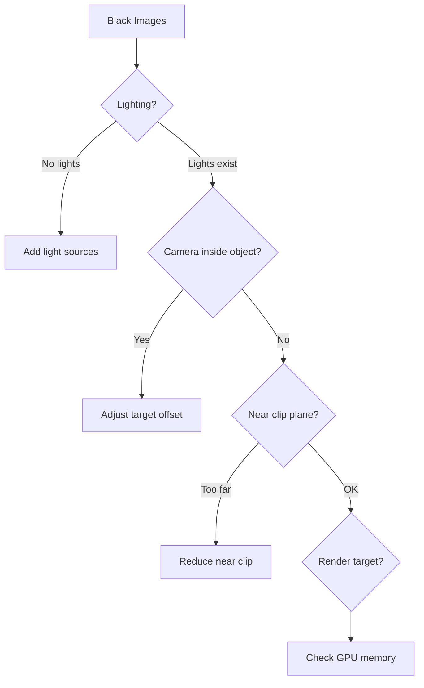
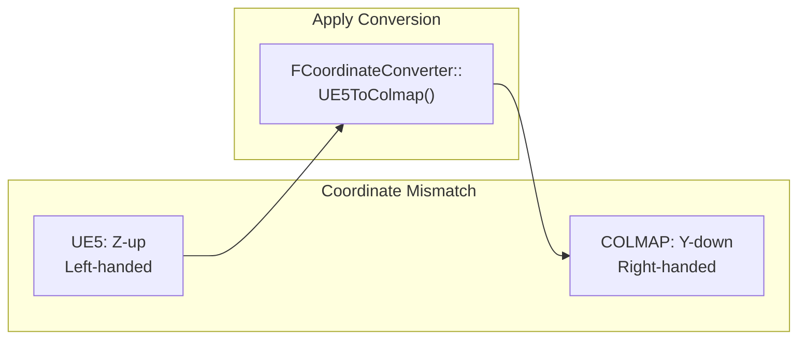

# Troubleshooting Guide

[← Back to Main README](../../README.md) | [← User Guide](user-guide.md) | [Format Reference →](../reference/formats.md)

---

## Common Issues

### Build & Compilation

<details>
<summary><b>Plugin fails to compile</b></summary>

**Symptoms:**
- Build errors referencing UE5_3DGS module
- Missing header files
- Linker errors

**Solutions:**

1. **Regenerate project files:**
   ```bash
   # Windows
   GenerateProjectFiles.bat

   # macOS
   ./GenerateProjectFiles.sh
   ```

2. **Verify engine version:**
   - UE5-3DGS requires UE5.3 or later
   - Check `UE5_3DGS.uplugin` for version requirements

3. **Clean rebuild:**
   ```bash
   # Delete intermediate files
   rm -rf Intermediate/
   rm -rf Binaries/

   # Rebuild
   MSBuild.exe YourProject.sln /t:Rebuild
   ```

</details>

<details>
<summary><b>Module not found at runtime</b></summary>

**Symptoms:**
- "Module 'UE5_3DGS' not found" error
- Plugin listed but not loading

**Solutions:**

1. **Check plugin enable status:**
   - Edit → Plugins → Search "UE5-3DGS"
   - Ensure checkbox is enabled
   - Restart editor

2. **Verify .uproject dependencies:**
   ```json
   {
     "Plugins": [
       {
         "Name": "UE5_3DGS",
         "Enabled": true
       }
     ]
   }
   ```

3. **Check build configuration:**
   - Ensure building for correct platform
   - Verify Development/Shipping configurations

</details>

---

### Capture Issues

<details>
<summary><b>Capture produces black images</b></summary>

**Symptoms:**
- All exported images are black
- Capture appears to complete successfully
- No errors in log

**Causes & Solutions:**



1. **Verify scene lighting:**
   ```cpp
   // Ensure scene has light sources
   Settings.bDisableDefaultLighting = false;
   ```

2. **Check camera position:**
   ```cpp
   // Add offset if camera inside target bounds
   Settings.TargetOffset = FVector(0, 0, 100);
   ```

3. **Adjust near clip plane:**
   ```cpp
   Settings.NearClipPlane = 10.0f;  // Default may be too high
   ```

</details>

<details>
<summary><b>Capture crashes midway</b></summary>

**Symptoms:**
- Editor crashes during capture
- Partial output generated
- GPU driver reset

**Solutions:**

1. **Reduce concurrent captures:**
   ```cpp
   Settings.MaxConcurrentCaptures = 1;  // Reduce from default 4
   Settings.bUseAsyncCapture = false;   // Disable async
   ```

2. **Lower resolution:**
   ```cpp
   Settings.ImageWidth = 1280;
   Settings.ImageHeight = 720;
   ```

3. **Increase GPU timeout:**
   - NVIDIA Control Panel → Manage 3D Settings
   - Set "Timeout Detection and Recovery" higher

4. **Check GPU memory:**
   ```cpp
   // Add to log GPU memory usage
   UE_LOG(LogTemp, Log, TEXT("GPU Memory: %d MB"),
       GRHIGlobals.GetTexturePoolSize() / (1024 * 1024));
   ```

</details>

<details>
<summary><b>Slow capture performance</b></summary>

**Symptoms:**
- Capture takes hours for 150 images
- Low GPU utilization
- I/O bottleneck

**Solutions:**

1. **Use SSD for output:**
   ```cpp
   // Avoid network or HDD paths
   Settings.OutputDirectory = TEXT("D:/Exports");  // Local SSD
   ```

2. **Enable async I/O:**
   ```cpp
   Settings.bUseAsyncIO = true;
   Settings.IOBufferSize = 16 * 1024 * 1024;  // 16MB buffer
   ```

3. **Reduce post-processing:**
   ```cpp
   Settings.bDisablePostProcessing = true;
   Settings.bDisableMotionBlur = true;
   Settings.bDisableDOF = true;
   ```

4. **Use JPEG for faster writes:**
   ```cpp
   Settings.ImageFormat = EImageFormat::JPEG;
   Settings.JpegQuality = 95;
   ```

</details>

---

### Export Format Issues

<details>
<summary><b>COLMAP fails to read output</b></summary>

**Symptoms:**
- COLMAP "Invalid camera model" error
- "Failed to read images.txt"
- Empty reconstruction

**Solutions:**

1. **Verify format compliance:**
   ```bash
   # Check cameras.txt format
   head -5 cameras.txt
   # Should show: # Camera list...
   ```

2. **Check image paths:**
   - COLMAP expects relative paths in images.txt
   - Ensure images/ subdirectory exists

3. **Validate quaternions:**
   ```cpp
   // Quaternions must be normalized
   FQuat Rot = Transform.GetRotation();
   if (!Rot.IsNormalized())
   {
       Rot.Normalize();
   }
   ```

4. **Use COLMAP's database import:**
   ```bash
   colmap feature_extractor \
       --database_path ./database.db \
       --image_path ./images

   colmap exhaustive_matcher \
       --database_path ./database.db

   colmap model_converter \
       --input_path ./sparse/0 \
       --output_path ./text \
       --output_type TXT
   ```

</details>

<details>
<summary><b>3DGS training fails with exported PLY</b></summary>

**Symptoms:**
- "Invalid PLY header"
- Training crashes on load
- Zero gaussians loaded

**Solutions:**

1. **Verify PLY byte count:**
   ```cpp
   // Each point must be exactly 236 bytes
   static_assert(sizeof(FGaussianSplat) == 236,
       "PLY point size mismatch");
   ```

2. **Check endianness:**
   ```cpp
   // Must be little-endian
   // Header: format binary_little_endian 1.0
   ```

3. **Validate SH coefficients:**
   ```cpp
   // DC coefficients from normalized RGB [0,1]
   const float C0 = 0.28209479177387814f;
   float sh_dc = (rgb - 0.5f) / C0;
   ```

4. **Use text PLY for debugging:**
   ```cpp
   Settings.bUsePlyTextFormat = true;  // Slower but readable
   ```

</details>

---

### Coordinate System Issues

<details>
<summary><b>Scene appears rotated/flipped in COLMAP</b></summary>

**Symptoms:**
- Reconstructed scene upside down
- Objects rotated 90°
- Mirrored geometry

**Solutions:**



1. **Verify conversion is applied:**
   ```cpp
   // Positions
   FVector ColmapPos = FCoordinateConverter::UE5ToColmap(UE5Pos);

   // Rotations
   FQuat ColmapRot = FCoordinateConverter::UE5ToColmapRotation(UE5Rot);
   ```

2. **Check rotation order:**
   - COLMAP uses (qw, qx, qy, qz) - scalar first
   - UE5 uses (qx, qy, qz, qw) - scalar last

3. **Debug with known transforms:**
   ```cpp
   // Identity in UE5 should produce specific COLMAP output
   FTransform Identity = FTransform::Identity;
   FTransform Converted = FCoordinateConverter::ConvertTransform(Identity);
   // Verify expected values
   ```

</details>

<details>
<summary><b>Scale mismatch between UE5 and output</b></summary>

**Symptoms:**
- Objects appear tiny in COLMAP viewer
- Training produces wrong-sized reconstruction
- Camera positions seem wrong

**Solutions:**

1. **Verify scale conversion:**
   ```cpp
   // UE5 uses centimeters, COLMAP uses meters
   // Scale factor: 0.01
   FVector ColmapPos = UE5Pos * 0.01f;
   ```

2. **Check orbit radius units:**
   ```cpp
   // OrbitRadius is in centimeters
   Settings.OrbitRadius = 500.0f;  // 5 meters
   ```

3. **Apply consistent scaling:**
   ```cpp
   const float ScaleFactor = FCoordinateConverter::GetScaleFactor();
   // Use consistently throughout pipeline
   ```

</details>

---

### Editor Integration Issues

<details>
<summary><b>Capture panel not appearing</b></summary>

**Symptoms:**
- Window menu doesn't show UE5-3DGS option
- Panel opens but is empty
- UI elements missing

**Solutions:**

1. **Restart editor after plugin enable**
2. **Reset editor layout:**
   - Window → Load Layout → Default
3. **Check Slate UI initialization:**
   ```cpp
   // Verify in startup log
   LogSlate: Registered window: UE5_3DGS_CapturePanel
   ```

</details>

<details>
<summary><b>Camera gizmos not visible</b></summary>

**Symptoms:**
- Preview generates but no visualization
- Gizmos appear then disappear
- Wrong viewport selected

**Solutions:**

1. **Enable editor mode visualizations:**
   - Show → Advanced → Editor Sprites
2. **Check correct viewport:**
   - Gizmos only appear in active viewport
   - Click viewport to focus
3. **Verify gizmo scale:**
   ```cpp
   Settings.GizmoScale = 1.0f;  // Increase if too small
   ```

</details>

---

## Diagnostic Tools

### Logging

Enable verbose logging:

```cpp
// In your code
UE_LOG(LogUE5_3DGS, Verbose, TEXT("Capture frame %d"), FrameIndex);

// In DefaultEngine.ini
[Core.Log]
LogUE5_3DGS=VeryVerbose
```

### Validation Commands

```bash
# Validate COLMAP output
colmap model_analyzer \
    --input_path ./sparse/0 \
    --output_path ./analysis

# Check image EXIF data
exiftool ./images/frame_0000.png

# Verify PLY structure
head -20 output.ply
```

### Debug Visualization

```cpp
// Enable debug drawing
Settings.bDrawDebugInfo = true;
Settings.bDrawCameraFrustums = true;
Settings.bDrawTrajectoryPath = true;
Settings.bLogCameraTransforms = true;
```

---

## Error Reference

| Error Code | Message | Cause | Solution |
|------------|---------|-------|----------|
| E001 | "Invalid output directory" | Path doesn't exist | Create directory first |
| E002 | "Target actor is null" | No target specified | Set TargetActor or CustomCenter |
| E003 | "Zero view count" | ViewCount = 0 | Set ViewCount > 0 |
| E004 | "Render target allocation failed" | GPU memory exhausted | Reduce resolution |
| E005 | "File write failed" | Disk full or permissions | Check disk space/permissions |
| E006 | "Invalid camera model" | Unsupported model type | Use supported ECameraModel |
| E007 | "Quaternion not normalized" | Rotation data invalid | Call Normalize() |
| E008 | "Capture timeout" | Frame took too long | Increase timeout or reduce quality |

---

## Getting Help

### Support Channels

1. **GitHub Issues**: [yourusername/UE5-3DGS/issues](https://github.com/yourusername/UE5-3DGS/issues)
2. **Discussions**: [yourusername/UE5-3DGS/discussions](https://github.com/yourusername/UE5-3DGS/discussions)
3. **Documentation**: [docs/](../README.md)

### Information to Include in Bug Reports

```markdown
**Environment:**
- UE5 Version: [e.g., 5.3.2]
- Plugin Version: [e.g., 1.0.0]
- OS: [e.g., Windows 11]
- GPU: [e.g., RTX 4090]

**Steps to Reproduce:**
1. ...
2. ...

**Expected Behavior:**
...

**Actual Behavior:**
...

**Logs:**
```
[paste relevant logs]
```

**Settings Used:**
```cpp
FCaptureSettings Settings;
Settings.ViewCount = ...;
// etc.
```
```

---

[← Back to Main README](../../README.md) | [← User Guide](user-guide.md) | [Format Reference →](../reference/formats.md)
