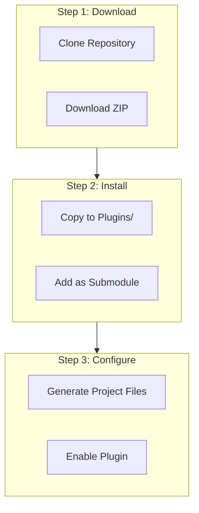
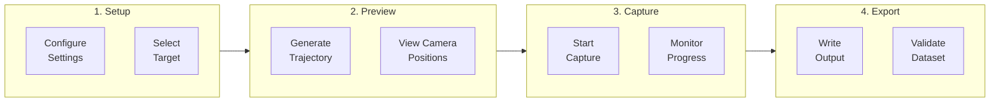
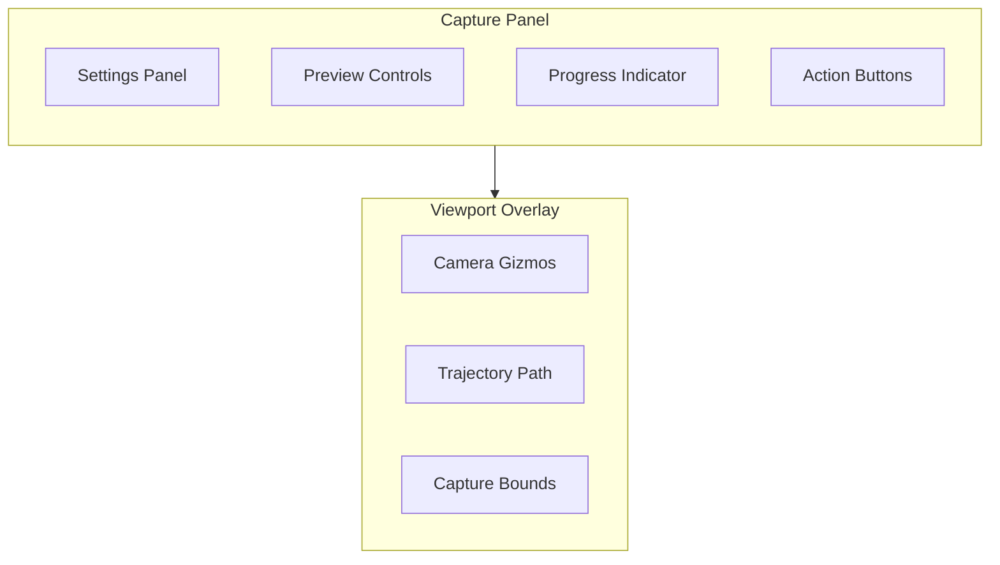
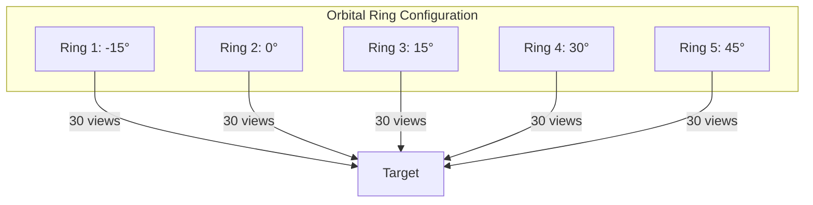
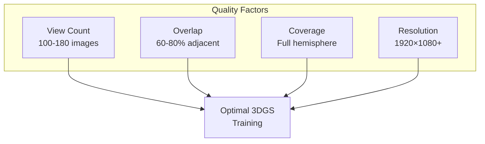
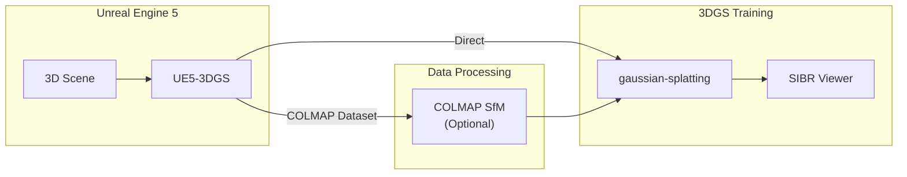

# User Guide

[← Back to Main README](../../README.md) | [← API Reference](../api/README.md) | [Troubleshooting →](troubleshooting.md)

---

## Table of Contents

- [Installation](#installation)
- [Quick Start](#quick-start)
- [Editor Mode](#editor-mode)
- [Configuration](#configuration)
- [Trajectory Types](#trajectory-types)
- [Export Formats](#export-formats)
- [Best Practices](#best-practices)
- [Workflow Integration](#workflow-integration)

---

## Installation

### Prerequisites

- Unreal Engine 5.3 or later
- Visual Studio 2022 (Windows) or Xcode 14+ (macOS)
- 8GB+ RAM recommended
- SSD storage for optimal capture performance

### Installation Steps



<details>
<summary><b>Option A: Clone to Plugins Folder</b></summary>

```bash
cd YourProject/Plugins
git clone https://github.com/yourusername/UE5-3DGS.git
```

</details>

<details>
<summary><b>Option B: Git Submodule</b></summary>

```bash
git submodule add https://github.com/yourusername/UE5-3DGS.git Plugins/UE5_3DGS
git submodule update --init --recursive
```

</details>

<details>
<summary><b>Option C: Download ZIP</b></summary>

1. Download from GitHub releases
2. Extract to `YourProject/Plugins/UE5_3DGS/`
3. Regenerate project files

</details>

### Verify Installation

1. Open your project in UE5 Editor
2. Navigate to Edit → Plugins
3. Search for "UE5-3DGS"
4. Verify the plugin is enabled

---

## Quick Start

### Minimal Code Example

```cpp
#include "UE5_3DGS.h"

void ExportScene()
{
    // 1. Configure settings
    FCaptureSettings Settings;
    Settings.OutputDirectory = FPaths::ProjectSavedDir() / TEXT("Exports");
    Settings.ViewCount = 150;

    // 2. Create orchestrator
    UCaptureOrchestrator* Orchestrator = NewObject<UCaptureOrchestrator>();
    Orchestrator->Initialize(Settings);

    // 3. Start capture
    Orchestrator->StartCapture();
}
```

### Step-by-Step Workflow



---

## Editor Mode

### Opening the Capture Panel

1. Go to **Window** → **UE5-3DGS Capture Panel**
2. Or use the keyboard shortcut: `Ctrl+Shift+G`

### Panel Overview



### Settings Panel

| Section | Options |
|---------|---------|
| **Output** | Directory, format, naming convention |
| **Image** | Resolution, format (PNG/EXR), quality |
| **Trajectory** | Type, view count, radius, elevations |
| **Target** | Actor selection, offset, bounds |
| **Advanced** | Depth capture, point cloud, threading |

### Preview System

1. Click **Generate Preview** to visualize camera positions
2. Camera gizmos appear in the viewport
3. Blue lines show the trajectory path
4. Green frustums indicate capture bounds

### Starting Capture

1. Click **Start Capture**
2. Progress bar shows completion percentage
3. Real-time frame counter displays progress
4. Click **Stop** to cancel (discards incomplete data)

---

## Configuration

### FCaptureSettings Reference

<details>
<summary><b>Output Settings</b></summary>

```cpp
// Output directory (supports project-relative paths)
Settings.OutputDirectory = TEXT("/Game/Exports/Scene01");

// Export format
Settings.ExportFormat = EExportFormat::COLMAP_Text;
// Options: COLMAP_Text, COLMAP_Binary, PLY_3DGS, All

// Image naming convention
Settings.ImagePrefix = TEXT("frame_");
Settings.ImagePadding = 4;  // frame_0001.png
```

</details>

<details>
<summary><b>Image Settings</b></summary>

```cpp
// Resolution
Settings.ImageWidth = 1920;   // 256-8192
Settings.ImageHeight = 1080;  // 256-8192

// Format
Settings.ImageFormat = EImageFormat::PNG;
// Options: PNG, JPEG, EXR

// Quality (JPEG only)
Settings.JpegQuality = 95;  // 1-100
```

</details>

<details>
<summary><b>Trajectory Settings</b></summary>

```cpp
// Trajectory type
Settings.TrajectoryType = ETrajectoryType::Orbital;

// View count (impacts training quality)
Settings.ViewCount = 150;  // 100-180 recommended

// Orbit parameters
Settings.OrbitRadius = 500.0f;  // 5 meters
Settings.ElevationAngles = {-15.0f, 0.0f, 15.0f, 30.0f, 45.0f};
```

</details>

<details>
<summary><b>Target Settings</b></summary>

```cpp
// Target actor (center of capture)
Settings.TargetActor = MyActor;

// Offset from actor origin
Settings.TargetOffset = FVector(0, 0, 100);

// Custom center (overrides actor)
Settings.bUseCustomCenter = true;
Settings.CustomCenter = FVector(0, 0, 200);
```

</details>

<details>
<summary><b>Advanced Settings</b></summary>

```cpp
// Depth capture
Settings.bCaptureDepth = true;
Settings.MaxDepthDistance = 10000.0f;  // 100 meters

// Point cloud generation
Settings.bGeneratePointCloud = false;
Settings.PointCloudDensity = 1000000;

// Threading
Settings.bUseAsyncCapture = true;
Settings.MaxConcurrentCaptures = 4;
```

</details>

---

## Trajectory Types

### Comparison Chart

| Type | Best For | View Distribution | Coverage |
|------|----------|-------------------|----------|
| **Orbital** | Objects | Ring-based | Excellent |
| **Spiral** | Interiors | Continuous | Good |
| **Hemisphere** | Outdoor | Even spherical | Excellent |
| **Full 360°** | Products | Single ring | Moderate |
| **Custom** | Special | User-defined | Variable |

### Orbital Rings



**Configuration:**
```cpp
Settings.TrajectoryType = ETrajectoryType::Orbital;
Settings.ViewCount = 150;
Settings.ElevationAngles = {-15.0f, 0.0f, 15.0f, 30.0f, 45.0f};
// Result: 30 views per ring × 5 rings = 150 views
```

### Spiral Path

Continuous helical path providing smooth transitions between views.

**Configuration:**
```cpp
Settings.TrajectoryType = ETrajectoryType::Spiral;
Settings.ViewCount = 150;
Settings.SpiralHeightRange = 300.0f;  // Total vertical span
Settings.SpiralRevolutions = 3.0f;    // Number of full rotations
```

### Hemisphere (Fibonacci)

Uses Fibonacci sphere algorithm for optimal point distribution.

**Configuration:**
```cpp
Settings.TrajectoryType = ETrajectoryType::Hemisphere;
Settings.ViewCount = 150;
Settings.HemisphereMinElevation = 0.0f;   // Equator
Settings.HemisphereMaxElevation = 85.0f;  // Near pole
```

### Custom Trajectory

Provide your own camera transforms:

```cpp
Settings.TrajectoryType = ETrajectoryType::Custom;

TArray<FTransform> CustomPath;
CustomPath.Add(FTransform(FRotator(0, 0, 0), FVector(500, 0, 0)));
CustomPath.Add(FTransform(FRotator(0, 90, 0), FVector(0, 500, 0)));
// ... add more keyframes

// Optional: interpolate between keyframes
Settings.CustomTrajectory = FTrajectoryGenerator::InterpolateKeyframes(
    CustomPath, 150);
```

---

## Export Formats

### COLMAP Text Format

```
output/
├── cameras.txt      # Camera intrinsics
├── images.txt       # Image poses
├── points3D.txt     # Sparse points (empty by default)
└── images/
    ├── frame_0000.png
    ├── frame_0001.png
    └── ...
```

**cameras.txt Example:**
```
# Camera list with one line of data per camera:
#   CAMERA_ID, MODEL, WIDTH, HEIGHT, PARAMS[]
1 PINHOLE 1920 1080 1000.0 1000.0 960.0 540.0
```

**images.txt Example:**
```
# Image list with two lines of data per image:
#   IMAGE_ID, QW, QX, QY, QZ, TX, TY, TZ, CAMERA_ID, NAME
1 0.8509 0.3254 -0.1251 0.3941 1.234 -0.567 2.891 1 frame_0000.png

```

### COLMAP Binary Format

More compact than text format, preferred for large datasets.

```
output/
├── cameras.bin      # Binary camera data
├── images.bin       # Binary pose data
├── points3D.bin     # Binary point cloud
└── images/
    └── ...
```

### 3DGS PLY Format

Direct input for 3D Gaussian Splatting training.

**Header:**
```
ply
format binary_little_endian 1.0
element vertex N
property float x
property float y
property float z
...
end_header
```

---

## Best Practices

### Optimal Training Parameters



### Recommended Settings by Scene Type

| Scene Type | Views | Trajectory | Radius | Notes |
|------------|-------|------------|--------|-------|
| **Small Object** | 100-120 | Orbital | 50-100cm | Dense elevation angles |
| **Large Object** | 150-180 | Orbital | 200-500cm | 5+ elevation levels |
| **Interior Room** | 150-200 | Spiral | N/A | Cover all corners |
| **Outdoor Scene** | 180-200 | Hemisphere | Variable | Include sky views |
| **Product Shot** | 80-100 | Full 360° | 50-80cm | Multiple heights |

### Performance Tips

1. **Use SSD Storage**: Write speeds significantly impact capture time
2. **Disable Post-Processing**: Reduces render time, cleaner output
3. **Lower Shadow Quality**: Faster rendering without quality loss
4. **Enable Async Capture**: Overlaps I/O with rendering
5. **Batch Processing**: Export multiple scenes overnight

### Quality Checklist

- [ ] Consistent lighting across all views
- [ ] No objects intersecting capture bounds
- [ ] Target fully visible from all camera positions
- [ ] No motion blur or temporal effects
- [ ] Adequate view overlap (60-80%)
- [ ] Coverage includes top-down views

---

## Workflow Integration

### Integration with 3DGS Training



### Command Line Training

After export, train with [gaussian-splatting](https://github.com/graphdeco-inria/gaussian-splatting):

```bash
# Navigate to gaussian-splatting directory
cd gaussian-splatting

# Train with UE5-3DGS output
python train.py \
    -s /path/to/ue5_export \
    -m /path/to/output_model \
    --iterations 30000
```

### CI/CD Integration

```yaml
# Example GitHub Actions workflow
name: Scene Export

on:
  push:
    paths:
      - 'Content/Scenes/**'

jobs:
  export:
    runs-on: windows-latest
    steps:
      - uses: actions/checkout@v3

      - name: Export Scene
        run: |
          UE5Editor.exe MyProject \
            -run=UE5_3DGS_Export \
            -scene=/Game/Scenes/MyScene \
            -output=./exports

      - name: Upload Artifacts
        uses: actions/upload-artifact@v3
        with:
          name: colmap-dataset
          path: ./exports
```

---

## Related Documentation

| Document | Description |
|----------|-------------|
| [Architecture Guide](../architecture/README.md) | System design |
| [API Reference](../api/README.md) | Complete API |
| [Format Specifications](../reference/formats.md) | Output formats |
| [Troubleshooting](troubleshooting.md) | Common issues |

---

[← Back to Main README](../../README.md) | [← API Reference](../api/README.md) | [Troubleshooting →](troubleshooting.md)
