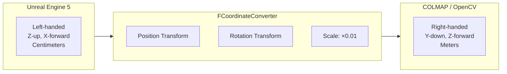
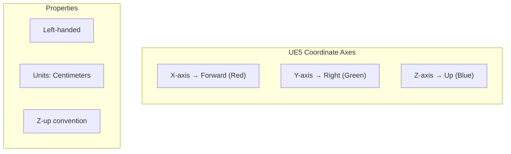
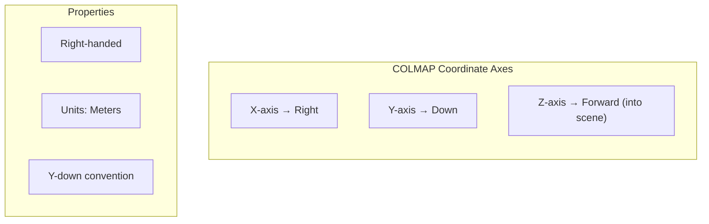
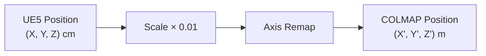
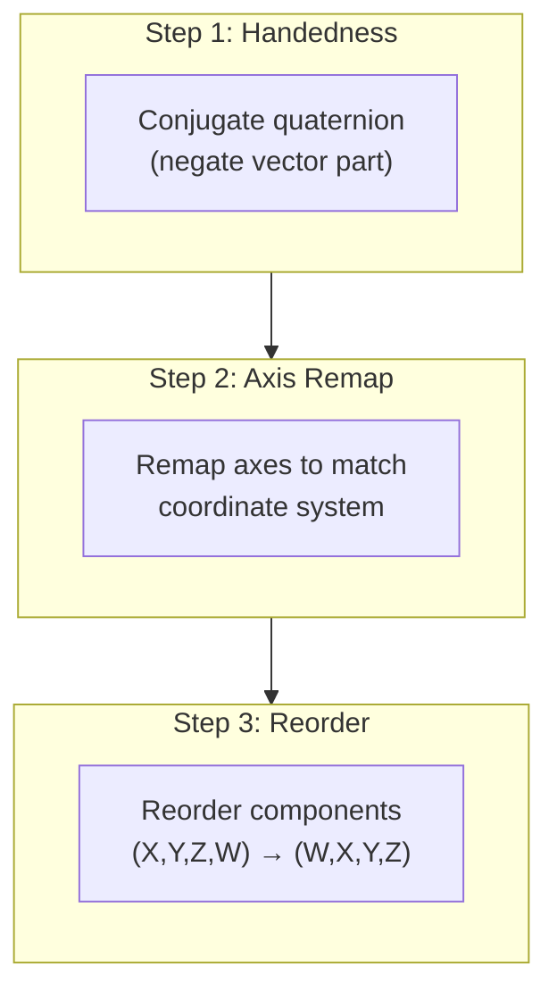
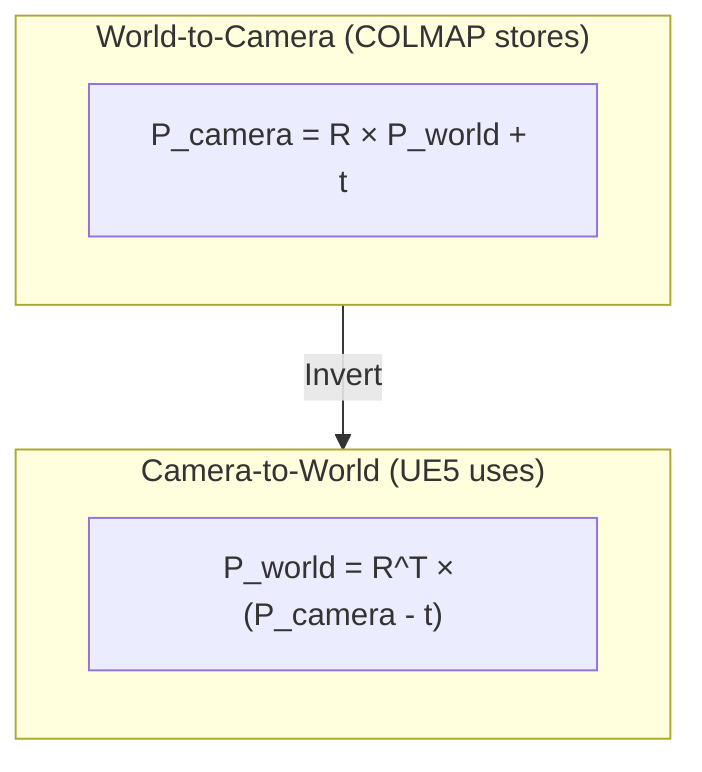

# Coordinate Systems Reference

[← Back to Main README](../../README.md) | [← Format Specifications](formats.md) | [API Reference →](../api/README.md)

---

## Table of Contents

- [Overview](#overview)
- [UE5 Coordinate System](#ue5-coordinate-system)
- [COLMAP Coordinate System](#colmap-coordinate-system)
- [Transformation Mathematics](#transformation-mathematics)
- [Rotation Conventions](#rotation-conventions)
- [Implementation Reference](#implementation-reference)

---

## Overview

Converting between UE5 and COLMAP coordinate systems requires careful handling of:
- **Handedness**: Left-handed (UE5) vs Right-handed (COLMAP)
- **Axis orientation**: Z-up vs Y-down
- **Scale**: Centimeters vs Meters
- **Rotation conventions**: Quaternion component ordering



---

## UE5 Coordinate System

### Axis Definition



| Axis | Direction | Color | Description |
|------|-----------|-------|-------------|
| X | Forward | Red | Actor facing direction |
| Y | Right | Green | Actor's right side |
| Z | Up | Blue | World up direction |

### Rotation Order

UE5 uses **intrinsic** rotations with order: **Roll → Pitch → Yaw** (X → Y → Z)

```cpp
// FRotator components
FRotator Rotation;
Rotation.Roll   // Rotation around X (forward) axis
Rotation.Pitch  // Rotation around Y (right) axis
Rotation.Yaw    // Rotation around Z (up) axis
```

### Quaternion Convention

UE5 `FQuat` stores components as: `(X, Y, Z, W)` - **vector first, scalar last**

```cpp
FQuat Q;
Q.X  // Vector component X
Q.Y  // Vector component Y
Q.Z  // Vector component Z
Q.W  // Scalar component
```

---

## COLMAP Coordinate System

### Axis Definition



| Axis | Direction | Description |
|------|-----------|-------------|
| X | Right | Image +U direction |
| Y | Down | Image +V direction |
| Z | Forward | Optical axis (into scene) |

### Camera Pose Convention

COLMAP stores camera pose as **world-to-camera** transformation:
- Rotation `R`: Rotates world coordinates to camera coordinates
- Translation `t`: Camera center in world coordinates (after rotation applied)

```
P_camera = R * P_world + t
```

### Quaternion Convention

COLMAP uses: `(QW, QX, QY, QZ)` - **scalar first**

```
# In images.txt
IMAGE_ID QW QX QY QZ TX TY TZ CAMERA_ID NAME
```

---

## Transformation Mathematics

### Position Transformation



**Transformation Matrix:**

$$
\begin{bmatrix} X_{colmap} \\ Y_{colmap} \\ Z_{colmap} \end{bmatrix} =
\frac{1}{100} \begin{bmatrix} 0 & 1 & 0 \\ 0 & 0 & -1 \\ 1 & 0 & 0 \end{bmatrix}
\begin{bmatrix} X_{ue5} \\ Y_{ue5} \\ Z_{ue5} \end{bmatrix}
$$

**Explicit Mapping:**
```
COLMAP.X =  UE5.Y × 0.01    (UE5 right → COLMAP right)
COLMAP.Y = -UE5.Z × 0.01    (UE5 up → COLMAP down, negated)
COLMAP.Z =  UE5.X × 0.01    (UE5 forward → COLMAP forward)
```

### Inverse Position Transformation

```
UE5.X =  COLMAP.Z × 100
UE5.Y =  COLMAP.X × 100
UE5.Z = -COLMAP.Y × 100
```

### Rotation Transformation

The rotation transformation must account for:
1. Handedness change (conjugation)
2. Axis remapping
3. Component reordering



**Transformation Steps:**

```cpp
// Input: UE5 quaternion (X, Y, Z, W)
FQuat UE5_Quat = Transform.GetRotation();

// Step 1: Conjugate for handedness change
// Left-handed to right-handed requires conjugation
FQuat Conjugate(-UE5_Quat.X, -UE5_Quat.Y, -UE5_Quat.Z, UE5_Quat.W);

// Step 2: Remap axes
// UE5 (X=fwd, Y=right, Z=up) → COLMAP (X=right, Y=down, Z=fwd)
FQuat Remapped(
    Conjugate.Y,    // COLMAP X from UE5 Y (right)
    -Conjugate.Z,   // COLMAP Y from -UE5 Z (down)
    Conjugate.X,    // COLMAP Z from UE5 X (forward)
    Conjugate.W     // Scalar unchanged
);

// Step 3: Component order for COLMAP (W, X, Y, Z)
// When writing to images.txt: QW QX QY QZ
```

---

## Rotation Conventions

### Rotation Matrix Comparison

<details>
<summary><b>UE5 Rotation Matrix</b></summary>

```cpp
// UE5 constructs rotation matrix from FRotator as:
// R = R_yaw * R_pitch * R_roll (Z * Y * X)

FMatrix RotationMatrix = FRotationMatrix(FRotator(Pitch, Yaw, Roll));

// Column-major, left-handed
// Transforms local to world coordinates
```

</details>

<details>
<summary><b>COLMAP Rotation Matrix</b></summary>

```cpp
// COLMAP rotation matrix from quaternion:
// R transforms world coordinates to camera coordinates

// Row-major, right-handed
// P_camera = R * P_world + t

// Quaternion to matrix:
// R = [1-2(y²+z²)   2(xy-wz)    2(xz+wy) ]
//     [2(xy+wz)     1-2(x²+z²)  2(yz-wx) ]
//     [2(xz-wy)     2(yz+wx)    1-2(x²+y²)]
```

</details>

### World-to-Camera vs Camera-to-World



**Converting between conventions:**

```cpp
// COLMAP (world-to-camera) to UE5 (camera-to-world)
FQuat CameraToWorld = ColmapRotation.Inverse();
FVector CameraPosition = -CameraToWorld.RotateVector(ColmapTranslation);
```

---

## Implementation Reference

### FCoordinateConverter Class

```cpp
class UNREALTOGAUSSIAN_API FCoordinateConverter
{
public:
    // Scale factor: cm to m
    static constexpr float ScaleFactor = 0.01f;

    /**
     * Convert position from UE5 to COLMAP coordinates
     * UE5: X-forward, Y-right, Z-up, centimeters, left-handed
     * COLMAP: X-right, Y-down, Z-forward, meters, right-handed
     */
    static FVector UE5ToColmap(const FVector& UE5Position)
    {
        return FVector(
            UE5Position.Y * ScaleFactor,   // Right
            -UE5Position.Z * ScaleFactor,  // Down (negated)
            UE5Position.X * ScaleFactor    // Forward
        );
    }

    /**
     * Convert position from COLMAP to UE5 coordinates
     */
    static FVector ColmapToUE5(const FVector& ColmapPosition)
    {
        return FVector(
            ColmapPosition.Z / ScaleFactor,   // Forward
            ColmapPosition.X / ScaleFactor,   // Right
            -ColmapPosition.Y / ScaleFactor   // Up (negated)
        );
    }

    /**
     * Convert rotation from UE5 to COLMAP quaternion
     * Handles handedness change and axis remapping
     */
    static FQuat UE5ToColmapRotation(const FQuat& UE5Rotation)
    {
        // Ensure normalized
        FQuat Q = UE5Rotation.GetNormalized();

        // Conjugate for handedness (negate vector part)
        FQuat Conj(-Q.X, -Q.Y, -Q.Z, Q.W);

        // Remap axes
        return FQuat(
            Conj.Y,    // X from Y (right)
            -Conj.Z,   // Y from -Z (down)
            Conj.X,    // Z from X (forward)
            Conj.W     // W unchanged
        );
    }

    /**
     * Convert rotation from COLMAP to UE5 quaternion
     */
    static FQuat ColmapToUE5Rotation(const FQuat& ColmapRotation)
    {
        // Inverse remap
        FQuat Remapped(
            ColmapRotation.Z,    // X from Z
            ColmapRotation.X,    // Y from X
            -ColmapRotation.Y,   // Z from -Y
            ColmapRotation.W
        );

        // Inverse conjugate (conjugate again)
        return FQuat(-Remapped.X, -Remapped.Y, -Remapped.Z, Remapped.W);
    }

    /**
     * Convert complete transform
     */
    static FTransform ConvertTransform(const FTransform& UE5Transform)
    {
        return FTransform(
            UE5ToColmapRotation(UE5Transform.GetRotation()),
            UE5ToColmap(UE5Transform.GetLocation()),
            FVector::OneVector  // Scale typically ignored
        );
    }
};
```

### Verification Tests

```cpp
// Unit test for round-trip conversion
IMPLEMENT_SIMPLE_AUTOMATION_TEST(FCoordinateRoundTrip,
    "UE5_3DGS.Unit.CoordinateConverter.RoundTrip",
    EAutomationTestFlags::EditorContext | EAutomationTestFlags::ProductFilter)

bool FCoordinateRoundTrip::RunTest(const FString& Parameters)
{
    // Test positions
    TArray<FVector> TestPositions = {
        FVector(100, 0, 0),      // Forward
        FVector(0, 100, 0),      // Right
        FVector(0, 0, 100),      // Up
        FVector(100, 200, 300),  // Arbitrary
    };

    for (const FVector& Original : TestPositions)
    {
        FVector Converted = FCoordinateConverter::UE5ToColmap(Original);
        FVector RoundTrip = FCoordinateConverter::ColmapToUE5(Converted);

        TestTrue(TEXT("Position round-trip"),
            Original.Equals(RoundTrip, 0.001f));
    }

    // Test rotations
    TArray<FQuat> TestRotations = {
        FQuat::Identity,
        FQuat(FRotator(0, 90, 0)),   // Yaw 90
        FQuat(FRotator(45, 0, 0)),   // Pitch 45
        FQuat(FRotator(0, 0, 30)),   // Roll 30
    };

    for (const FQuat& Original : TestRotations)
    {
        FQuat Converted = FCoordinateConverter::UE5ToColmapRotation(Original);
        FQuat RoundTrip = FCoordinateConverter::ColmapToUE5Rotation(Converted);

        TestTrue(TEXT("Rotation round-trip"),
            Original.Equals(RoundTrip, 0.001f));
    }

    return true;
}
```

---

## Visual Reference

### Axis Alignment Diagram

```
UE5 System:                    COLMAP System:

     Z (up)                         Y (down)
     |                              |
     |                              |
     |_____ Y (right)               |_____ X (right)
    /                              /
   /                              /
  X (forward)                    Z (forward)

Left-handed                    Right-handed
```

### Transformation Summary Table

| Property | UE5 | COLMAP | Conversion |
|----------|-----|--------|------------|
| Forward | +X | +Z | X ↔ Z |
| Right | +Y | +X | Y ↔ X |
| Up/Down | +Z (up) | +Y (down) | Z ↔ -Y |
| Units | cm | m | ×0.01 |
| Handedness | Left | Right | Conjugate |
| Quat order | (X,Y,Z,W) | (W,X,Y,Z) | Reorder |

---

## Common Pitfalls

1. **Forgetting handedness conjugation**: Results in mirrored geometry
2. **Wrong quaternion component order**: Causes severe rotation errors
3. **Missing scale conversion**: Scene appears 100× too large/small
4. **Applying transforms in wrong space**: World vs local confusion
5. **Not normalizing quaternions**: Leads to numerical instability

---

## Related Documentation

| Document | Description |
|----------|-------------|
| [API Reference](../api/README.md) | FCoordinateConverter API |
| [Format Specifications](formats.md) | Output format details |
| [Troubleshooting](../guides/troubleshooting.md) | Common issues |

---

[← Back to Main README](../../README.md) | [← Format Specifications](formats.md) | [API Reference →](../api/README.md)
