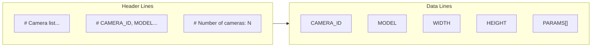
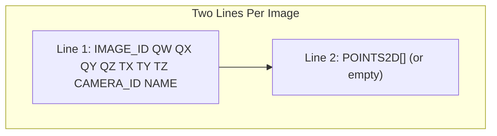
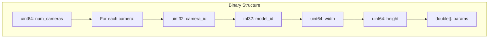
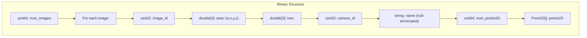
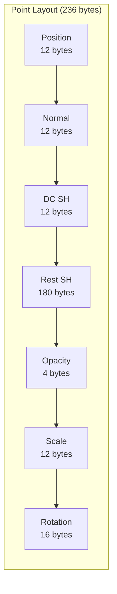
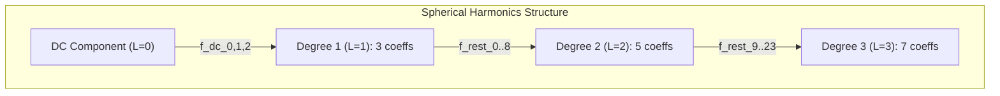

# Format Specifications

[← Back to Main README](../../README.md) | [← Troubleshooting](../guides/troubleshooting.md) | [Coordinate Systems →](coordinates.md)

---

## Table of Contents

- [COLMAP Text Format](#colmap-text-format)
- [COLMAP Binary Format](#colmap-binary-format)
- [3DGS PLY Format](#3dgs-ply-format)
- [Image Formats](#image-formats)

---

## COLMAP Text Format

COLMAP text format is human-readable and ideal for debugging. All files use UTF-8 encoding with Unix-style line endings.

**Reference:** [COLMAP Documentation](https://colmap.github.io/format.html)

### cameras.txt



**Format:**
```
# Camera list with one line of data per camera:
#   CAMERA_ID, MODEL, WIDTH, HEIGHT, PARAMS[]
# Number of cameras: 1
1 PINHOLE 1920 1080 1000.0 1000.0 960.0 540.0
```

<details>
<summary><b>Camera Models and Parameters</b></summary>

| Model ID | Model Name | Params | Description |
|----------|------------|--------|-------------|
| 0 | SIMPLE_PINHOLE | 3 | f, cx, cy |
| 1 | PINHOLE | 4 | fx, fy, cx, cy |
| 2 | SIMPLE_RADIAL | 4 | f, cx, cy, k |
| 3 | RADIAL | 5 | f, cx, cy, k1, k2 |
| 4 | OPENCV | 8 | fx, fy, cx, cy, k1, k2, p1, p2 |
| 5 | OPENCV_FISHEYE | 8 | fx, fy, cx, cy, k1, k2, k3, k4 |
| 6 | FULL_OPENCV | 12 | fx, fy, cx, cy, k1, k2, p1, p2, k3, k4, k5, k6 |
| 7 | FOV | 5 | fx, fy, cx, cy, omega |
| 8 | SIMPLE_RADIAL_FISHEYE | 4 | f, cx, cy, k |
| 9 | RADIAL_FISHEYE | 5 | f, cx, cy, k1, k2 |
| 10 | THIN_PRISM_FISHEYE | 12 | fx, fy, cx, cy, k1, k2, p1, p2, k3, k4, sx1, sy1 |

**Common Parameters:**
- `fx`, `fy`: Focal lengths in pixels
- `cx`, `cy`: Principal point (image center offset)
- `k1`, `k2`, ...: Radial distortion coefficients
- `p1`, `p2`: Tangential distortion coefficients

</details>

### images.txt



**Format:**
```
# Image list with two lines of data per image:
#   IMAGE_ID, QW, QX, QY, QZ, TX, TY, TZ, CAMERA_ID, NAME
#   POINTS2D[] as (X, Y, POINT3D_ID)
# Number of images: 150, mean observations per image: 0
1 0.8509035 0.3253892 -0.1250934 0.3940825 1.234 -0.567 2.891 1 frame_0000.png

2 0.9234521 0.2840183 -0.1982734 0.1563928 1.456 -0.234 3.012 1 frame_0001.png

```

<details>
<summary><b>Field Descriptions</b></summary>

| Field | Type | Description |
|-------|------|-------------|
| IMAGE_ID | int | Unique image identifier (1-indexed) |
| QW | float | Quaternion scalar component |
| QX | float | Quaternion X component |
| QY | float | Quaternion Y component |
| QZ | float | Quaternion Z component |
| TX | float | Translation X (meters) |
| TY | float | Translation Y (meters) |
| TZ | float | Translation Z (meters) |
| CAMERA_ID | int | Reference to cameras.txt |
| NAME | string | Image filename (relative path) |

**Important Notes:**
- Quaternion is (QW, QX, QY, QZ) - scalar first
- Translation is camera center in world coordinates
- Rotation transforms world to camera coordinates
- Empty line after POINTS2D for synthetic data

</details>

### points3D.txt

**Format:**
```
# 3D point list with one line of data per point:
#   POINT3D_ID, X, Y, Z, R, G, B, ERROR, TRACK[] as (IMAGE_ID, POINT2D_IDX)
# Number of points: 0
```

For synthetic captures (no feature matching), this file is typically empty or contains only the header.

<details>
<summary><b>Field Descriptions</b></summary>

| Field | Type | Description |
|-------|------|-------------|
| POINT3D_ID | int | Unique point identifier |
| X, Y, Z | float | 3D position (meters) |
| R, G, B | int | Color (0-255) |
| ERROR | float | Reprojection error |
| TRACK[] | pairs | (IMAGE_ID, POINT2D_IDX) observations |

</details>

---

## COLMAP Binary Format

Binary format is more compact and faster to read/write for large datasets.

### cameras.bin



<details>
<summary><b>Binary Layout</b></summary>

```cpp
// cameras.bin structure
struct CamerasBin
{
    uint64_t num_cameras;

    struct Camera
    {
        uint32_t camera_id;
        int32_t model_id;
        uint64_t width;
        uint64_t height;
        double params[];  // Size depends on model
    } cameras[];
};
```

</details>

### images.bin



<details>
<summary><b>Binary Layout</b></summary>

```cpp
// images.bin structure
struct ImagesBin
{
    uint64_t num_images;

    struct Image
    {
        uint32_t image_id;
        double qvec[4];      // (qw, qx, qy, qz)
        double tvec[3];      // (tx, ty, tz)
        uint32_t camera_id;
        char name[];         // Null-terminated string
        uint64_t num_points2D;
        struct Point2D
        {
            double x, y;
            uint64_t point3D_id;  // -1 if not triangulated
        } points2D[];
    } images[];
};
```

</details>

### points3D.bin

<details>
<summary><b>Binary Layout</b></summary>

```cpp
// points3D.bin structure
struct Points3DBin
{
    uint64_t num_points3D;

    struct Point3D
    {
        uint64_t point3D_id;
        double xyz[3];
        uint8_t rgb[3];
        double error;
        uint64_t track_length;
        struct TrackElement
        {
            uint32_t image_id;
            uint32_t point2D_idx;
        } track[];
    } points[];
};
```

</details>

---

## 3DGS PLY Format

The 3D Gaussian Splatting PLY format stores Gaussian primitives for real-time rendering.

**Reference:** [gaussian-splatting/scene/gaussian_model.py](https://github.com/graphdeco-inria/gaussian-splatting/blob/main/scene/gaussian_model.py)

### PLY Header

```
ply
format binary_little_endian 1.0
element vertex 1000000
property float x
property float y
property float z
property float nx
property float ny
property float nz
property float f_dc_0
property float f_dc_1
property float f_dc_2
property float f_rest_0
property float f_rest_1
...
property float f_rest_44
property float opacity
property float scale_0
property float scale_1
property float scale_2
property float rot_0
property float rot_1
property float rot_2
property float rot_3
end_header
```

### Point Structure (236 bytes)



<details>
<summary><b>Detailed Field Layout</b></summary>

| Field | Offset | Size | Type | Description |
|-------|--------|------|------|-------------|
| x | 0 | 4 | float | Position X |
| y | 4 | 4 | float | Position Y |
| z | 8 | 4 | float | Position Z |
| nx | 12 | 4 | float | Normal X (unused in training) |
| ny | 16 | 4 | float | Normal Y (unused in training) |
| nz | 20 | 4 | float | Normal Z (unused in training) |
| f_dc_0 | 24 | 4 | float | DC SH coefficient (red) |
| f_dc_1 | 28 | 4 | float | DC SH coefficient (green) |
| f_dc_2 | 32 | 4 | float | DC SH coefficient (blue) |
| f_rest_0..44 | 36 | 180 | float[45] | Higher-order SH coefficients |
| opacity | 216 | 4 | float | Gaussian opacity |
| scale_0 | 220 | 4 | float | Scale X (log space) |
| scale_1 | 224 | 4 | float | Scale Y (log space) |
| scale_2 | 228 | 4 | float | Scale Z (log space) |
| rot_0 | 232 | 4 | float | Rotation quaternion W |
| rot_1 | 236 | 4 | float | Rotation quaternion X |
| rot_2 | 240 | 4 | float | Rotation quaternion Y |
| rot_3 | 244 | 4 | float | Rotation quaternion Z |

**Total: 248 bytes** (Note: actual total is 248 bytes based on field offsets)

</details>

### Spherical Harmonics Encoding



<details>
<summary><b>SH Conversion Formulas</b></summary>

**Constants:**
```cpp
// SH basis function coefficient for L=0
const float C0 = 0.28209479177387814f;

// Additional constants for higher degrees
const float C1 = 0.4886025119029199f;
const float C2[] = {
    1.0925484305920792f,
    -1.0925484305920792f,
    0.31539156525252005f,
    -1.0925484305920792f,
    0.5462742152960396f
};
```

**RGB to SH DC:**
```cpp
// Convert normalized RGB [0,1] to SH DC coefficient
float sh_dc = (rgb - 0.5f) / C0;
```

**SH DC to RGB:**
```cpp
// Convert SH DC coefficient to RGB [0,1]
float rgb = FMath::Clamp(sh_dc * C0 + 0.5f, 0.0f, 1.0f);
```

</details>

### Opacity and Scale Encoding

<details>
<summary><b>Activation Functions</b></summary>

**Opacity:**
```cpp
// Stored as inverse sigmoid (logit)
float raw_opacity = ...;  // Stored value
float opacity = 1.0f / (1.0f + FMath::Exp(-raw_opacity));  // Activated [0,1]

// To store:
float stored = FMath::Loge(opacity / (1.0f - opacity));
```

**Scale:**
```cpp
// Stored in log space
float raw_scale = ...;  // Stored value
float scale = FMath::Exp(raw_scale);  // Activated (positive)

// To store:
float stored = FMath::Loge(scale);
```

</details>

---

## Image Formats

### Supported Output Formats

| Format | Extension | Use Case | Size | Quality |
|--------|-----------|----------|------|---------|
| PNG | .png | Default, lossless | Large | Perfect |
| JPEG | .jpg | Fast I/O, smaller | Small | Good (95%) |
| EXR | .exr | HDR, depth maps | Large | Perfect |

### PNG Settings

```cpp
Settings.ImageFormat = EImageFormat::PNG;
Settings.PngCompressionLevel = 3;  // 0-9, 3 is good balance
```

### JPEG Settings

```cpp
Settings.ImageFormat = EImageFormat::JPEG;
Settings.JpegQuality = 95;  // 1-100, 95 recommended for training
```

### EXR Settings (HDR/Depth)

```cpp
Settings.ImageFormat = EImageFormat::EXR;
Settings.ExrCompression = EExrCompression::ZIP;  // or PIZ, RLE, None
Settings.bExrHalfFloat = true;  // Use FP16 for smaller files
```

---

## Directory Structure

### Standard COLMAP Layout

```
output/
├── sparse/
│   └── 0/
│       ├── cameras.bin (or .txt)
│       ├── images.bin (or .txt)
│       └── points3D.bin (or .txt)
└── images/
    ├── frame_0000.png
    ├── frame_0001.png
    ├── frame_0002.png
    └── ...
```

### UE5-3DGS Output Layout

```
output/
├── cameras.txt
├── images.txt
├── points3D.txt
├── images/
│   ├── frame_0000.png
│   └── ...
├── depth/           (if bCaptureDepth=true)
│   ├── frame_0000.exr
│   └── ...
└── metadata/
    ├── capture_settings.json
    └── trajectory.json
```

---

## Validation

### COLMAP Validation

```bash
# Verify file integrity
colmap model_analyzer \
    --input_path ./sparse/0 \
    --output_path ./analysis.txt

# Check for issues
colmap model_converter \
    --input_path ./sparse/0 \
    --output_path ./verified \
    --output_type TXT
```

### PLY Validation

```python
# Python validation script
import struct

def validate_ply(filepath):
    with open(filepath, 'rb') as f:
        # Read header
        header = b''
        while True:
            line = f.readline()
            header += line
            if b'end_header' in line:
                break

        # Parse vertex count
        for line in header.split(b'\n'):
            if b'element vertex' in line:
                num_vertices = int(line.split()[-1])
                break

        # Verify file size
        data = f.read()
        expected_size = num_vertices * 248  # bytes per vertex
        actual_size = len(data)

        if actual_size == expected_size:
            print(f"Valid PLY: {num_vertices} vertices")
        else:
            print(f"Invalid: expected {expected_size}, got {actual_size}")

validate_ply('output.ply')
```

---

## Related Documentation

| Document | Description |
|----------|-------------|
| [Coordinate Systems](coordinates.md) | Math transformations |
| [API Reference](../api/README.md) | Code documentation |
| [User Guide](../guides/user-guide.md) | Usage instructions |
| [COLMAP Docs](https://colmap.github.io/format.html) | Official format spec |

---

[← Back to Main README](../../README.md) | [← Troubleshooting](../guides/troubleshooting.md) | [Coordinate Systems →](coordinates.md)
