# SPARC Architecture Document
## UE5-3DGS: System Architecture

**Version:** 1.0
**Phase:** Architecture
**Status:** Draft

---

## 1. System Overview

### 1.1 Component Diagram

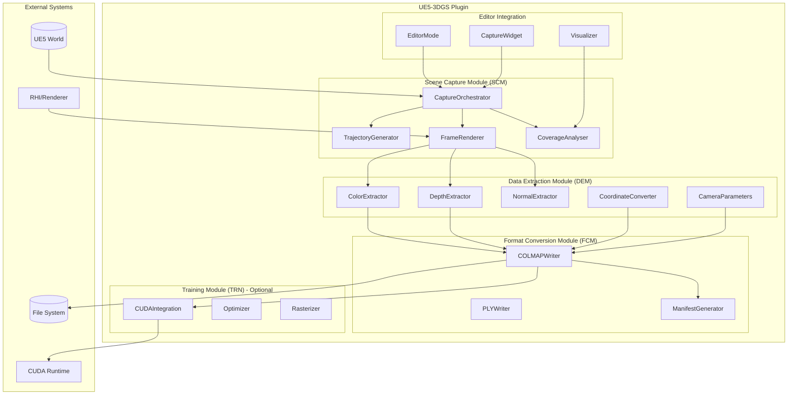

### 1.2 Module Responsibilities

| Module | Responsibility | Dependencies |
|--------|---------------|--------------|
| SCM | Camera trajectory and capture orchestration | UWorld, RenderCore |
| DEM | Buffer extraction and coordinate conversion | RHI, RenderCore |
| FCM | File format writing | ImageWrapper, FileManager |
| TRN | Optional in-engine training | CUDA, FCM output |
| UI | Editor tools and visualization | Slate, EditorFramework |

---

## 2. Data Flow Architecture

### 2.1 Capture Pipeline Data Flow

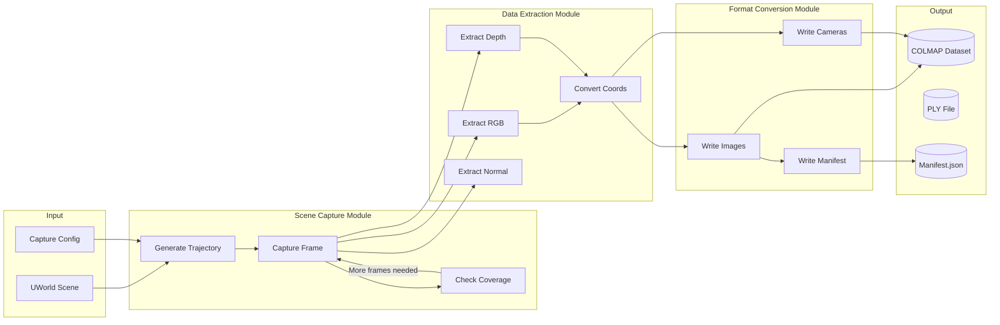

### 2.2 Data Structures Flow

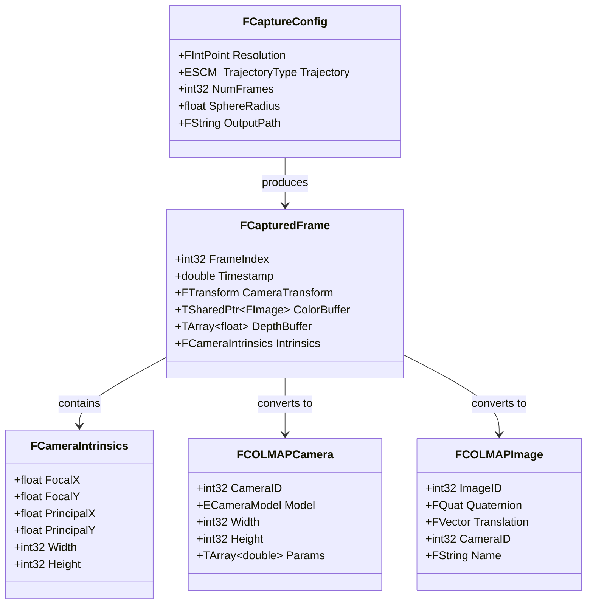

---

## 3. Sequence Diagrams

### 3.1 Capture Workflow Sequence

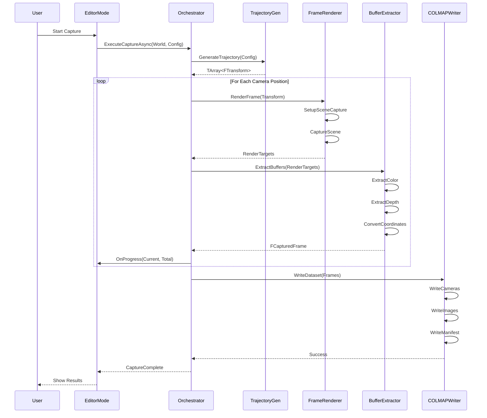

### 3.2 Export Workflow Sequence

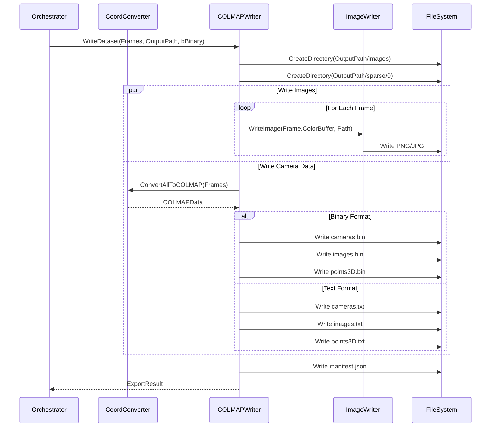

### 3.3 Training Workflow Sequence (Phase 2)

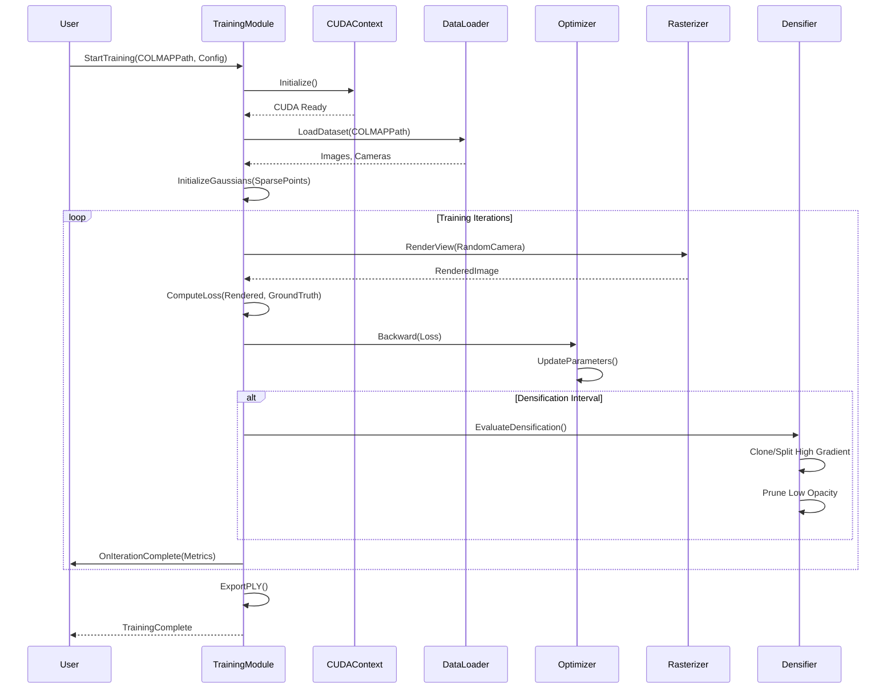

---

## 4. Class Architecture

### 4.1 Core Classes UML

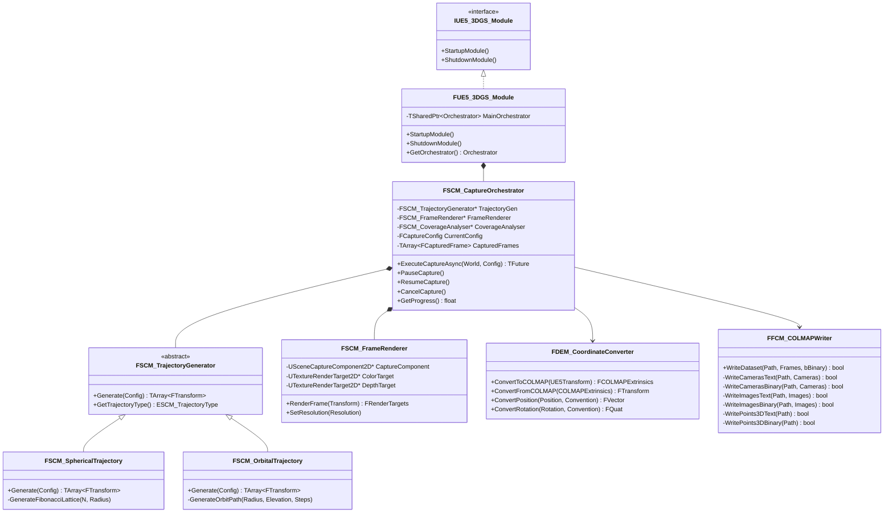

### 4.2 Buffer Extraction Classes

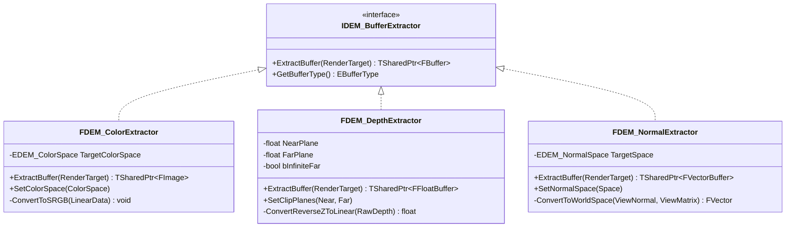

---

## 5. Plugin Architecture

### 5.1 Directory Structure

```
UE5_3DGS/
├── Source/
│   ├── UE5_3DGS/                          # Runtime module
│   │   ├── Public/
│   │   │   ├── UE5_3DGS.h                 # Module header
│   │   │   ├── SCM/
│   │   │   │   ├── SCM_CaptureOrchestrator.h
│   │   │   │   ├── SCM_TrajectoryGenerator.h
│   │   │   │   ├── SCM_SphericalTrajectory.h
│   │   │   │   ├── SCM_OrbitalTrajectory.h
│   │   │   │   ├── SCM_SplineTrajectory.h
│   │   │   │   ├── SCM_FrameRenderer.h
│   │   │   │   └── SCM_CoverageAnalyser.h
│   │   │   ├── DEM/
│   │   │   │   ├── DEM_BufferExtractor.h
│   │   │   │   ├── DEM_ColorExtractor.h
│   │   │   │   ├── DEM_DepthExtractor.h
│   │   │   │   ├── DEM_NormalExtractor.h
│   │   │   │   ├── DEM_CoordinateConverter.h
│   │   │   │   └── DEM_CameraParameters.h
│   │   │   ├── FCM/
│   │   │   │   ├── FCM_COLMAPWriter.h
│   │   │   │   ├── FCM_PLYWriter.h
│   │   │   │   └── FCM_ManifestGenerator.h
│   │   │   └── Types/
│   │   │       ├── UE5_3DGS_Types.h
│   │   │       └── UE5_3DGS_Enums.h
│   │   ├── Private/
│   │   │   ├── UE5_3DGS.cpp
│   │   │   ├── SCM/
│   │   │   │   └── [Implementation files]
│   │   │   ├── DEM/
│   │   │   │   └── [Implementation files]
│   │   │   └── FCM/
│   │   │       └── [Implementation files]
│   │   └── UE5_3DGS.Build.cs
│   │
│   ├── UE5_3DGS_Editor/                   # Editor module
│   │   ├── Public/
│   │   │   ├── UE5_3DGS_EditorMode.h
│   │   │   ├── UE5_3DGS_EditorCommands.h
│   │   │   └── Widgets/
│   │   │       ├── SUE5_3DGS_CapturePanel.h
│   │   │       └── SUE5_3DGS_ProgressBar.h
│   │   ├── Private/
│   │   │   └── [Implementation files]
│   │   └── UE5_3DGS_Editor.Build.cs
│   │
│   └── UE5_3DGS_Training/                 # Optional training module
│       ├── Public/
│       │   ├── TRN_CUDAContext.h
│       │   ├── TRN_GaussianOptimizer.h
│       │   └── TRN_TileRasterizer.h
│       ├── Private/
│       │   └── [Implementation files]
│       └── UE5_3DGS_Training.Build.cs
│
├── Shaders/
│   └── Private/
│       ├── DepthExtraction.usf
│       ├── NormalExtraction.usf
│       └── CoverageVisualization.usf
│
├── Content/
│   ├── Blueprints/
│   │   └── BP_3DGS_CaptureActor.uasset
│   ├── Materials/
│   │   ├── M_DepthVisualization.uasset
│   │   └── M_CoverageHeatmap.uasset
│   └── UI/
│       └── WBP_CapturePanel.uasset
│
├── ThirdParty/
│   ├── Eigen/
│   │   └── [Eigen 3.4+ headers]
│   └── CUDA/
│       └── [CUDA headers - optional]
│
├── Config/
│   └── DefaultUE5_3DGS.ini
│
├── Resources/
│   └── Icon128.png
│
└── UE5_3DGS.uplugin
```

### 5.2 Module Dependencies

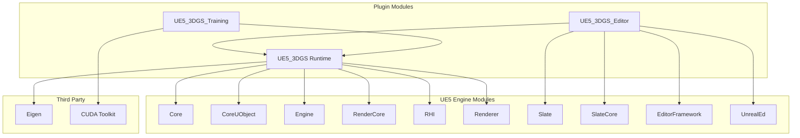

---

## 6. Interface Design

### 6.1 Public C++ API

```cpp
// UE5_3DGS.h - Main public interface

#pragma once

#include "CoreMinimal.h"
#include "Modules/ModuleManager.h"

// Forward declarations
class FSCM_CaptureOrchestrator;
struct FCaptureConfig;
struct FCaptureResult;

/**
 * Main module interface for UE5-3DGS plugin
 */
class IUE5_3DGS_Module : public IModuleInterface
{
public:
    /**
     * Get module singleton
     */
    static IUE5_3DGS_Module& Get()
    {
        return FModuleManager::LoadModuleChecked<IUE5_3DGS_Module>("UE5_3DGS");
    }

    /**
     * Check if module is loaded
     */
    static bool IsAvailable()
    {
        return FModuleManager::Get().IsModuleLoaded("UE5_3DGS");
    }

    /**
     * Get the capture orchestrator for programmatic control
     */
    virtual TSharedPtr<FSCM_CaptureOrchestrator> GetOrchestrator() = 0;

    /**
     * Quick capture with default settings
     * @param World Target world to capture
     * @param OutputPath Output directory path
     * @param NumFrames Number of frames to capture
     * @return Async future with capture result
     */
    virtual TFuture<FCaptureResult> QuickCapture(
        UWorld* World,
        const FString& OutputPath,
        int32 NumFrames = 100
    ) = 0;
};

/**
 * Capture configuration structure
 */
USTRUCT(BlueprintType)
struct FCaptureConfig
{
    GENERATED_BODY()

    /** Output resolution */
    UPROPERTY(EditAnywhere, BlueprintReadWrite)
    FIntPoint Resolution = FIntPoint(1920, 1080);

    /** Trajectory type */
    UPROPERTY(EditAnywhere, BlueprintReadWrite)
    ESCM_TrajectoryType TrajectoryType = ESCM_TrajectoryType::Spherical;

    /** Number of frames to capture */
    UPROPERTY(EditAnywhere, BlueprintReadWrite, meta=(ClampMin="1", ClampMax="10000"))
    int32 NumFrames = 100;

    /** Sphere radius for spherical/orbital trajectory (auto if <= 0) */
    UPROPERTY(EditAnywhere, BlueprintReadWrite)
    float SphereRadius = 0.0f;

    /** Output directory path */
    UPROPERTY(EditAnywhere, BlueprintReadWrite)
    FString OutputPath;

    /** Export format */
    UPROPERTY(EditAnywhere, BlueprintReadWrite)
    EFCM_ExportFormat ExportFormat = EFCM_ExportFormat::COLMAP_Binary;

    /** Include depth maps in export */
    UPROPERTY(EditAnywhere, BlueprintReadWrite)
    bool bExportDepth = false;

    /** Include normal maps in export */
    UPROPERTY(EditAnywhere, BlueprintReadWrite)
    bool bExportNormals = false;
};
```

### 6.2 Blueprint Interface

```cpp
// UE5_3DGS_BlueprintLibrary.h

#pragma once

#include "Kismet/BlueprintFunctionLibrary.h"
#include "UE5_3DGS_BlueprintLibrary.generated.h"

DECLARE_DYNAMIC_DELEGATE_TwoParams(FOnCaptureProgress, int32, CurrentFrame, int32, TotalFrames);
DECLARE_DYNAMIC_DELEGATE_OneParam(FOnCaptureComplete, bool, bSuccess);

/**
 * Blueprint function library for UE5-3DGS
 */
UCLASS()
class UE5_3DGS_API UUE5_3DGS_BlueprintLibrary : public UBlueprintFunctionLibrary
{
    GENERATED_BODY()

public:
    /**
     * Start asynchronous capture session
     * @param WorldContextObject World context
     * @param Config Capture configuration
     * @param OnProgress Progress callback
     * @param OnComplete Completion callback
     */
    UFUNCTION(BlueprintCallable, Category = "3DGS", meta = (WorldContext = "WorldContextObject"))
    static void StartCapture(
        UObject* WorldContextObject,
        const FCaptureConfig& Config,
        FOnCaptureProgress OnProgress,
        FOnCaptureComplete OnComplete
    );

    /**
     * Cancel active capture session
     */
    UFUNCTION(BlueprintCallable, Category = "3DGS")
    static void CancelCapture();

    /**
     * Check if capture is in progress
     */
    UFUNCTION(BlueprintPure, Category = "3DGS")
    static bool IsCaptureInProgress();

    /**
     * Get current capture progress (0.0 - 1.0)
     */
    UFUNCTION(BlueprintPure, Category = "3DGS")
    static float GetCaptureProgress();

    /**
     * Generate trajectory preview transforms
     * @param WorldContextObject World context
     * @param Config Capture configuration
     * @return Array of camera transforms for preview
     */
    UFUNCTION(BlueprintCallable, Category = "3DGS", meta = (WorldContext = "WorldContextObject"))
    static TArray<FTransform> GenerateTrajectoryPreview(
        UObject* WorldContextObject,
        const FCaptureConfig& Config
    );
};
```

---

## 7. Error Handling Architecture

### 7.1 Error Propagation

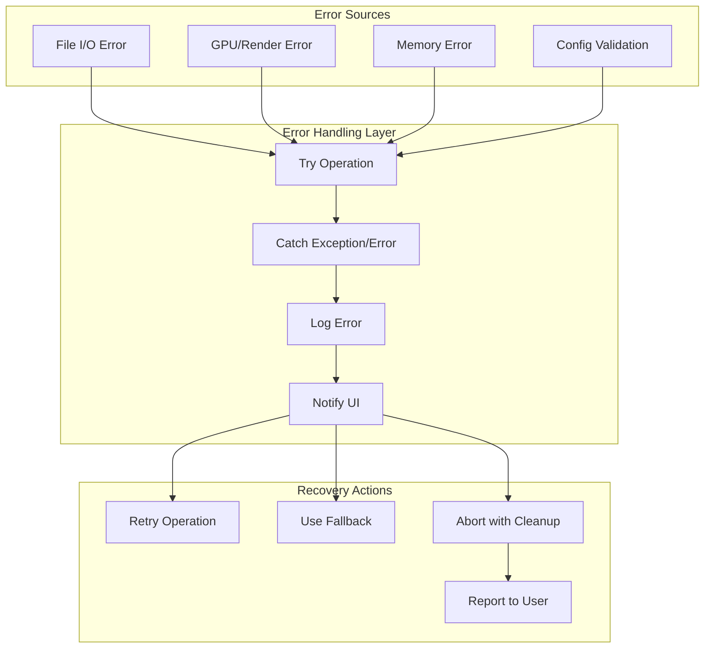

### 7.2 Error Codes Enum

```cpp
UENUM(BlueprintType)
enum class EUE5_3DGS_ErrorCode : uint8
{
    Success = 0,

    // Configuration Errors (100-199)
    E_InvalidWorld = 100,
    E_InvalidConfig = 101,
    E_PathNotWritable = 102,
    E_InsufficientDiskSpace = 103,

    // Capture Errors (200-299)
    E_TrajectoryGenerationFailed = 200,
    E_RenderTargetCreationFailed = 201,
    E_FrameCaptureFailed = 202,
    E_BufferReadbackFailed = 203,
    E_CaptureTimeout = 204,

    // Export Errors (300-399)
    E_FileWriteFailed = 300,
    E_ImageEncodingFailed = 301,
    E_CoordinateConversionFailed = 302,
    E_InvalidExportFormat = 303,

    // Training Errors (400-499)
    E_CUDAInitFailed = 400,
    E_CUDAOutOfMemory = 401,
    E_TrainingDiverged = 402,
    E_InvalidTrainingData = 403,

    // Internal Errors (500-599)
    E_InternalError = 500,
    E_NotImplemented = 501
};
```

---

## 8. Configuration Architecture

### 8.1 Config File Schema

```ini
; DefaultUE5_3DGS.ini

[/Script/UE5_3DGS.UE5_3DGS_Settings]

; Default capture settings
DefaultResolution=(X=1920,Y=1080)
DefaultNumFrames=100
DefaultTrajectoryType=Spherical
DefaultExportFormat=COLMAP_Binary

; Performance settings
MaxConcurrentFrames=4
AsyncIOEnabled=true
GPUReadbackPoolSize=8

; Quality settings
DefaultImageFormat=PNG
JPEGQuality=95
DepthPrecision=32

; Coordinate conversion
DefaultCoordinateConvention=COLMAP_RightHanded
DefaultUnitScale=0.01

; Paths
DefaultOutputPath=Saved/3DGS_Export
TempBufferPath=Saved/3DGS_Temp

; Training (optional module)
CUDADeviceIndex=0
TrainingIterations=30000
CheckpointInterval=5000
```

### 8.2 Settings Class

```cpp
UCLASS(config=UE5_3DGS, defaultconfig)
class UE5_3DGS_API UUE5_3DGS_Settings : public UObject
{
    GENERATED_BODY()

public:
    UUE5_3DGS_Settings();

    /** Default capture resolution */
    UPROPERTY(config, EditAnywhere, Category = "Capture")
    FIntPoint DefaultResolution;

    /** Default number of frames */
    UPROPERTY(config, EditAnywhere, Category = "Capture")
    int32 DefaultNumFrames;

    /** Default trajectory type */
    UPROPERTY(config, EditAnywhere, Category = "Capture")
    ESCM_TrajectoryType DefaultTrajectoryType;

    /** Maximum concurrent frame captures */
    UPROPERTY(config, EditAnywhere, Category = "Performance")
    int32 MaxConcurrentFrames;

    /** Enable async I/O for exports */
    UPROPERTY(config, EditAnywhere, Category = "Performance")
    bool bAsyncIOEnabled;

    /** Get singleton settings object */
    static UUE5_3DGS_Settings* Get();
};
```

---

## 9. Memory Management

### 9.1 Buffer Pool Architecture

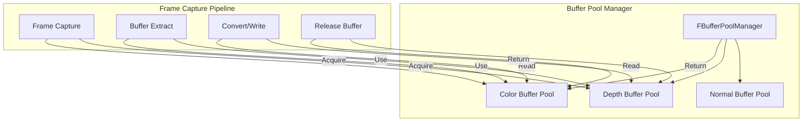

### 9.2 Memory Budget

| Resource | Budget | Notes |
|----------|--------|-------|
| Render Target Pool | 4 GB | 8x 4K RGBA + Depth |
| Frame Queue | 10 frames | Async pipeline depth |
| Export Buffer | 1 GB | Streaming write |
| Training (GPU) | 8 GB | Gaussian parameters + optimizer state |

---

## 10. Platform Considerations

### 10.1 Platform Support Matrix

| Platform | Capture | Export | Training |
|----------|---------|--------|----------|
| Windows (DX12) | Full | Full | Full (CUDA) |
| Windows (DX11) | Full | Full | Limited |
| Linux (Vulkan) | Full | Full | Full (CUDA) |
| macOS (Metal) | Full | Full | Not Supported |

### 10.2 API Abstraction

```cpp
// Platform-specific render target handling
class FDEM_PlatformBufferExtractor
{
public:
    static TSharedPtr<FDEM_PlatformBufferExtractor> Create();

    virtual TArray<uint8> ReadColorBuffer(UTextureRenderTarget2D* Target) = 0;
    virtual TArray<float> ReadDepthBuffer(UTextureRenderTarget2D* Target) = 0;

protected:
#if PLATFORM_WINDOWS
    // DX12/DX11 specific implementation
    virtual TArray<uint8> ReadColorBuffer_DX(UTextureRenderTarget2D* Target);
#elif PLATFORM_LINUX
    // Vulkan specific implementation
    virtual TArray<uint8> ReadColorBuffer_Vulkan(UTextureRenderTarget2D* Target);
#elif PLATFORM_MAC
    // Metal specific implementation
    virtual TArray<uint8> ReadColorBuffer_Metal(UTextureRenderTarget2D* Target);
#endif
};
```

---

*Document Version: 1.0*
*Last Updated: January 2025*
