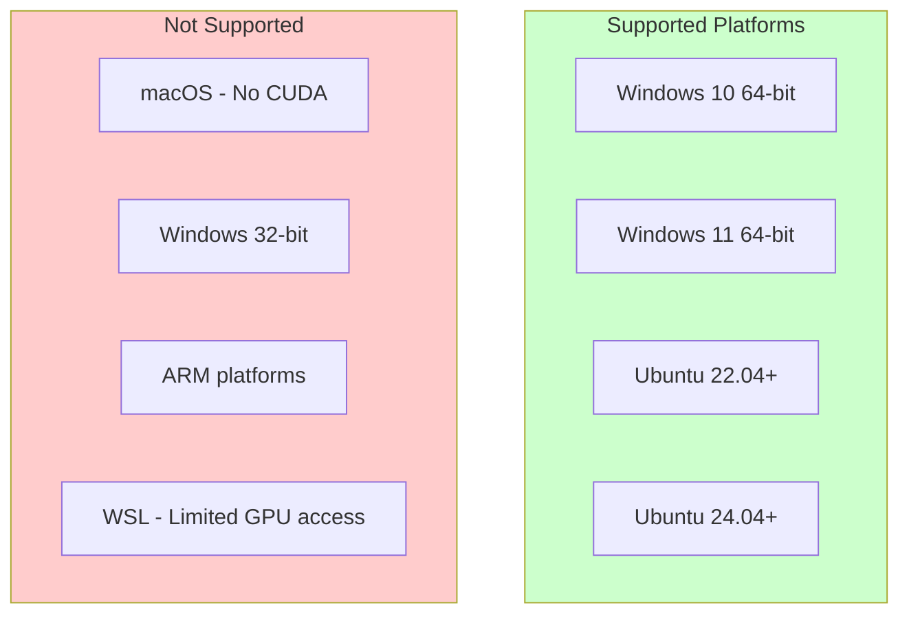
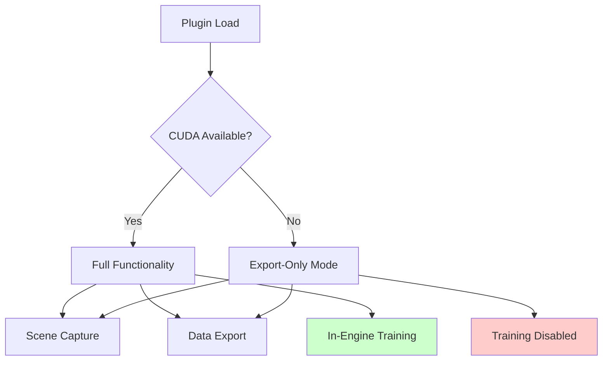
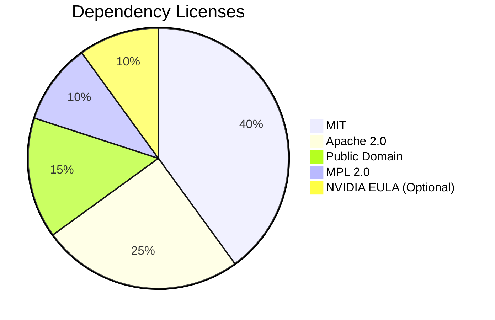
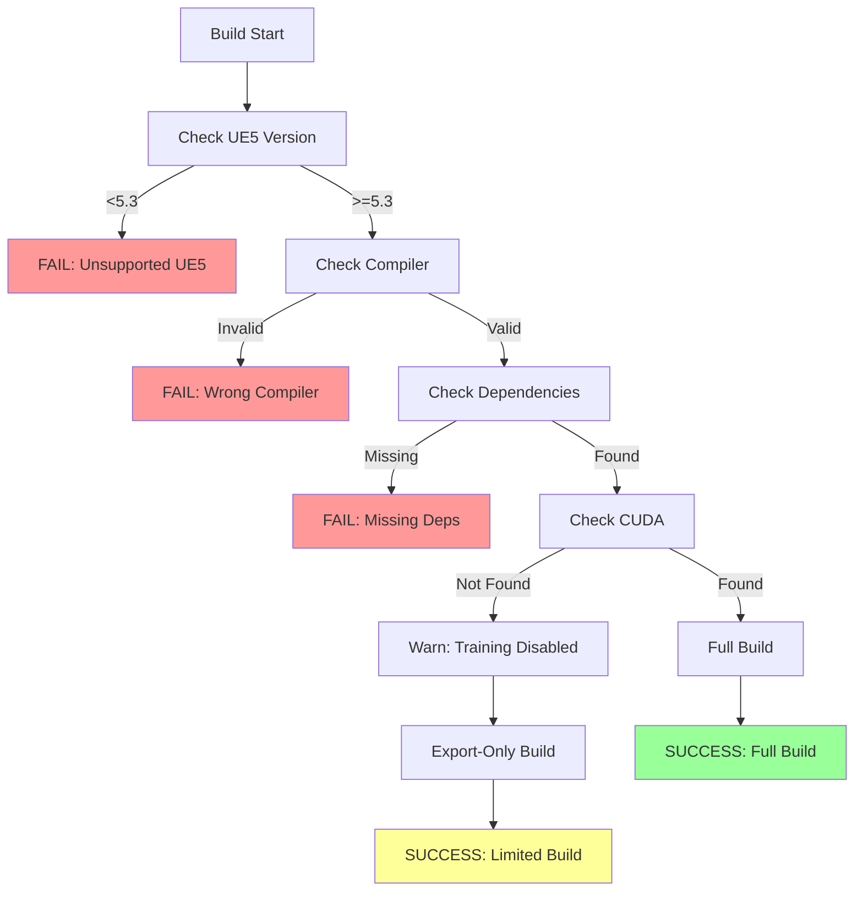

# Technical Constraints Specification
## UE5-3DGS Pipeline

**Version:** 1.0
**Phase:** SPARC Specification
**Source:** PRD Sections 5, 9, Appendices C-D

---

## 1. Platform Constraints

### 1.1 Unreal Engine Constraints

| Constraint ID | Description | Rationale | Impact |
|---------------|-------------|-----------|--------|
| CON-UE-001 | **Minimum UE5 version: 5.3.0** | Required API features for render target access | Cannot support UE5.0-5.2 |
| CON-UE-002 | **Maximum tested UE5 version: 5.5.x** | Tested compatibility range | Newer versions may require updates |
| CON-UE-003 | **C++ plugin architecture required** | Performance-critical buffer access | Blueprint-only not supported |
| CON-UE-004 | **DX12 or Vulkan rendering API** | Modern render target features | DX11 not supported |
| CON-UE-005 | **Editor-only functionality** | Relies on editor viewport access | Runtime capture not supported |

### 1.2 Operating System Constraints

| Constraint ID | Description | Rationale |
|---------------|-------------|-----------|
| CON-OS-001 | **Windows 10/11 64-bit required** | UE5 requirement + CUDA support |
| CON-OS-002 | **Linux: Ubuntu 22.04+ only** | Tested distribution |
| CON-OS-003 | **macOS not supported** | No CUDA, limited UE5 support |
| CON-OS-004 | **ARM architecture not supported** | No CUDA, UE5 x86 only |

### 1.3 Hardware Constraints

| Constraint ID | Description | Minimum | Recommended |
|---------------|-------------|---------|-------------|
| CON-HW-001 | **GPU Vendor** | NVIDIA (for training) | NVIDIA RTX series |
| CON-HW-002 | **GPU VRAM (Export)** | 4GB | 8GB |
| CON-HW-003 | **GPU VRAM (Training)** | 8GB | 12GB+ |
| CON-HW-004 | **System RAM** | 16GB | 64GB |
| CON-HW-005 | **Storage** | HDD (slow) | NVMe SSD |
| CON-HW-006 | **Storage Space** | 50GB | 200GB+ |

---

## 2. CUDA Constraints

### 2.1 CUDA Toolkit Requirements

| Constraint ID | Description | Value | Notes |
|---------------|-------------|-------|-------|
| CON-CUDA-001 | **Minimum CUDA version** | 11.8 | Required for 3DGS training |
| CON-CUDA-002 | **Maximum CUDA version** | 12.x | Tested compatibility |
| CON-CUDA-003 | **Compute capability** | 7.0+ | Volta architecture or newer |
| CON-CUDA-004 | **cuDNN requirement** | Optional | May improve performance |

### 2.2 CUDA Optional Status

| Constraint ID | Description | Impact |
|---------------|-------------|--------|
| CON-CUDA-010 | **CUDA is optional for export** | Core functionality works without CUDA |
| CON-CUDA-011 | **CUDA required for training** | In-engine training disabled without CUDA |
| CON-CUDA-012 | **CUDA path detection** | Uses CUDA_PATH environment variable |

---

## 3. Memory Constraints

### 3.1 GPU Memory Limits

| Constraint ID | Description | Value | Mitigation |
|---------------|-------------|-------|------------|
| CON-MEM-001 | **Max render target size** | 8192x8192 | Tile rendering for larger |
| CON-MEM-002 | **Max simultaneous buffers** | 4 (RGB, Depth, Normal, Motion) | Sequential extraction available |
| CON-MEM-003 | **Training memory per splat** | ~100 bytes | Limits max splat count |
| CON-MEM-004 | **Max splats at 8GB VRAM** | ~5M | Reduce for stability |
| CON-MEM-005 | **Max splats at 12GB VRAM** | ~10M | Desktop target |

### 3.2 System Memory Limits

| Constraint ID | Description | Value | Mitigation |
|---------------|-------------|-------|------------|
| CON-MEM-010 | **Max images in memory** | 100 @ 1080p | Stream to disk |
| CON-MEM-011 | **Max capture queue depth** | 16 frames | Backpressure mechanism |
| CON-MEM-012 | **Export buffer size** | 2GB per PLY | Split large exports |

---

## 4. Format Constraints

### 4.1 COLMAP Format Constraints

| Constraint ID | Description | Rationale |
|---------------|-------------|-----------|
| CON-FMT-001 | **Binary format is little-endian only** | COLMAP specification |
| CON-FMT-002 | **Quaternion format: w, x, y, z (scalar-first)** | COLMAP convention |
| CON-FMT-003 | **Transform is world-to-camera** | COLMAP convention |
| CON-FMT-004 | **Camera models: PINHOLE, OPENCV** | Limited model support |
| CON-FMT-005 | **Image names must be unique** | COLMAP requirement |

### 4.2 PLY Format Constraints

| Constraint ID | Description | Rationale |
|---------------|-------------|-----------|
| CON-FMT-010 | **Binary little-endian only** | 3DGS reference implementation |
| CON-FMT-011 | **Float32 precision for all values** | Standard 3DGS format |
| CON-FMT-012 | **SH order: DC first, then rest** | Standard ordering |
| CON-FMT-013 | **Quaternion: scalar-first (w, x, y, z)** | 3DGS convention |
| CON-FMT-014 | **Scale in log-space** | 3DGS training requirement |
| CON-FMT-015 | **Opacity pre-sigmoid** | 3DGS training requirement |

### 4.3 Image Format Constraints

| Constraint ID | Description | Value |
|---------------|-------------|-------|
| CON-FMT-020 | **RGB image format** | PNG (lossless) or JPEG (lossy) |
| CON-FMT-021 | **Depth image format** | EXR (32-bit float) |
| CON-FMT-022 | **Normal image format** | PNG (8-bit RGB) |
| CON-FMT-023 | **Max image resolution** | 4096x4096 (recommended) |

---

## 5. Build System Constraints

### 5.1 Compilation Requirements

| Constraint ID | Description | Value |
|---------------|-------------|-------|
| CON-BUILD-001 | **C++ Standard** | C++17 (UE5 requirement) |
| CON-BUILD-002 | **Windows Compiler** | MSVC 2022 (v17.x) |
| CON-BUILD-003 | **Linux Compiler** | GCC 11+ or Clang 14+ |
| CON-BUILD-004 | **CMake version (if used)** | 3.20+ |

### 5.2 Dependency Constraints

| Constraint ID | Dependency | Version | License | Required |
|---------------|------------|---------|---------|----------|
| CON-DEP-001 | Eigen | 3.4+ | MPL2 | Yes |
| CON-DEP-002 | rapidjson | 1.1+ | MIT | Yes |
| CON-DEP-003 | stb_image_write | Latest | Public Domain | Yes |
| CON-DEP-004 | CUDA Toolkit | 11.8+ | NVIDIA EULA | Optional |
| CON-DEP-005 | cuBLAS | (with CUDA) | NVIDIA EULA | Optional |

---

## 6. Performance Constraints

### 6.1 Timing Constraints

| Constraint ID | Description | Limit | Rationale |
|---------------|-------------|-------|-----------|
| CON-PERF-001 | **Frame capture latency** | <500ms @ 1080p | Interactive feedback |
| CON-PERF-002 | **Export file write** | <100ms per image | Reasonable throughput |
| CON-PERF-003 | **Coordinate conversion** | <1ms per transform | Batch processing viable |
| CON-PERF-004 | **Training iteration** | <100ms | 30K iterations in <1 hour |

### 6.2 Throughput Constraints

| Constraint ID | Description | Minimum | Target |
|---------------|-------------|---------|--------|
| CON-PERF-010 | **Capture rate @ 1080p** | 2 fps | 5 fps |
| CON-PERF-011 | **Capture rate @ 4K** | 0.5 fps | 1 fps |
| CON-PERF-012 | **Disk write rate** | 50 MB/s | 200 MB/s |

---

## 7. Numerical Constraints

### 7.1 Precision Constraints

| Constraint ID | Description | Precision | Impact |
|---------------|-------------|-----------|--------|
| CON-NUM-001 | **Position precision** | Float32 | ~1mm at 1km scale |
| CON-NUM-002 | **Rotation precision** | Float32 quaternion | ~0.001 degrees |
| CON-NUM-003 | **Depth precision** | Float32 | Reverse-Z helps near precision |
| CON-NUM-004 | **World coordinate limit** | ±1M units | UE5 precision limits |

### 7.2 Range Constraints

| Constraint ID | Description | Minimum | Maximum |
|---------------|-------------|---------|---------|
| CON-NUM-010 | **Near plane** | 0.01 cm | 100 cm |
| CON-NUM-011 | **Far plane** | 100 cm | 100 km |
| CON-NUM-012 | **FOV** | 10 degrees | 170 degrees |
| CON-NUM-013 | **Camera count** | 10 | 10000 |

---

## 8. Licensing Constraints

### 8.1 Permitted Licenses

| License | Permitted | Notes |
|---------|-----------|-------|
| MIT | Yes | Preferred |
| Apache 2.0 | Yes | Preferred |
| BSD (2/3-clause) | Yes | Acceptable |
| MPL 2.0 | Yes | Header-only OK |
| Public Domain | Yes | Ideal |
| GPL | No | Viral license |
| LGPL | Conditional | Dynamic linking only |
| Proprietary | Case-by-case | Requires approval |

### 8.2 Dependency License Matrix

---

## 9. API Constraints

### 9.1 UE5 API Usage Constraints

| Constraint ID | Description | Rationale |
|---------------|-------------|-----------|
| CON-API-001 | **No Engine source modification** | Plugin must work with binary builds |
| CON-API-002 | **Public API only** | No PRIVATE_ACCESS macros |
| CON-API-003 | **Stable API modules only** | Avoid experimental features |
| CON-API-004 | **No editor-to-runtime code** | Editor module separation |

### 9.2 Plugin API Constraints

| Constraint ID | Description | Rationale |
|---------------|-------------|-----------|
| CON-API-010 | **Async operations must be cancellable** | User experience |
| CON-API-011 | **Progress callbacks required for long ops** | Feedback |
| CON-API-012 | **Error messages must be user-friendly** | Usability |

---

## 10. Regulatory Constraints

### 10.1 Export Control

| Constraint ID | Description | Impact |
|---------------|-------------|--------|
| CON-REG-001 | **No encryption algorithms** | Avoid export restrictions |
| CON-REG-002 | **CUDA usage is commercial-compatible** | Check NVIDIA EULA |

### 10.2 Data Privacy

| Constraint ID | Description | Impact |
|---------------|-------------|--------|
| CON-REG-010 | **No telemetry by default** | GDPR compliance |
| CON-REG-011 | **Opt-in analytics only** | User consent required |
| CON-REG-012 | **No cloud dependencies** | Offline operation |

---

## 11. Constraint Prioritisation

| Priority | Count | Examples |
|----------|-------|----------|
| **Blocking** | 12 | UE5 version, CUDA version, C++ standard |
| **High** | 18 | Memory limits, format specs, precision |
| **Medium** | 15 | Performance targets, optional features |
| **Low** | 8 | Nice-to-have compatibility |

---

## 12. Constraint Validation

---

*Document generated for SPARC Specification phase*
