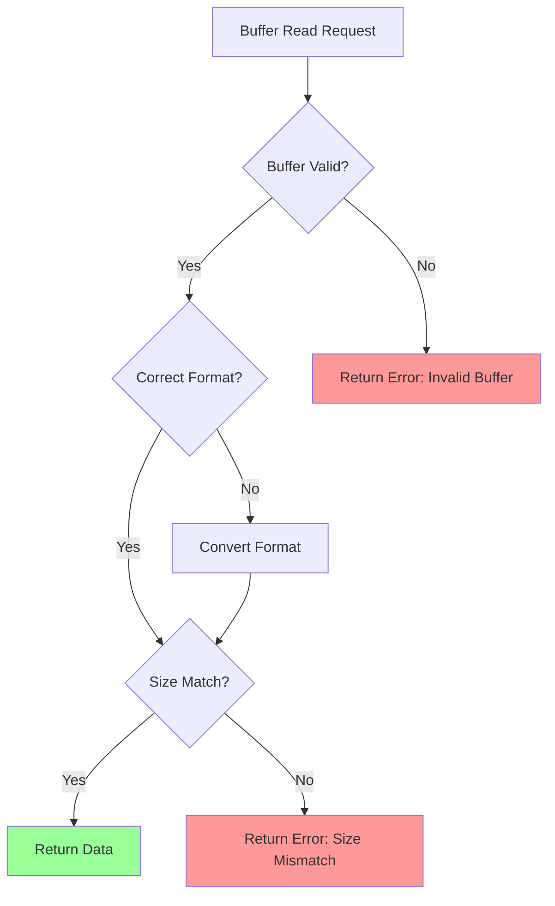
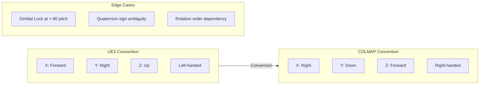
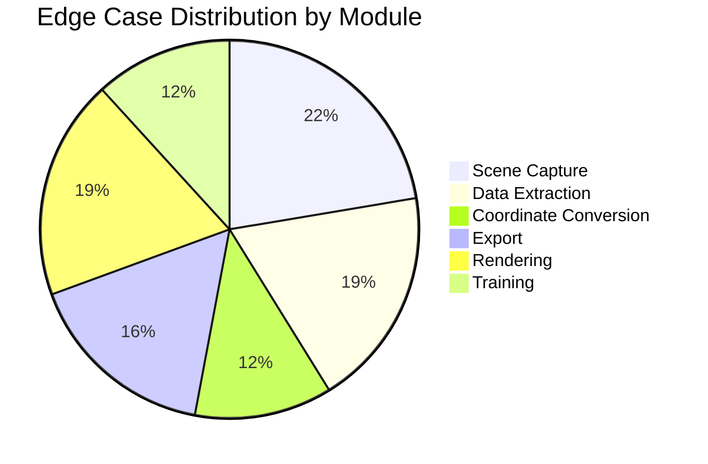

# Edge Cases Specification
## UE5-3DGS Pipeline

**Version:** 1.0
**Phase:** SPARC Specification
**Source:** PRD Sections 4, 7, 9

---

## 1. Scene Capture Edge Cases

### 1.1 Camera Position Edge Cases

| ID | Edge Case | Expected Behaviour | Test Scenario |
|----|-----------|-------------------|---------------|
| EC-CAM-001 | Camera inside geometry | Skip frame, log warning | Place camera inside BSP |
| EC-CAM-002 | Camera at world origin exactly | Normal capture | Transform at (0,0,0) |
| EC-CAM-003 | Camera at extreme coordinates | Precision handling | Position >1M units |
| EC-CAM-004 | Camera facing directly up/down | Gimbal lock avoidance | Pitch = +/-90 degrees |
| EC-CAM-005 | Zero baseline between frames | Skip duplicate, warn | Identical camera positions |
| EC-CAM-006 | Camera outside scene bounds | Capture with warning | Position beyond AABB |
| EC-CAM-007 | Overlapping camera frustums >90% | Log redundancy warning | Nearly identical views |

### 1.2 Trajectory Generation Edge Cases

| ID | Edge Case | Expected Behaviour | Test Scenario |
|----|-----------|-------------------|---------------|
| EC-TRAJ-001 | Scene with zero volume | Reject with error | Empty level |
| EC-TRAJ-002 | Scene with single point extent | Use minimum radius | Single actor |
| EC-TRAJ-003 | Highly elongated scene (1:100+ ratio) | Adaptive sampling | Corridor level |
| EC-TRAJ-004 | Scene with multiple disconnected regions | Warn, capture all | Islands in level |
| EC-TRAJ-005 | Spline with zero length | Reject, request valid spline | Collapsed spline actor |
| EC-TRAJ-006 | Spline with sharp discontinuities | Smooth or warn | 180-degree turn |
| EC-TRAJ-007 | Requested views > feasible positions | Cap at maximum, warn | 1000 views in small scene |

### 1.3 Coverage Analysis Edge Cases

| ID | Edge Case | Expected Behaviour | Test Scenario |
|----|-----------|-------------------|---------------|
| EC-COV-001 | Geometry with no visible surfaces | Skip from coverage calc | Hidden/culled meshes |
| EC-COV-002 | Thin geometry (single-sided) | Detect and warn | Paper-thin walls |
| EC-COV-003 | Fully enclosed interior | Require interior camera | Room with no windows |
| EC-COV-004 | Highly reflective surfaces | Flag for manual review | Mirror materials |
| EC-COV-005 | Transparent surfaces | Include in coverage | Glass materials |

---

## 2. Data Extraction Edge Cases

### 2.1 Buffer Extraction Edge Cases

| ID | Edge Case | Expected Behaviour | Test Scenario |
|----|-----------|-------------------|---------------|
| EC-BUF-001 | Depth buffer at infinity | Clamp to far plane | Sky pixels |
| EC-BUF-002 | Depth buffer NaN values | Replace with far plane | Invalid geometry |
| EC-BUF-003 | RGB buffer with HDR overflow | Tone-map or clamp | Bright emissive materials |
| EC-BUF-004 | Normal buffer with zero vector | Replace with up vector | Degenerate triangles |
| EC-BUF-005 | Buffer resolution mismatch | Scale or reject | RT size != requested |
| EC-BUF-006 | sRGB/Linear colour space confusion | Explicit conversion | Mixed material spaces |
| EC-BUF-007 | Render target not ready | Retry with backoff | Async rendering lag |

### 2.2 Depth Value Edge Cases

| ID | Edge Case | Expected Behaviour | Test Scenario |
|----|-----------|-------------------|---------------|
| EC-DEPTH-001 | Reverse-Z precision at far plane | Use double precision | Objects at 10km+ |
| EC-DEPTH-002 | Near plane clipping visible | Warn user | Object <10cm from camera |
| EC-DEPTH-003 | Depth discontinuity at edges | Expected, no action | Object silhouettes |
| EC-DEPTH-004 | Depth fighting between surfaces | Use higher precision | Coplanar surfaces |
| EC-DEPTH-005 | Motion blur affecting depth | Disable MB for depth | Fast-moving objects |

### 2.3 Camera Parameter Edge Cases

| ID | Edge Case | Expected Behaviour | Test Scenario |
|----|-----------|-------------------|---------------|
| EC-PARAM-001 | Non-square pixels | Convert to square | Anamorphic rendering |
| EC-PARAM-002 | Non-centred principal point | Export actual values | Off-centre projection |
| EC-PARAM-003 | Asymmetric FOV | Export as-is, warn | VR canted displays |
| EC-PARAM-004 | Zero focal length | Reject, error | Invalid camera config |
| EC-PARAM-005 | FOV >170 degrees | Warn, may cause issues | Fisheye-like views |

---

## 3. Coordinate Conversion Edge Cases

### 3.1 Transform Conversion Edge Cases

| ID | Edge Case | Expected Behaviour | Test Scenario |
|----|-----------|-------------------|---------------|
| EC-COORD-001 | Quaternion normalization error | Renormalize, warn if >1% | Accumulated rotation errors |
| EC-COORD-002 | Non-uniform scale in transform | Decompose, warn | Scaled actors |
| EC-COORD-003 | Negative scale (mirroring) | Handle sign flip | Mirrored instances |
| EC-COORD-004 | Transform at numerical limits | Use double precision | >1M unit positions |
| EC-COORD-005 | Identity transform special case | Handle efficiently | Object at origin |

### 3.2 Convention Conversion Edge Cases

| ID | Edge Case | Expected Behaviour | Test Scenario |
|----|-----------|-------------------|---------------|
| EC-CONV-001 | Gimbal lock during Euler conversion | Use quaternion throughout | Camera looking straight up |
| EC-CONV-002 | Quaternion double-cover (q = -q) | Enforce positive w | Any rotation |
| EC-CONV-003 | 180-degree rotation ambiguity | Consistent axis selection | Flip transforms |
| EC-CONV-004 | Scale != 1.0 in coordinate system | Apply scale factor | Metric vs. UE units |
| EC-CONV-005 | Different up-axis between systems | Explicit axis remapping | Z-up to Y-up |

---

## 4. Export Edge Cases

### 4.1 COLMAP Format Edge Cases

| ID | Edge Case | Expected Behaviour | Test Scenario |
|----|-----------|-------------------|---------------|
| EC-COL-001 | Camera ID collision | Auto-increment unique IDs | Multiple capture sessions |
| EC-COL-002 | Image name with special chars | Sanitize filename | Unicode/spaces in names |
| EC-COL-003 | Image name >255 characters | Truncate with hash suffix | Long path names |
| EC-COL-004 | Empty points3D file | Write valid empty file | No SfM points |
| EC-COL-005 | >10000 images | Warn performance impact | Large captures |
| EC-COL-006 | Binary write on big-endian system | Force little-endian | Cross-platform |
| EC-COL-007 | Disk full during write | Graceful abort, cleanup | Storage limit |

### 4.2 PLY Format Edge Cases

| ID | Edge Case | Expected Behaviour | Test Scenario |
|----|-----------|-------------------|---------------|
| EC-PLY-001 | Zero splats to export | Write valid empty PLY | No training result |
| EC-PLY-002 | >2 billion splats | Split files or error | Extreme scene |
| EC-PLY-003 | NaN/Inf in splat parameters | Replace with defaults | Invalid training output |
| EC-PLY-004 | Quaternion not normalized | Normalize on export | Training drift |
| EC-PLY-005 | Negative scale values | Abs value, warn | Invalid gaussian |
| EC-PLY-006 | Opacity outside [0,1] | Clamp to valid range | Training artifact |

### 4.3 File System Edge Cases

| ID | Edge Case | Expected Behaviour | Test Scenario |
|----|-----------|-------------------|---------------|
| EC-FS-001 | Output directory doesn't exist | Create recursively | First-time export |
| EC-FS-002 | Output directory not writable | Error with clear message | Permission denied |
| EC-FS-003 | Existing files in output dir | Prompt overwrite or rename | Re-export |
| EC-FS-004 | Path with spaces | Quote paths correctly | "My Project" folder |
| EC-FS-005 | Network drive output | Warn performance impact | NAS/SMB paths |
| EC-FS-006 | Symlink in output path | Resolve and warn | Complex directory structure |

---

## 5. Rendering Edge Cases

### 5.1 Material Edge Cases

| ID | Edge Case | Expected Behaviour | Test Scenario |
|----|-----------|-------------------|---------------|
| EC-MAT-001 | Emissive materials > HDR range | Tone-map or flag | Bright lights |
| EC-MAT-002 | Subsurface scattering materials | Capture as-rendered | Skin materials |
| EC-MAT-003 | Animated materials | Capture current frame | Water, fire |
| EC-MAT-004 | Invisible/hidden materials | Skip in capture | Collision-only meshes |
| EC-MAT-005 | Two-sided materials | Capture both sides | Foliage |
| EC-MAT-006 | Decal materials | Capture composited result | Projected textures |

### 5.2 Lighting Edge Cases

| ID | Edge Case | Expected Behaviour | Test Scenario |
|----|-----------|-------------------|---------------|
| EC-LIGHT-001 | No lights in scene | Warn, use ambient | Unlit scene |
| EC-LIGHT-002 | Extreme exposure difference between views | Auto-exposure or warn | Indoor/outdoor mix |
| EC-LIGHT-003 | Dynamic shadows changing | Warn temporal inconsistency | Time of day system |
| EC-LIGHT-004 | Lumen GI artifacts | Document as limitation | Bleeding, noise |
| EC-LIGHT-005 | Path tracing noise | Increase sample count | Low SPP |

### 5.3 Geometry Edge Cases

| ID | Edge Case | Expected Behaviour | Test Scenario |
|----|-----------|-------------------|---------------|
| EC-GEO-001 | Nanite geometry | Capture tessellated result | High-poly meshes |
| EC-GEO-002 | LOD transitions visible | Lock LOD during capture | Streaming levels |
| EC-GEO-003 | Procedural geometry | Capture static snapshot | Foliage, splines |
| EC-GEO-004 | Destructible geometry | Capture current state | Physics objects |
| EC-GEO-005 | Particle systems | Capture current frame | VFX |

---

## 6. Training Edge Cases (Optional Module)

### 6.1 CUDA Edge Cases

| ID | Edge Case | Expected Behaviour | Test Scenario |
|----|-----------|-------------------|---------------|
| EC-CUDA-001 | CUDA not available | Graceful export-only mode | CPU-only system |
| EC-CUDA-002 | CUDA version mismatch | Clear error message | Old driver |
| EC-CUDA-003 | GPU out of memory | Reduce batch size, retry | Large scene |
| EC-CUDA-004 | Multi-GPU system | Use primary GPU | SLI/NVLink |
| EC-CUDA-005 | GPU timeout (TDR) | Reduce workload, warn | Long kernel |

### 6.2 Training Convergence Edge Cases

| ID | Edge Case | Expected Behaviour | Test Scenario |
|----|-----------|-------------------|---------------|
| EC-TRAIN-001 | Loss explodes (NaN/Inf) | Reset to checkpoint | Bad learning rate |
| EC-TRAIN-002 | Loss plateaus early | Suggest parameter changes | Underfitting |
| EC-TRAIN-003 | Overfitting to training views | Early stopping, warn | Few input views |
| EC-TRAIN-004 | Densification creates too many splats | Enforce maximum count | Complex scene |
| EC-TRAIN-005 | Pruning removes all splats | Restore checkpoint | Aggressive pruning |

---

## 7. Error Recovery Matrix

| Error Type | Recovery Strategy | User Action Required |
|------------|-------------------|---------------------|
| Buffer read failure | Retry 3x with backoff | None (auto) |
| File write failure | Preserve partial, report | Check disk space |
| Coordinate conversion error | Log and skip frame | Review captured data |
| CUDA error | Fallback to CPU export | Install drivers |
| Memory exhaustion | Reduce resolution/batch | Adjust settings |
| Plugin crash | Attempt safe mode restart | Report bug |

---

## 8. Edge Case Test Coverage

| Category | Edge Cases | Critical | High | Medium |
|----------|------------|----------|------|--------|
| Scene Capture | 19 | 3 | 8 | 8 |
| Data Extraction | 16 | 4 | 6 | 6 |
| Coordinate Conversion | 10 | 5 | 3 | 2 |
| Export | 14 | 4 | 5 | 5 |
| Rendering | 16 | 2 | 6 | 8 |
| Training | 10 | 3 | 4 | 3 |
| **Total** | **85** | **21** | **32** | **32** |

---

*Document generated for SPARC Specification phase*
