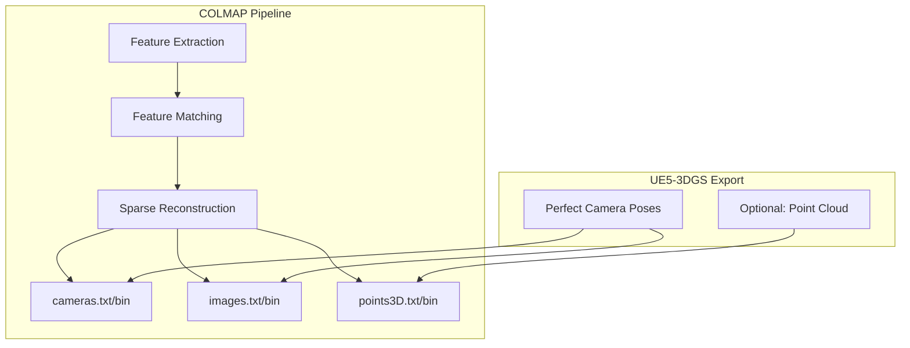
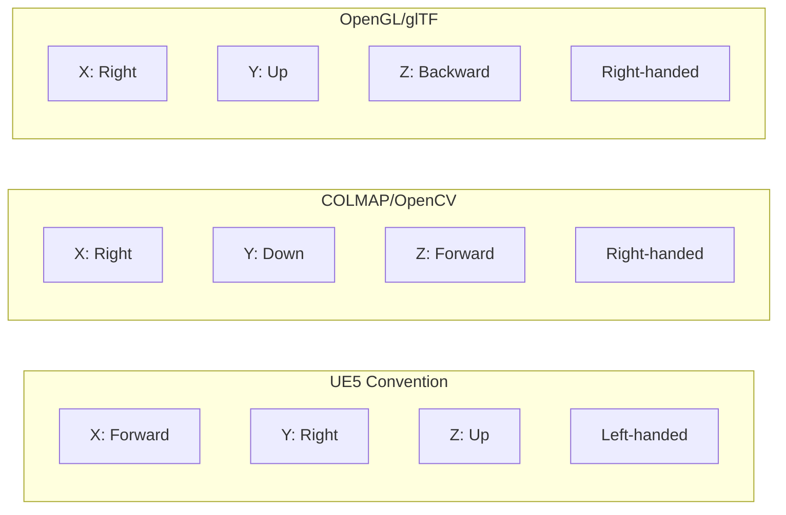

# Domain Glossary
## UE5-3DGS Pipeline

**Version:** 1.0
**Phase:** SPARC Specification
**Source:** PRD Section 12, Appendix A

---

## 1. Core Concepts

### 1.1 3D Gaussian Splatting (3DGS)

| Term | Definition |
|------|------------|
| **3DGS** | 3D Gaussian Splatting - A neural scene representation technique using anisotropic 3D gaussians to represent scenes. Introduced by Kerbl et al. at SIGGRAPH 2023. Enables real-time rendering of photorealistic scenes. |
| **Gaussian/Splat** | A single 3D primitive in 3DGS, defined by position, covariance (orientation/scale), opacity, and spherical harmonics for view-dependent colour. |
| **Splatting** | The rendering technique of projecting 3D primitives (gaussians) onto a 2D image plane, computing their contribution to each pixel. |
| **Anisotropic Gaussian** | A 3D gaussian with non-uniform scale along its principal axes, allowing elongated ellipsoid shapes rather than spheres. |

### 1.2 Neural Rendering Terms

| Term | Definition |
|------|------------|
| **NeRF** | Neural Radiance Fields - Predecessor to 3DGS using MLPs to represent volumetric scenes. Slower rendering but continuous representation. |
| **Novel View Synthesis** | The task of generating images from viewpoints not present in the training data. |
| **View-Dependent Effects** | Visual phenomena that change based on viewing angle (e.g., specular highlights, reflections). |
| **Radiance Field** | A function mapping 3D position and viewing direction to colour and density/opacity. |

---

## 2. COLMAP and Structure from Motion

### 2.1 COLMAP Components

| Term | Definition |
|------|------------|
| **COLMAP** | Structure-from-Motion and Multi-View Stereo pipeline. De facto standard for camera pose estimation from images. UE5-3DGS bypasses SfM by providing ground-truth poses. |
| **SfM** | Structure from Motion - Technique to estimate 3D structure and camera poses from 2D images. |
| **MVS** | Multi-View Stereo - Dense reconstruction technique that generates detailed 3D models from calibrated images. |
| **cameras.txt/bin** | COLMAP file containing camera intrinsic parameters (focal length, principal point, distortion). |
| **images.txt/bin** | COLMAP file containing camera extrinsic parameters (position, rotation) per image. |
| **points3D.txt/bin** | COLMAP file containing sparse 3D point cloud from SfM. Can be empty for 3DGS training. |

### 2.2 Camera Terminology

| Term | Definition |
|------|------------|
| **Intrinsics (K)** | Internal camera parameters: focal length (fx, fy), principal point (cx, cy), distortion coefficients. |
| **Extrinsics (R, t)** | External camera parameters: rotation matrix (R) and translation vector (t) defining camera pose in world space. |
| **World-to-Camera Transform** | Transform that converts world coordinates to camera coordinates. COLMAP uses this convention. |
| **Camera-to-World Transform** | Transform that converts camera coordinates to world coordinates. Inverse of world-to-camera. |
| **Principal Point** | The point where the optical axis intersects the image plane. Ideally image centre. |
| **Focal Length** | Distance from camera centre to image plane. Measured in pixels (fx, fy) or mm (physical). |

---

## 3. Coordinate Systems

### 3.1 Convention Definitions

| Term | Definition |
|------|------------|
| **Left-handed System** | Coordinate system where cross product of X and Y points in +Z direction. UE5 uses this. |
| **Right-handed System** | Coordinate system where cross product of X and Y points in -Z direction. COLMAP, OpenGL use this. |
| **Z-up Convention** | World coordinate system with Z axis pointing upward. UE5 native. |
| **Y-up Convention** | World coordinate system with Y axis pointing upward. OpenGL, glTF, many game engines. |

### 3.2 Transform Terminology

| Term | Definition |
|------|------------|
| **Quaternion** | Four-component representation of 3D rotation. (w, x, y, z) where w is the scalar component. |
| **Euler Angles** | Three-component rotation representation. Subject to gimbal lock. |
| **Rotation Matrix** | 3x3 orthonormal matrix representing rotation. |
| **Homogeneous Coordinates** | 4D representation of 3D points enabling translation via matrix multiplication. |

---

## 4. Spherical Harmonics (SH)

### 4.1 SH in 3DGS

| Term | Definition |
|------|------------|
| **Spherical Harmonics** | Orthogonal basis functions on the sphere used to represent view-dependent colour in 3DGS. |
| **SH Degree/Order** | Number of SH bands used. 3DGS typically uses degree 3 (16 coefficients per colour channel). |
| **DC Component (f_dc)** | Zero-order SH coefficient representing average colour (view-independent). 3 values for RGB. |
| **SH Rest (f_rest)** | Higher-order SH coefficients encoding view-dependent colour variation. 45 values for degree 3. |
| **SH Evaluation** | Computing colour from SH coefficients given a viewing direction. |

### 4.2 SH Memory Layout

| Component | Coefficients | Description |
|-----------|--------------|-------------|
| f_dc_0, f_dc_1, f_dc_2 | 3 | DC (average) colour per channel |
| f_rest_0 to f_rest_44 | 45 | Bands 1-3 (15 per channel) |
| **Total** | **48** | Full SH representation |

---

## 5. File Formats

### 5.1 PLY Format

| Term | Definition |
|------|------------|
| **PLY** | Polygon File Format (Stanford Triangle Format). Simple format for 3D data. Used for 3DGS splat storage. |
| **PLY Header** | ASCII section describing vertex properties and counts. |
| **PLY Binary** | Binary section containing vertex data. Can be little or big endian. |
| **PLY Properties** | Named data fields per vertex (x, y, z, opacity, scale_0, etc.). |

### 5.2 Other Formats

| Term | Definition |
|------|------------|
| **SPZ** | Compressed 3DGS format achieving ~90% size reduction vs PLY. Uses quantization and entropy coding. |
| **EXR** | OpenEXR - High dynamic range image format supporting float precision. Used for depth maps. |
| **glTF** | GL Transmission Format - Standard 3D asset format. Emerging extensions for gaussian splats (2025). |
| **USD** | Universal Scene Description - Pixar's scene format. Neural asset proposals in development. |

---

## 6. Training Terminology

### 6.1 Optimisation Terms

| Term | Definition |
|------|------------|
| **Adam Optimiser** | Adaptive Moment Estimation - Gradient descent algorithm used for 3DGS training. |
| **Learning Rate (LR)** | Step size for parameter updates during training. Different LRs for position, colour, scale, rotation. |
| **Iteration** | Single forward-backward pass through the network. 3DGS typically uses 30K iterations. |
| **Batch Size** | Number of images processed per iteration. Often 1 for 3DGS. |
| **Loss Function** | Function measuring difference between rendered and ground-truth images. L1 + SSIM for 3DGS. |

### 6.2 Densification and Pruning

| Term | Definition |
|------|------------|
| **Densification** | Process of adding new gaussians during training to cover under-reconstructed regions. |
| **Clone** | Densification operation copying a gaussian (for small gradients). |
| **Split** | Densification operation dividing a gaussian into two (for large gradients). |
| **Pruning** | Removing gaussians with low opacity or extreme size during training. |
| **Gradient Threshold** | Threshold triggering densification based on accumulated positional gradients. |

### 6.3 Quality Metrics

| Term | Definition |
|------|------------|
| **PSNR** | Peak Signal-to-Noise Ratio - Pixel-level quality metric. Higher is better. Target: >30dB. |
| **SSIM** | Structural Similarity Index - Perceptual quality metric. Range 0-1. Target: >0.95. |
| **LPIPS** | Learned Perceptual Image Patch Similarity - Neural network based perceptual metric. Lower is better. Target: <0.1. |

---

## 7. UE5 Terminology

### 7.1 Rendering Terms

| Term | Definition |
|------|------------|
| **Lumen** | UE5's global illumination system providing dynamic indirect lighting and reflections. |
| **Nanite** | UE5's virtualised geometry system enabling film-quality assets in real-time. |
| **Reverse-Z** | Depth buffer technique using Z=1 at near plane and Z=0 at far plane for improved precision. |
| **Render Target** | GPU texture that can be written to by rendering operations. |
| **Scene Capture** | UE5 component for rendering a scene to a texture from a specified viewpoint. |

### 7.2 UE5 Coordinate System

| Term | Definition |
|------|------------|
| **Unreal Units (uu)** | UE5's unit of measurement. 1 uu = 1 cm by default. |
| **World Space** | Global coordinate system of the level/world. |
| **Actor Space** | Local coordinate system relative to an actor's root. |
| **Component Space** | Local coordinate system relative to a component. |

---

## 8. Research Terminology

### 8.1 Key Papers

| Abbreviation | Full Name | Contribution |
|--------------|-----------|--------------|
| **3DGS** | 3D Gaussian Splatting (Kerbl et al., 2023) | Original method |
| **Mip-Splatting** | Mip-Splatting (Yu et al., 2024) | Anti-aliasing for 3DGS |
| **2DGS** | 2D Gaussian Splatting (Huang et al., 2024) | Surface reconstruction focus |
| **Scaffold-GS** | Scaffold-GS (Lu et al., 2024) | Structured anchor points |
| **3DGS-MCMC** | 3D Gaussian Splatting MCMC | Training speedup via sampling |
| **DashGaussian** | DashGaussian (2024) | 10-15x training acceleration |

### 8.2 Research Terms

| Term | Definition |
|------|------------|
| **Ablation Study** | Experiment isolating effect of individual components/parameters. |
| **Ground Truth** | Known correct data for comparison. UE5-3DGS provides perfect ground truth poses. |
| **Benchmark Dataset** | Standardised dataset for comparing methods (e.g., MipNeRF360, Tanks and Temples). |
| **SOTA** | State of the Art - Current best performance on a task. |

---

## 9. Quick Reference

### 9.1 Acronym Table

| Acronym | Expansion |
|---------|-----------|
| 3DGS | 3D Gaussian Splatting |
| SH | Spherical Harmonics |
| PLY | Polygon File Format |
| EXR | Extended Range (OpenEXR) |
| SfM | Structure from Motion |
| MVS | Multi-View Stereo |
| PSNR | Peak Signal-to-Noise Ratio |
| SSIM | Structural Similarity Index |
| LPIPS | Learned Perceptual Image Patch Similarity |
| FOV | Field of View |
| LR | Learning Rate |
| VRAM | Video Random Access Memory |
| UE5 | Unreal Engine 5 |
| RT | Render Target |
| GI | Global Illumination |

### 9.2 Symbol Reference

| Symbol | Meaning | Context |
|--------|---------|---------|
| K | Intrinsic matrix (3x3) | Camera calibration |
| R | Rotation matrix (3x3) | Camera extrinsics |
| t | Translation vector (3x1) | Camera extrinsics |
| q | Quaternion (4x1) | Rotation representation |
| fx, fy | Focal length (pixels) | Camera intrinsics |
| cx, cy | Principal point | Camera intrinsics |
| k1, k2, k3 | Radial distortion | Lens distortion |
| p1, p2 | Tangential distortion | Lens distortion |
| w, x, y, z | Quaternion components | Rotation |

---

## 10. Conversion Reference

### 10.1 Unit Conversions

| From | To | Factor |
|------|----|----|
| UE units | Metres | ÷ 100 |
| UE units | Centimetres | × 1 |
| Degrees | Radians | × (π/180) |
| Radians | Degrees | × (180/π) |

### 10.2 Colour Space Conversions

| From | To | Method |
|------|----|----|
| sRGB | Linear | Remove gamma (^2.2 approx) |
| Linear | sRGB | Apply gamma (^0.4545 approx) |
| RGB [0,255] | RGB [0,1] | ÷ 255 |

---

*Document generated for SPARC Specification phase*
