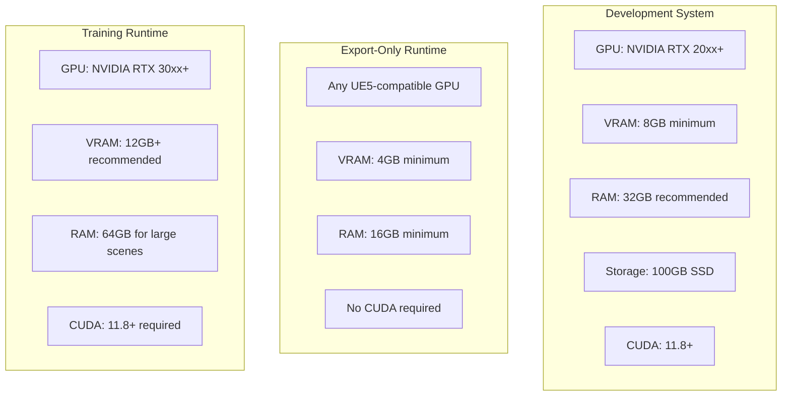

# Non-Functional Requirements Specification
## UE5-3DGS Pipeline

**Version:** 1.0
**Phase:** SPARC Specification
**Source:** PRD Sections 7, 11, Appendix C

---

## 1. Performance Requirements

### 1.1 Capture Performance

| ID | Requirement | Target | Measurement |
|----|-------------|--------|-------------|
| NFR-PERF-001 | Capture throughput at 1080p | >5 fps | Benchmark on RTX 3080 |
| NFR-PERF-002 | Capture throughput at 4K | >1 fps | Benchmark on RTX 3080 |
| NFR-PERF-003 | Memory usage during capture | <8GB GPU VRAM | Profile with Nsight |
| NFR-PERF-004 | Frame queue depth | 8-16 frames | Configurable buffer |
| NFR-PERF-005 | Disk write throughput | >100 MB/s | Async I/O validation |

### 1.2 Export Performance

| ID | Requirement | Target | Measurement |
|----|-------------|--------|-------------|
| NFR-PERF-010 | COLMAP text export (100 frames) | <5 seconds | Wall-clock timing |
| NFR-PERF-011 | COLMAP binary export (100 frames) | <2 seconds | Wall-clock timing |
| NFR-PERF-012 | PLY export (1M splats) | <10 seconds | Wall-clock timing |
| NFR-PERF-013 | Manifest generation | <1 second | Wall-clock timing |

### 1.3 Training Performance (Optional Module)

| ID | Requirement | Target | Measurement |
|----|-------------|--------|-------------|
| NFR-PERF-020 | Training speedup with DashGaussian/MCMC | 10-15x vs baseline | Iteration timing |
| NFR-PERF-021 | Training iteration time (30K iterations) | <15 minutes | End-to-end timing |
| NFR-PERF-022 | GPU memory for training | <12GB VRAM | Profile with Nsight |

---

## 2. Quality Metrics

### 2.1 Accuracy Requirements

| ID | Requirement | Target | Validation Method |
|----|-------------|--------|-------------------|
| NFR-QUAL-001 | Position export accuracy | <1mm error | Round-trip transform test |
| NFR-QUAL-002 | Rotation export accuracy | <0.01 degrees | Quaternion comparison |
| NFR-QUAL-003 | Depth buffer accuracy | <0.1% of range | Known geometry validation |
| NFR-QUAL-004 | Intrinsic matrix accuracy | <0.1px principal point | Calibration target test |

### 2.2 Reconstruction Quality (When Training)

| ID | Requirement | Target | Validation Method |
|----|-------------|--------|-------------------|
| NFR-QUAL-010 | PSNR on holdout views | >30 dB | Automated test suite |
| NFR-QUAL-011 | SSIM on holdout views | >0.95 | Automated test suite |
| NFR-QUAL-012 | LPIPS perceptual metric | <0.1 | Automated test suite |
| NFR-QUAL-013 | Training convergence rate | <30K iterations | Loss plateau detection |

### 2.3 Coverage Quality

| ID | Requirement | Target | Validation Method |
|----|-------------|--------|-------------------|
| NFR-QUAL-020 | Scene coverage percentage | >95% | Voxel occupancy analysis |
| NFR-QUAL-021 | Angular coverage uniformity | <15% std deviation | Spherical distribution test |
| NFR-QUAL-022 | Baseline distribution | Log-normal profile | Statistical analysis |

---

## 3. Platform Requirements

### 3.1 Engine Compatibility

| ID | Requirement | Specification |
|----|-------------|---------------|
| NFR-PLAT-001 | Minimum UE5 version | 5.3.0 |
| NFR-PLAT-002 | Maximum UE5 version | 5.5.x (tested) |
| NFR-PLAT-003 | Rendering API | DX12, Vulkan |
| NFR-PLAT-004 | Lumen support | Required for full fidelity |
| NFR-PLAT-005 | Nanite support | Optional (improves geometry detail) |

### 3.2 Operating System Support

| ID | Requirement | Specification |
|----|-------------|---------------|
| NFR-PLAT-010 | Windows support | Windows 10/11 (64-bit) |
| NFR-PLAT-011 | Linux support | Ubuntu 22.04+ |
| NFR-PLAT-012 | macOS support | Not supported (no CUDA) |

### 3.3 Hardware Requirements



### 3.4 Target Platform Splat Limits

| Platform | Max Splats | Notes |
|----------|------------|-------|
| Desktop (High-end) | 10M | RTX 4080+ |
| Desktop (Mid-range) | 5M | RTX 3060+ |
| Quest 3 | 1M | Mobile GPU constraints |
| Mobile (iOS/Android) | 500K | WebGL/Metal limits |
| Web (WebGL 2.0) | 2M | Browser memory limits |

---

## 4. Reliability Requirements

### 4.1 Error Handling

| ID | Requirement | Specification |
|----|-------------|---------------|
| NFR-REL-001 | Capture failure recovery | Resume from last successful frame |
| NFR-REL-002 | Export failure recovery | Partial output preserved |
| NFR-REL-003 | CUDA failure handling | Graceful fallback to CPU |
| NFR-REL-004 | Memory exhaustion handling | Warning at 80% usage, abort at 95% |

### 4.2 Data Integrity

| ID | Requirement | Specification |
|----|-------------|---------------|
| NFR-REL-010 | Image file integrity | Checksum validation optional |
| NFR-REL-011 | COLMAP file integrity | Format validation on write |
| NFR-REL-012 | PLY file integrity | Header/data count verification |

### 4.3 Availability

| ID | Requirement | Target |
|----|-------------|--------|
| NFR-REL-020 | Successful export rate | >90% first attempt |
| NFR-REL-021 | Plugin load success | 100% on supported platforms |
| NFR-REL-022 | Editor crash rate | <1% during capture |

---

## 5. Scalability Requirements

### 5.1 Scene Complexity

| ID | Requirement | Specification |
|----|-------------|---------------|
| NFR-SCAL-001 | Maximum scene triangles | 100M+ (Nanite scenes) |
| NFR-SCAL-002 | Maximum texture memory | 16GB+ |
| NFR-SCAL-003 | Maximum world size | 20km x 20km |
| NFR-SCAL-004 | Minimum scene size | 1m x 1m x 1m |

### 5.2 Capture Scale

| ID | Requirement | Specification |
|----|-------------|---------------|
| NFR-SCAL-010 | Minimum camera views | 20 |
| NFR-SCAL-011 | Standard camera views | 100-180 |
| NFR-SCAL-012 | Maximum camera views | 1000+ |
| NFR-SCAL-013 | Complex scene views | 300+ recommended |

### 5.3 Output Scale

| ID | Requirement | Specification |
|----|-------------|---------------|
| NFR-SCAL-020 | Maximum output dataset size | 100GB+ |
| NFR-SCAL-021 | Maximum PLY file size | 2GB (single file) |
| NFR-SCAL-022 | Batch scene processing | 10+ scenes sequential |

---

## 6. Maintainability Requirements

### 6.1 Code Quality

| ID | Requirement | Target |
|----|-------------|--------|
| NFR-MAIN-001 | Code coverage | >80% |
| NFR-MAIN-002 | Documentation coverage | 100% public API |
| NFR-MAIN-003 | Cyclomatic complexity | <15 per function |
| NFR-MAIN-004 | File size limit | <500 lines per file |

### 6.2 Build System

| ID | Requirement | Target |
|----|-------------|--------|
| NFR-MAIN-010 | Full build time | <5 minutes |
| NFR-MAIN-011 | Incremental build time | <30 seconds |
| NFR-MAIN-012 | Plugin binary size | <50MB |

### 6.3 Dependency Management

| ID | Requirement | Specification |
|----|-------------|---------------|
| NFR-MAIN-020 | External dependencies | Eigen, rapidjson, stb_image_write |
| NFR-MAIN-021 | Optional dependencies | CUDA Toolkit 11.8+ |
| NFR-MAIN-022 | Dependency licensing | MIT/Apache/BSD/Public Domain |

---

## 7. Usability Requirements

### 7.1 Learning Curve

| ID | Requirement | Target |
|----|-------------|--------|
| NFR-USE-001 | Time to first export | <30 minutes |
| NFR-USE-002 | Documentation completeness | Quickstart + API reference |
| NFR-USE-003 | Error message clarity | Actionable error messages |

### 7.2 Workflow Integration

| ID | Requirement | Specification |
|----|-------------|---------------|
| NFR-USE-010 | UE5 workflow compatibility | Standard editor patterns |
| NFR-USE-011 | Batch automation support | Command-line interface |
| NFR-USE-012 | Progress feedback | Real-time progress bar |

---

## 8. Security Requirements

### 8.1 Data Handling

| ID | Requirement | Specification |
|----|-------------|---------------|
| NFR-SEC-001 | No network access required | Offline-capable |
| NFR-SEC-002 | No telemetry by default | Opt-in analytics only |
| NFR-SEC-003 | Local file access only | No cloud dependencies |

### 8.2 Third-Party Code

| ID | Requirement | Specification |
|----|-------------|---------------|
| NFR-SEC-010 | Dependency audit | No known vulnerabilities |
| NFR-SEC-011 | License compliance | SPDX identifiers required |

---

## 9. Format Compatibility Matrix

| Format | Version | Read | Write | Notes |
|--------|---------|------|-------|-------|
| COLMAP Text | 1.0 | No | Yes | cameras.txt, images.txt, points3D.txt |
| COLMAP Binary | 1.0 | No | Yes | cameras.bin, images.bin, points3D.bin |
| PLY (3DGS) | 1.0 | No | Yes | Binary little-endian |
| PLY (Extended) | 1.0 | No | Yes | With SH coefficients |
| SPZ | 1.0 | No | Yes | 90% compression |
| EXR | 2.0 | No | Yes | Depth maps |
| PNG | 1.6 | No | Yes | RGB/Normal |
| JSON | RFC 8259 | No | Yes | Training manifest |

---

## 10. Performance Benchmarks

### 10.1 Reference Hardware Configuration

| Component | Specification |
|-----------|---------------|
| CPU | AMD Ryzen 9 5900X / Intel i9-12900K |
| GPU | NVIDIA RTX 3080 (10GB VRAM) |
| RAM | 64GB DDR4-3600 |
| Storage | NVMe SSD (3500 MB/s read) |
| OS | Windows 11 / Ubuntu 22.04 |

### 10.2 Expected Performance

```mermaid
gantt
    title Capture Pipeline Timing (100 frames @ 1080p)
    dateFormat s
    axisFormat %S

    section Capture
    Frame Rendering    :0, 20s
    Buffer Readback    :20s, 5s

    section Export
    Image Writing      :25s, 10s
    COLMAP Export      :35s, 2s
    Manifest Gen       :37s, 1s

    section Total
    End-to-End         :0, 38s
```

---

*Document generated for SPARC Specification phase*
