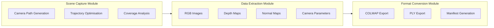
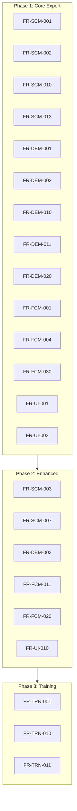

# Functional Requirements Specification
## UE5-3DGS Pipeline

**Version:** 1.0
**Phase:** SPARC Specification
**Source:** PRD Sections 2-4

---

## 1. System Overview

The UE5-3DGS system SHALL provide an in-engine pipeline for generating 3D Gaussian Splat representations from Unreal Engine 5 scenes.

---

## 2. Scene Capture Module (SCM) Requirements

### 2.1 Camera Trajectory Generation

| ID | Requirement | Priority | Acceptance Criteria |
|----|-------------|----------|---------------------|
| FR-SCM-001 | System SHALL generate spherical (Fibonacci lattice) camera trajectories | P1 | Uniform distribution on sphere with configurable radius |
| FR-SCM-002 | System SHALL generate orbital camera trajectories around scene centroid | P1 | Smooth orbit path with configurable elevation |
| FR-SCM-003 | System SHALL generate flythrough trajectories via spline paths | P2 | Catmull-Rom interpolation with user-defined keyframes |
| FR-SCM-004 | System SHALL support random stratified sampling with coverage constraints | P2 | Coverage target achievable (>95%) |
| FR-SCM-005 | System SHALL support grid systematic sampling | P2 | Regular grid with configurable density |
| FR-SCM-006 | System SHALL support custom spline paths from user input | P2 | Accept UE5 spline actors as input |
| FR-SCM-007 | System SHALL support adaptive coverage optimisation | P3 | Neural-driven coverage prediction |

### 2.2 Capture Configuration

| ID | Requirement | Priority | Acceptance Criteria |
|----|-------------|----------|---------------------|
| FR-SCM-010 | System SHALL support configurable capture resolution | P1 | 512x512 to 4K (3840x2160) |
| FR-SCM-011 | System SHALL support configurable FOV | P1 | 30-120 degrees |
| FR-SCM-012 | System SHALL support configurable near/far planes | P1 | 0.1cm to 100km range |
| FR-SCM-013 | System SHALL generate 100-300 camera views per scene | P1 | Configurable count with coverage validation |
| FR-SCM-014 | System SHALL support both batch and interactive capture modes | P1 | Async execution with pause/resume |

### 2.3 Coverage Analysis

| ID | Requirement | Priority | Acceptance Criteria |
|----|-------------|----------|---------------------|
| FR-SCM-020 | System SHALL compute scene coverage percentage | P1 | Report coverage >95% achievable |
| FR-SCM-021 | System SHALL visualise coverage heatmap in editor | P2 | Real-time overlay on scene geometry |
| FR-SCM-022 | System SHALL identify under-covered regions | P2 | Highlight areas needing additional views |

---

## 3. Data Extraction Module (DEM) Requirements

### 3.1 Buffer Extraction

| ID | Requirement | Priority | Acceptance Criteria |
|----|-------------|----------|---------------------|
| FR-DEM-001 | System SHALL extract RGB colour buffers | P1 | sRGB and Linear colour space support |
| FR-DEM-002 | System SHALL extract depth buffers in linear metres | P1 | Reverse-Z conversion accurate to 0.1mm |
| FR-DEM-003 | System SHALL extract world-space normal buffers | P2 | Normalised vectors in [-1,1] range |
| FR-DEM-004 | System SHALL extract motion vector buffers | P3 | Per-pixel velocity for temporal analysis |

### 3.2 Camera Parameter Extraction

| ID | Requirement | Priority | Acceptance Criteria |
|----|-------------|----------|---------------------|
| FR-DEM-010 | System SHALL extract camera extrinsics (position, rotation) | P1 | World-space transform with nanosecond timestamp |
| FR-DEM-011 | System SHALL compute camera intrinsics (fx, fy, cx, cy) | P1 | Derived from FOV and resolution |
| FR-DEM-012 | System SHALL support PINHOLE camera model | P1 | No distortion coefficients |
| FR-DEM-013 | System SHALL support OPENCV camera model | P2 | k1, k2, k3 radial + p1, p2 tangential |
| FR-DEM-014 | System SHALL compute projection and view matrices | P1 | Per-frame matrix extraction |

### 3.3 Coordinate Conversion

| ID | Requirement | Priority | Acceptance Criteria |
|----|-------------|----------|---------------------|
| FR-DEM-020 | System SHALL convert UE5 coordinates to COLMAP convention | P1 | Right-handed, X-right, Y-down, Z-forward |
| FR-DEM-021 | System SHALL convert UE5 coordinates to OpenCV convention | P1 | Standard CV coordinate frame |
| FR-DEM-022 | System SHALL convert UE5 coordinates to OpenGL convention | P2 | Right-handed Y-up |
| FR-DEM-023 | System SHALL convert UE5 coordinates to Blender convention | P3 | Right-handed Z-up |
| FR-DEM-024 | System SHALL preserve transform accuracy <1mm positional error | P1 | Round-trip validation test |
| FR-DEM-025 | System SHALL preserve rotation accuracy <0.01 degrees | P1 | Quaternion comparison test |

### 3.4 Metadata Extraction

| ID | Requirement | Priority | Acceptance Criteria |
|----|-------------|----------|---------------------|
| FR-DEM-030 | System SHALL compute axis-aligned scene bounding box | P1 | Min/max vectors in world space |
| FR-DEM-031 | System SHALL record visible actors per frame | P2 | List of actor names/IDs |
| FR-DEM-032 | System SHALL record exposure value per frame | P2 | EV100 or aperture/shutter/ISO |
| FR-DEM-033 | System SHALL generate per-frame timestamps | P1 | Nanosecond precision |

---

## 4. Format Conversion Module (FCM) Requirements

### 4.1 COLMAP Export

| ID | Requirement | Priority | Acceptance Criteria |
|----|-------------|----------|---------------------|
| FR-FCM-001 | System SHALL export COLMAP text format (cameras.txt) | P1 | Parseable by COLMAP CLI |
| FR-FCM-002 | System SHALL export COLMAP text format (images.txt) | P1 | Quaternion world-to-camera |
| FR-FCM-003 | System SHALL export COLMAP text format (points3D.txt) | P1 | Can be empty for 3DGS training |
| FR-FCM-004 | System SHALL export COLMAP binary format (cameras.bin) | P1 | Binary little-endian |
| FR-FCM-005 | System SHALL export COLMAP binary format (images.bin) | P1 | Binary little-endian |
| FR-FCM-006 | System SHALL export COLMAP binary format (points3D.bin) | P1 | Binary little-endian |
| FR-FCM-007 | System SHALL organise output in standard COLMAP directory structure | P1 | images/, sparse/0/ structure |

### 4.2 PLY Export

| ID | Requirement | Priority | Acceptance Criteria |
|----|-------------|----------|---------------------|
| FR-FCM-010 | System SHALL export minimal PLY (position only) | P1 | Binary little-endian PLY |
| FR-FCM-011 | System SHALL export 3DGS PLY with SH coefficients | P2 | f_dc_* and f_rest_* properties |
| FR-FCM-012 | System SHALL export 3DGS PLY with opacity | P2 | Pre-sigmoid opacity value |
| FR-FCM-013 | System SHALL export 3DGS PLY with scale (log-space) | P2 | 3-component scale vector |
| FR-FCM-014 | System SHALL export 3DGS PLY with rotation quaternion | P2 | 4-component quaternion |

### 4.3 Additional Export Formats

| ID | Requirement | Priority | Acceptance Criteria |
|----|-------------|----------|---------------------|
| FR-FCM-020 | System SHALL export SPZ compressed format | P2 | 90% size reduction vs PLY |
| FR-FCM-021 | System SHALL export depth maps as EXR | P2 | 32-bit float per pixel |
| FR-FCM-022 | System SHALL export normal maps as PNG | P2 | RGB encoded normals |

### 4.4 Training Manifest

| ID | Requirement | Priority | Acceptance Criteria |
|----|-------------|----------|---------------------|
| FR-FCM-030 | System SHALL generate JSON training manifest | P1 | Valid against JSON schema |
| FR-FCM-031 | Manifest SHALL include scene info (bounds, scale, up-axis) | P1 | Complete metadata |
| FR-FCM-032 | Manifest SHALL include capture config (resolution, FOV, frame count) | P1 | Complete configuration |
| FR-FCM-033 | Manifest SHALL include recommended training parameters | P2 | Iterations, learning rates, densification |
| FR-FCM-034 | Manifest SHALL include output paths | P1 | Relative paths to all outputs |

---

## 5. Editor Integration Requirements

### 5.1 UI Components

| ID | Requirement | Priority | Acceptance Criteria |
|----|-------------|----------|---------------------|
| FR-UI-001 | System SHALL provide toolbar button for 3DGS capture | P1 | Accessible from Level Editor |
| FR-UI-002 | System SHALL provide capture configuration panel | P1 | All settings configurable via UI |
| FR-UI-003 | System SHALL display capture progress with frame count | P1 | Progress bar + current/total frames |
| FR-UI-004 | System SHALL provide pause/resume controls | P1 | Functional during capture |
| FR-UI-005 | System SHALL visualise planned camera positions | P2 | 3D frustum rendering in editor |

### 5.2 Editor Mode

| ID | Requirement | Priority | Acceptance Criteria |
|----|-------------|----------|---------------------|
| FR-UI-010 | System SHALL provide dedicated 3DGS Capture editor mode | P2 | Accessible via mode selector |
| FR-UI-011 | Editor mode SHALL render camera frustums | P2 | Wireframe frustum per camera |
| FR-UI-012 | Editor mode SHALL render trajectory path | P2 | Spline visualisation |
| FR-UI-013 | Editor mode SHALL render coverage heatmap | P3 | Colour-coded surface overlay |

---

## 6. Optional Training Module Requirements

### 6.1 CUDA Integration

| ID | Requirement | Priority | Acceptance Criteria |
|----|-------------|----------|---------------------|
| FR-TRN-001 | System SHALL initialise CUDA context when available | P3 | CUDA 11.8+ detection |
| FR-TRN-002 | System SHALL gracefully degrade without CUDA | P3 | Export-only mode functional |

### 6.2 Training Execution

| ID | Requirement | Priority | Acceptance Criteria |
|----|-------------|----------|---------------------|
| FR-TRN-010 | System SHALL execute 3DGS training with configurable iterations | P3 | 1K-100K iterations |
| FR-TRN-011 | System SHALL support Adam optimiser with configurable LR | P3 | Per-parameter learning rates |
| FR-TRN-012 | System SHALL perform adaptive densification | P3 | Add gaussians based on gradient |
| FR-TRN-013 | System SHALL perform opacity-based pruning | P3 | Remove low-opacity gaussians |
| FR-TRN-014 | System SHALL report training metrics per iteration | P3 | PSNR, SSIM, loss values |

---

## 7. Requirement Traceability

---

## 8. Acceptance Test Summary

| Module | Test Count | Critical Tests |
|--------|------------|----------------|
| SCM | 14 | Trajectory generation, coverage >95% |
| DEM | 16 | Coordinate conversion accuracy, buffer extraction |
| FCM | 15 | COLMAP compatibility, PLY format validation |
| UI | 8 | Capture workflow, progress display |
| TRN | 5 | CUDA init, training convergence |
| **Total** | **58** | |

---

*Document generated for SPARC Specification phase*
